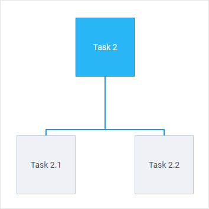

# autoPlace()

:::info
The **autoPlace()** method works only in the default mode of the diagram and only for shapes
:::

### Description

@short: Automatically arranges connected diagram shapes in the hierarchical structure

### Usage

~~~jsx
autoPlace(config?: object): void;
~~~

### Parameters

- `config` - (optional) an object with configuration settings of the autoplacement. If not specified, the default settings will be applied. Here you can specify the following parameters:
    - `mode` - (optional) the mode of connecting shapes, "direct" (by default) or "edges"
    - `graphPadding` - (optional) sets the distance between unconnected diagrams, 200 by default
    - `placeMode` - (optional) sets the mode of placement of shapes, "orthogonal" (by default) or "radial"

### Example

~~~jsx {4-7}
const diagram = new dhx.Diagram("diagram_container");
diagram.data.parse(data);

diagram.autoPlace({
    mode: "edges",
    placeMode: "radial"
});
~~~

## Modes of connecting shapes

### "direct" mode

Connector lines with no arrows are aligned "from center to center"; they are straight and diagonal.

### "edges" mode

Connector lines are aligned "from side to side".

:::info 
To add arrows to the lines, specify **forwardArrow: "filled"** or **backArrow: "filled"** in the configuration of a [line object](../../../lines/configuration_properties/).
:::

The connector lines in the "edges" mode can be:
  - either straight (if you set **connectType: "straight"** property of a [line object](../../../lines/configuration_properties/))

  - or 90-degree curved (if you set **connectType: "elbow"** property of a [line object](../../../lines/configuration_properties/))

## Modes of placement of shapes

### "orthogonal" mode

Shapes are arranged along vertical and horizontal lines

- **"orthogonal"** arrangement with lines in the **"direct"** mode

- **"orthogonal"** arrangement with lines in the **"edges"** mode

### "radial" mode

Shapes are arranged on imaginary circles relative to the central shape, i.e. a shape with the most connections

- **"radial"** arrangement with lines in the **"direct"** mode

- **"radial"** arrangement with lines in the **"edges"** mode

**Change log**:

- The **placeMode** parameter is added in v5.0
- The **autoplacement** property is added in v3.0

**Related articles**: [Arranging shapes automatically](../../../guides/manipulating_items/#arranging-shapes-automatically)

**Related sample**: [Diagram. Default mode. Autoplacement](https://snippet.dhtmlx.com/f3uekgjw)
