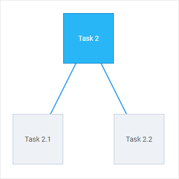
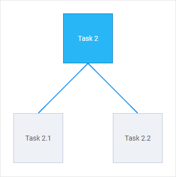
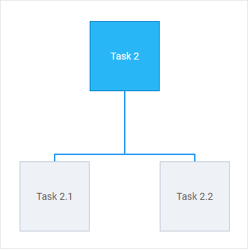
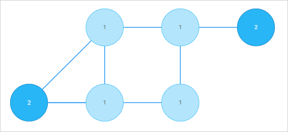
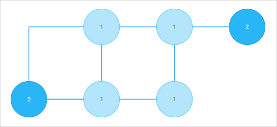
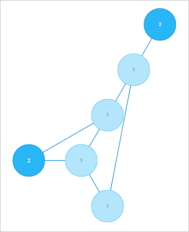
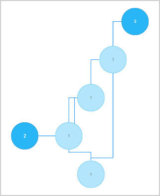

# autoplacement

### Description

@short: Optional. An object with configuration settings for auto-placement of shapes

:::info
The `autoplacement` property works only in the default mode of the diagram and only for shapes. It does not work if you use groups or swimlanes.

Autoplacement will be applied only after the [`autoPlace()`](/api/diagram/autoplace_method/) method is applied. 
:::

### Usage

~~~ts
autoplacement?: {
    mode?: "direct" | "edges", // "direct" by default
    graphPadding?: number, // 200 by default
    placeMode?: "orthogonal" | "radial", // "orthogonal" by default
    itemPadding?: number, // 20 by default
    levelPadding?: number // 20 by default
};
~~~

### Parameters

The `autoplacement` object has the following parameters:

- `mode` - (optional) the mode of connecting shapes, *"direct"* (by default) or *"edges"*
- `graphPadding` - (optional) sets the distance between two or more unconnected diagrams, *200* by default
- `placeMode` - (optional) sets the mode of placement of shapes, *"orthogonal"* (by default) or *"radial"*
- `itemPadding` - (optional) minimal padding between items (the minimal value is *1*), *20* by default
- `levelPadding` - (optional) minimal padding between hierarchy levels (the minimal value is *1*), *20* by default

### Default config

~~~jsx
autoplacement: {
    mode: "direct",
    graphPadding: 200,
    placeMode: "orthogonal",
    itemPadding: 20, 
    levelPadding: 20 
}
~~~

### Example

~~~jsx
const diagram = new dhx.Diagram("diagram_container", {
    autoplacement: {
        placeMode: "radial",
        mode: "direct",
        itemPadding: 10,
        levelPadding: 10,
        graphPadding: 100
    }
});

diagram.data.parse(data);

diagram.autoPlace();
~~~

## Modes of connecting shapes

### "direct" mode

Connector lines with no arrows are aligned "from center to center". They are straight and diagonal.

 

### "edges" mode

Connector lines are aligned "from side to side".

:::info
To add arrows to the lines, specify `forwardArrow: "filled"` or `backArrow: "filled"` in the configuration of a [line object](../../../lines/configuration_properties/).
:::

The connector lines in the "edges" mode can be:

- either straight (if you set the `connectType: "straight"` property of a [line object](../../../lines/configuration_properties/))

- or 90-degree curved (if you set the `connectType: "elbow"` property of a [line object](../../../lines/configuration_properties/))

## Modes of placement of shapes

### "orthogonal" mode

Shapes are arranged along vertical and horizontal lines

- **"orthogonal"** arrangement with lines in the **"direct"** mode

- **"orthogonal"** arrangement with lines in the **"edges"** mode

### "radial" mode

Shapes are arranged on imaginary circles relative to the central shape, i.e. the shape with the most connections

- **"radial"** arrangement with lines in the **"direct"** mode

- **"radial"** arrangement with lines in the **"edges"** mode

**Change log**: 

- The `itemPadding` and `levelPadding` parameters are added in v6.1.3
- The `placeMode` parameter is added in v5.0

**Related articles**:

- [Configuring autoplacement for shapes](../../../guides/diagram/configuration/#configuring-autoplacement-for-shapes)
- [Arranging shapes automatically](../../../guides/manipulating_items/#arranging-shapes-automatically)

**Related sample**: 

- [Diagram. Default mode. Radial autoplacement with padding options](https://snippet.dhtmlx.com/huut0l1s)
- [Diagram. Default mode. Arranging a generated radial dataset with autoplacement](https://snippet.dhtmlx.com/rwsime82)
