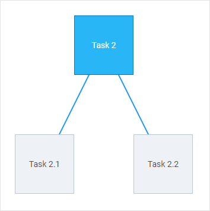

# autoplacement

@short: sets configuration for auto-placement of shapes

@signature: {`autoplacement?: IAutoPlacement;`}

@example:

var diagram = new dhx.Diagram("diagram_container", {
    autoplacement: {
		mode: "edges",
		graphPadding: 100
	}
});

diagram.parse(autoData);

@relatedsample:
**Related samples**:
- [Diagram. Autoplacement](https://snippet.dhtmlx.com/f3uekgjw)
- [Diagram. Diagram Editor. Autoplacement direct mode](https://snippet.dhtmlx.com/p1ybrkz2)
- [Diagram. Diagram Editor. Autoplacement edges mode](https://snippet.dhtmlx.com/1i65txcw)

@descr:

{{note The **autoplacement** property works only in the default mode of the diagram and only for shapes.}}

The `autoplacement` object can contain the following options:

- **mode** - (*string*) the mode of connecting shapes, "direct" (by default) or "edges"
- **graphPadding** - (*number*) sets the distance between unconnected diagrams, *"200"* by default

### Modes of connecting shapes

| mode: "direct"                                                                  | mode: "edges"                                                                       |
| :------------------------------------------------------------------------------ | :---------------------------------------------------------------------------------- |
| Connectors are aligned "from center to center"; they are straight and diagonal. | Connectors are aligned "from side to side"; they are straight and 90-degree curved. |
|                                                |                                                     |

**Related articles**

common_guides/configuration.md#configuringautoplacement

@changelog: added in v3.0
