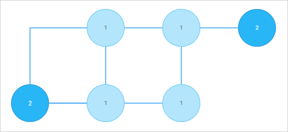
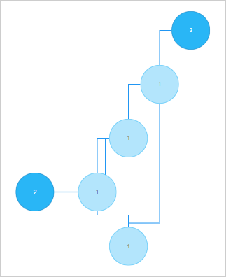

# autoplacement

### Description

@short: Optional. An object with configuration settings for auto-placement of shapes

:::info
The `autoplacement` property works only in the default mode of the diagram and only for shapes
:::

### Usage

~~~js
autoplacement?: {
    mode?: "direct" | "edges",
    graphPadding?: number,
    placeMode?: "orthogonal" | "radial"
};
~~~

### Parameters

The `autoplacement` object has the following parameters:

- `mode` - (optional) the mode of connecting shapes, "direct" (by default) or "edges"
- `graphPadding` - (optional) sets the distance between two or more unconnected diagrams, *"200"* by default
- `placeMode` - (optional) sets the mode of placement of shapes, "orthogonal" (by default) or "radial"

### Default config

~~~jsx
autoplacement: {
    mode: "direct",
    graphPadding: 200,
    placeMode: "orthogonal"
}
~~~

### Example

~~~jsx
const diagram = new dhx.Diagram("diagram_container", {
    autoplacement: {
        mode: "edges",
        graphPadding: 100
    }
});

diagram.data.parse(data);

diagram.autoPlace();
~~~

## Modes of connecting shapes

### "direct" mode

Connector lines with no arrows are aligned "from center to center". They are straight and diagonal.

 

### "edges" mode

Connector lines are aligned "from side to side". 

:::info 
To add arrows to the lines, specify `forwardArrow: "filled"` or `backArrow: "filled"` in the configuration of a [line object](../../../lines/configuration_properties/).
:::

The connector lines in the "edges" mode can be:

- either straight (if you set the `connectType: "straight"` property of a [line object](../../../lines/configuration_properties/))

- or 90-degree curved (if you set the `connectType: "elbow"` property of a [line object](../../../lines/configuration_properties/))

## Modes of placement of shapes

### "orthogonal" mode

Shapes are arranged along vertical and horizontal lines

- **"orthogonal"** arrangement with lines in the **"direct"** mode

- **"orthogonal"** arrangement with lines in the **"edges"** mode

### "radial" mode

Shapes are arranged on imaginary circles relative to the central shape, i.e. the shape with the most connections

- **"radial"** arrangement with lines in the **"direct"** mode

- **"radial"** arrangement with lines in the **"edges"** mode

**Change log**:

- The `placeMode` parameter is added in v5.0

**Related articles**:

- [Configuring autoplacement for shapes](../../../guides/diagram/configuration/#configuring-autoplacement-for-shapes)
- [Arranging shapes automatically](../../../guides/manipulating_items/#arranging-shapes-automatically)

**Related sample**: [Diagram. Default mode. Autoplacement](https://snippet.dhtmlx.com/f3uekgjw)
