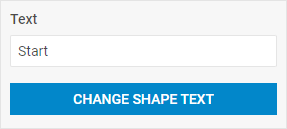

# Button 

@short: The basic button control that can have an icon.

## Usage

~~~jsx
{
    type: "button",
    text?: string,
    
    css?: string,
    disabled?: boolean, // false by default
    hidden?: boolean, // false by default
    height?: string | number | "content", // "content" by default
    width?: string | number | "content", // "content" by default
    padding?: string | number,

    // button view
    circle?: boolean, // false by default
    color?: "danger" | "secondary" | "primary" | "success", // "primary" by default
    full?: boolean, // false by default
    icon?: string,
    size?: "small" | "medium", // "medium" by default
    view?: "flat" | "link", // "flat" by default

    // service properties and methods 
    $on?: { [eventName: string]: function },
    $layout?: function
}
~~~

## Description

### Basic properties

- `type` - (required) the type of a control. Set it to *"button"*
- `text` - (optional) the text label of a button
- `css` - (optional) adds style classes to a control
- `disabled` - (optional) defines whether a control is enabled (*false*) or disabled (*true*). *false* by default
- `hidden` - (optional) defines whether a control is hidden. *false* by default
- `height` - (optional) the height of a control. *"content"* by default
- `width` - (optional) the width of a control. *"content"* by default
- `padding` - (optional) sets padding between a cell and a border of a button control
- `circle` - (optional) makes the corners of a button round. *false* by default
- `color` - (optional) defines the color scheme of a button: *"danger"* | *"secondary"* | *"primary"* | *"success"*. *"primary"* by default
- `full` - (optional) extends a button to the full width of the Editbar. *false* by default
- `icon` - (optional) sets the CSS class of an icon displayed inside the button
- `size` - (optional) defines the size of a button: *"small"* | *"medium"*. *"medium"* by default
- `view` - (optional) defines the look of a button: *"flat"* | *"link"*. *"flat"* by default

### Service properties and methods

:::warning
Note that it's highly not recommended to redefine the service properties and methods for the default types of controls, since it may cause breaks in their functionality. 
:::

- `$on` - (optional) - allows setting an event listener. The object has the following properties:
    - `eventName`  - a callback function which is called with the following parameters:
        - `object` - an object with the following properties:
            - `control` - the [Button](https://docs.dhtmlx.com/suite/form/button/) Form control
            - `editor` - the object of the Diagram Editor
            - `id` - the id of a Diagram item 
        - `arguments` - (optional) - the [original event arguments](https://docs.dhtmlx.com/suite/category/form-button-events/)
- `$layout` - (optional) - a callback function that allows setting the structure of a control. Returns the configuration of the [Button](https://docs.dhtmlx.com/suite/form/button/) Form control. Called with the following parameter:
    - `object` - the configuration of a control without service properties

## Example

~~~jsx {8-20}
const editor = new dhx.DiagramEditor("editor_container", {
    type: "default",
    view: {
        editbar: {
            properties: {
                $shape: [
                    { type: "input", label: "Text", placeholder: "Push the button", key: "text" },
                    {
                        type: "button",
                        full: true,
                        text: "Change shape text",
                        color: "danger",
                        $on: {
                            click: ({ id, editor }) => {
                                editor.diagram.data.update(id, {
                                    text: "New text"
                                });
                            }
                        }
                    }
                ]
            }
        }
    }
});
~~~
