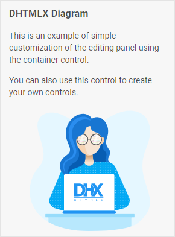

# Container

@short: The basic control for attaching an HTML code.

## Usage

~~~jsx
{
    type: "container",
    html: HTMLElement | string,
    wrap?: boolean, // false by default
    
    css?: string,
    disabled?: boolean, // false by default
    hidden?: boolean, // false by default
    height?: string | number | "content", // "content" by default
    width?: string | number | "content", // "content" by default
    padding?: string | number,

    // for `wrap:true` check the label properties for the Fieldset
    label?: string,
    labelWidth?: string | number,
    labelPosition?: "left" | "top", // "top" by default

    // service method
    $layout?: function
}
~~~

## Description

### Basic properties

- `type` - (required) the type of a control. Set it to *"container"*
- `html` - (required) the HTML content of a control
- `wrap` - (optional) allows displaying the external wrapping. *false* by default
- `css` - (optional) adds style classes to a control string
- `disabled` - (optional) defines whether a control is enabled (*false*) or disabled (*true*). *false* by default
- `hidden` - (optional) defines whether a control is hidden. *false* by default
- `height` - (optional) the height of a control. *"content"* by default
- `width` - (optional) the width of a control. *"content"* by default
- `padding` - (optional) sets padding between a cell and a border of a control
- `label` - (optional) specifies a label for the control
- `labelWidth` - (optional) sets the label width of the control
- `labelPosition` - (optional) defines the position of a label: *"left"* | *"top"*. *"top"* by default

#### Service properties and methods

:::warning
Note that it's highly not recommended to redefine the service properties and methods for the default types of controls, since it may cause breaks in their functionality. 
:::

- `$layout` - (optional) - a callback function that allows setting the structure of a control. Returns the configuration of the [Container](https://docs.dhtmlx.com/suite/form/container/) Form control. Called with the following parameter:
    - `object` - the configuration of a control without service properties

## Example

~~~jsx {7-18}
const editor = new dhx.DiagramEditor("editor_container", {
    type: "org",
    view: {
        editbar: {
            properties: {
                $default: [
                    {
                        type: "container",
                        html: `
                            <h3>DHTMLX Diagram</h3>
                            
This is an example of simple customization of the editing panel using the container control.

                            
You can also use this control to create your own controls.

                            
                        `
                    }
                ]
            }
        }
    }
});
~~~
