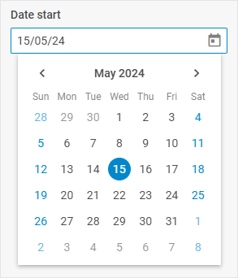

# Datepicker

@short: The basic control for selecting a date.

## Usage

~~~jsx
{
    type: "datepicker",
    key?: string | string[],
    wrap?: boolean, // false by default

    css?: string,
    disabled?: boolean, // false by default
    hidden?: boolean, // false by default
    height?: string | number | "content", // "content" by default
    width?: string | number | "content", // "content" by default
    padding?: string | number,

    date?: Date | string,
    dateFormat?: string, // "%d/%m/%y" by default
    disabledDates?: (date: Date) => boolean,
    icon?: string,
    mark?: (date: Date) => string,
    mode?: "calendar" | "month" | "year", // "calendar" by default
    placeholder?: string,
    thisMonthOnly?: boolean, // false by  default
    timeFormat?: 24 | 12, // 24 by default
    timePicker?: boolean, // false by default
    valueFormat?: "string" | "Date", // "string" by default
    weekNumbers?: boolean, // false by default
    weekStart?: "saturday" | "sunday" | "monday", // "sunday" by default

    // for `wrap:true` check the label properties for the Fieldset 
    label?: string,
    labelWidth?: string | number,
    labelPosition?: "left" | "top", // "top" by default

    // service properties and methods 
    $on?: { [eventName: string]: function },
    $handler?: function,
    $setValue?: function,
    $layout?: function
}
~~~

## Description

### Basic properties

- `type` - (required) the type of a control. Set it to *"datepicker"*
- `key` - (optional) the name of the specified/modified property or the path to it in the object of a Diagram item 
- `wrap` - (optional) allows displaying the external wrapping. *false* by default
- `css` - (optional) adds style classes to a control string
- `disabled` - (optional) defines whether a control is enabled (*false*) or disabled (*true*). *false* by default
- `hidden` - (optional) defines whether a control is hidden. *false* by default
- `height` - (optional) the height of a control. *"content"* by default
- `width` - (optional) the width of a control. *"content"* by default
- `padding` - (optional) sets padding between a cell and a border of a Datepicker control
- `date` - (optional) defines the date that will be opened when the calendar is created
- `dateFormat` - (optional) defines the format of dates in the calendar. *"%d/%m/%y"* by default. The date format must include delimiters (space or symbol), otherwise an error will be thrown
- `disabledDates` - (optional) allows disabling some date intervals, day labels are dimmed
- `icon` - (optional) the CSS class of an icon from the used icon font
- `mark` - (optional) allows adding a CSS class to specific days
- `mode` - (optional) specifies the mode of displaying a calendar: *"calendar"* | *"month"* | *"year"*. *"calendar"* by default
- `placeholder` - (optional) a tip for the input
- `thisMonthOnly` - (optional) hides dates of the previous/next months relative to the currently displayed one
- `timeFormat` - (optional) defines the time format of a timepicker, 12-hour or 24-hour: *12* | *24*. *24* by default
- `timePicker` - (optional) adds a timepicker into a calendar. *false* by default
- `valueFormat` - (optional) defines the format of the value that will be returned while getting the current value of the control: *"string"* | *"Date"*. *"string"* by default
- `weekNumbers` - (optional) defines whether to show the numbers of weeks, *false* by default
- `weekStart` - (optional) sets the starting day of the week: *"saturday"* | *"monday"* | *"sunday"*. *"sunday"* by default
- `label` - (optional) specifies a label for the control
- `labelWidth` - (optional) sets the label width of the control
- `labelPosition` - (optional) defines the position of a label: *"left"* | *"top"*. *"top"* by default

### Service properties and methods

:::warning
Note that it's highly not recommended to redefine the service properties and methods for the default types of controls, since it may cause breaks in their functionality. 
:::

- `$on` - (optional) - allows setting an event listener. The object has the following properties:
    - `eventName`  - a callback function which is called with the following parameters:
        - `object` - an object with the following properties:
            - `control` - the [Datepicker](https://docs.dhtmlx.com/suite/form/calendar/) Form control
            - `editor` - the object of the Diagram Editor
            - `id` - the id of a Diagram item 
        - `arguments` - (optional) - the [original event arguments](https://docs.dhtmlx.com/suite/category/form-datepicker-events/)
- `$handler` - (optional) - a callback function that allows handling actions on firing the `change` and `input` events of a form control and the `change` event of DataCollection. Called with the following parameter:
    - `object` - an object with the following properties:
        - `id` - the id of a Diagram item 
        - `key` - the name of the specified/modified property or the path to it in the object of a Diagram item 
        - `editor` - the object of the Diagram Editor
        - `control` - the object of the [Datepicker](https://docs.dhtmlx.com/suite/form/calendar/) Form control the component is built on
        - `value` - the new value of the [Datepicker](https://docs.dhtmlx.com/suite/form/calendar/) Form control
- `$setValue` - (optional) - a callback function that allows setting the value of the [Datepicker](https://docs.dhtmlx.com/suite/form/calendar/) Form control on initialization of a control and on changing the value in DataCollection. Called with the following parameter:
    - `object` - an object with the following properties:
        - `editor` - the object of the Diagram Editor
        - `control` - the object of the [Datepicker](https://docs.dhtmlx.com/suite/form/calendar/) Form control the component is built on
        - `value` - the value of a Diagram item 
- `$layout` - (optional) - a callback function that allows setting the structure of a control. Returns the configuration of the [Datepicker](https://docs.dhtmlx.com/suite/form/calendar/) Form control. Called with the following parameter:
    - `object` - the configuration of a control without service properties

## Example

~~~jsx {7-21}
const editor = new dhx.DiagramEditor("editor_container", {
    type: "org",
    view: {
        editbar: {
            properties: {
                $shape: [
                    {
                        type: "datepicker",
                        key: "date_start",
                        label: "Date start",
                        wrap: true,
                    },
                    {
                        type: "datepicker",
                        key: "date_end",
                        label: "Date end",
                        wrap: true,
                        valueFormat: "Date",
                        timePicker: true,
                        weekStart: "monday"
                    }
                ]
            }
        }
    }
});
editor.parse([
    { "id": "shape_1" },
    { "id": "shape_2", "parent": "shape_1", "date_start": "25/03/24", "date_end": new Date },
    { "id": "shape_3", "parent": "shape_1", "date_start": "25/03/24", "date_end": new Date }
]);
~~~
