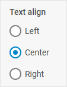

# RadioGroup

@short: The basic control for creating groups of Radio buttons.

## Usage

~~~jsx
{
    type: "radiogroup",
    options: {
        rows?: object[],
        cols?: object[],
        css?: string,
        height?: string | number | "content",
        padding?: string | number,
        width?: string | number | "content"
    },
    key?: string | string[],
    wrap?: boolean, // false by default

    disabled?: boolean, // false by default
    hidden?: boolean, // false by default

    css?: string,
    height?: string | number | "content", // "content" by default
    width?: string | number | "content", // "content" by default
    padding?: string | number,

   	// for `wrap:true` check the label properties for the Fieldset
    label?: string,
    labelWidth?: string | number,
    labelPosition?: "left" | "top", // "top" by default

    // service properties and methods 
    $on?: { [eventName: string]: function },
    $handler?: function,
    $setValue?: function,
    $layout?: function
}
~~~

Radio button configuration object inside RadioGroup:

~~~jsx
{
    value: string,
    text?: string,

    disabled?: boolean,
    hidden?: boolean,
    css?: string,
    height?: string | number | "content",
    width?: string | number | "content",
    padding?: string | number
}
~~~

## Description

### RadioGroup properties

#### Basic properties

- `type` - (required) the type of a control. Set it to "radioGroup"
- `key` - (optional) the name of the specified/modified property or the path to it in the object of a Diagram item 
- `wrap` - (optional) allows displaying the external wrapping. *false* by default
- `options` - (required) an object with options of a RadioGroup. The object can contain the following attributes:
	- `rows` - (optional) arranges [radio buttons](#radio-button-properties) inside the RadioGroup control vertically
	- `cols` - (optional) arranges [radio buttons](#radio-button-properties) inside the RadioGroup control horizontally
	- `css` - (optional) adds style classes to a RadioGroup
	- `height` - (optional) the height of a RadioGroup
	- `padding` - (optional) sets padding between a cell and a border of a RadioGroup
	- `width` - (optional) the width of a RadioGroup
- `disabled` - (optional) defines whether a control is enabled (*false*) or disabled (*true*). *false* by default
- `hidden` - (boolean) defines whether a RadioGroup is hidden. *false* by default
- `css` - (optional) adds style classes to a control
- `height` - (optional) the height of a control. *"content"* by default
- `width` - (optional) the width of a control. *"content"* by default
- `padding` - (optional) sets padding between a cell and a border of a RadioGroup control
- `label` - (optional) specifies a label for the control
- `labelWidth` - (optional) sets the label width of the control
- `labelPosition` - (optional) defines the position of a label: *"left"* | *"top"*. *"top"* by default

#### Service properties and methods

:::warning
Note that it's highly not recommended to redefine the service properties and methods for the default types of controls, since it may cause breaks in their functionality. 
:::

- `$on` - (optional) - allows setting an event listener. The object has the following properties:
    - `eventName`  - a callback function which is called with the following parameters:
        - `object` - an object with the following properties:
            - `control` - the [RadioGroup](https://docs.dhtmlx.com/suite/form/radiogroup/) Form control
            - `editor` - the object of the Diagram Editor
            - `id` - the id of a Diagram item 
        - `arguments` - (optional) - the [original event arguments](https://docs.dhtmlx.com/suite/category/form-radiogroup-events/)
- `$handler` - (optional) - a callback function that allows handling actions on firing the `change` event of the [RadioGroup](https://docs.dhtmlx.com/suite/form/radiogroup/) Form control and the `change` event of DataCollection. Called with the following parameter:
    - `object` - an object with the following properties:
        - `id` - the id of a Diagram item 
        - `key` - the name of the specified/modified property or the path to it in the object of a Diagram item 
        - `editor` - the object of the Diagram Editor
        - `control` - the object of the [RadioGroup](https://docs.dhtmlx.com/suite/form/radiogroup/) Form control the component is built on
        - `value` - the new value of the [RadioGroup](https://docs.dhtmlx.com/suite/form/radiogroup/) Form control
- `$setValue` - (optional) - a callback function that allows setting the value of the [RadioGroup](https://docs.dhtmlx.com/suite/form/radiogroup/) Form control on initialization of a control and on changing the value in DataCollection. Called with the following parameter:
    - `object` - an object with the following properties:
        - `editor` - the object of the Diagram Editor
        - `control` - the object of the [RadioGroup](https://docs.dhtmlx.com/suite/form/radiogroup/) Form control the component is built on
        - `value` - the value of a Diagram item 
- `$layout` - (optional) - a callback function that allows setting the structure of a control. Returns the configuration of the [RadioGroup](https://docs.dhtmlx.com/suite/form/radiogroup/) Form control. Called with the following parameter:
    - `object` - the configuration of a control without service properties

### Radio button properties 

- `value` - (required) the value of a radio button
- `text` - (optional) the text label of a radio button
- `disabled` - (optional) defines whether a control is enabled (*false*) or disabled (*true*). *false* by default
- `hidden` - (optional) defines whether a radio button is hidden. *false* by default
- `css` - (optional) adds style classes to a control
- `height` - (optional) the height of a control. *"content"* by default
- `width` - (optional) the width of a control. *"content"* by default
- `padding` - (optional) sets padding between a cell and a border of a radio button control

## Example

~~~jsx {7-28}
const editor = new dhx.DiagramEditor("editor_container", {
    type: "default",
     view: {
        editbar: {
            properties: {
                $shape: [
                    {
                        type: "radioGroup",
                        key: "textAlign",
                        label: "Text align",
                        wrap: true,
                        options: {
                            rows: [
                                {
                                    text: "Left",
                                    value: "left",
                                },
                                {
                                    text: "Center",
                                    value: "center",
                                },
                                {
                                    text: "Right",
                                    value: "right",
                                },
                            ]
                        },
                    },
                ]
            }
        }
    }
});
~~~