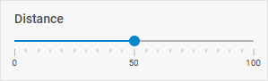

# Slider

@short: The basic control for selecting a numeric value by moving a thumb along a line with a fixed set of options.

## Usage

~~~jsx
{
    type: "slider",
    key?: string | string[],
    wrap?: boolean, // false by default
   
    disabled?: boolean, // false by default
    hidden?: boolean, // false by default
    css?: string,
    padding?: string | number,
    height?: string | number | "content", // "content" by default   
    width?: string | number | "content", // "content" by default

    inverse?: boolean, // false by default
    majorTick?: number,
    max?: number, // 100 by default
    min?: number, // 0 by default
    mode?: "vertical" | "horizontal", // "horizontal" by default
    range?: boolean, // false by default
    step?: number, // 1 by default
    tick?: number,
    tickTemplate?: (position: number) => string,
    tooltip?: boolean, // true by default
    
    // for `wrap:true` check the label properties for the Fieldset
    label?: string,
    labelWidth?: string | number,
    labelPosition?: "left" | "top", // "top" by default

    // service properties and methods 
    $on?: { [eventName: string]: function },
    $handler?: function,
    $setValue?: function,
    $layout?: function
}
~~~

## Description

### Basic properties

- `type` - (required) the type of a control. Set it to *"slider"*
- `key` - (optional) the name of the specified/modified property or the path to it in the object of a Diagram item 
- `wrap` - (optional) allows displaying the external wrapping. *false* by default
- `disabled` - (optional) defines whether a control is enabled (*false*) or disabled (*true*). *false* by default
- `hidden` - (optional) defines whether a control is hidden. *false* by default
- `css`	- (optional) adds style classes to a control
- `height` - (optional) the height of a control. *"content"* by default
- `width` - (optional) the width of a control. *"content"* by default
- `padding` - (optional) sets padding between a cell and a border of a slider control
- `inverse` - (optional) enables/disables the inverse slider mode. *false* by default
- `majorTick` - (optional) sets interval of rendering numeric values on the slider scale
- `max` - (optional) the maximal value of slider. *100* by default
- `min` - (optional) the minimal value of slider. *0* by default
- `mode` - (optional) the direction of the slider scale. *"horizontal"* by default
- `range` - (optional) enables/disables the possibility to select a range of values on the slider. *false* by default
- `step` - (optional) the step the slider thumb will be moved with. *1* by default
- `tick` - (optional) sets the interval of steps for rendering the slider scale
- `tickTemplate` - (optional) sets a template for rendering values on the scale
- `tooltip` - (optional) enables prompt messages with ticks values on hovering over the slider thumb. *true* by default

### Service properties and methods

:::warning
Note that it's highly not recommended to redefine the service properties and methods for the default types of controls, since it may cause breaks in their functionality. 
:::

- `$on` - (optional) - allows setting an event listener. The object has the following properties:
    - `eventName`  - a callback function which is called with the following parameters:
        - `object` - an object with the following properties:
            - `control` - the [Slider](https://docs.dhtmlx.com/suite/form/slider/) Form control
            - `editor` - the object of the Diagram Editor
            - `id` - the id of a Diagram item 
        - `arguments` - (optional) - the [original event arguments](https://docs.dhtmlx.com/suite/category/form-slider-events/)
- `$handler` - (optional) - a callback function that allows handling actions on firing the `change` event of the [Slider](https://docs.dhtmlx.com/suite/form/slider/) Form control and the `change` event of DataCollection. Called with the following parameter:
    - `object` - an object with the following properties:
        - `id` - the id of a Diagram item 
        - `key` - the name of the specified/modified property or the path to it in the object of a Diagram item 
        - `editor` - the object of the Diagram Editor
        - `control` - the object of the [Slider](https://docs.dhtmlx.com/suite/form/slider/) Form control the component is built on
        - `value` - the new value of the [Slider](https://docs.dhtmlx.com/suite/form/slider/) Form control
- `$setValue` - (optional) - a callback function that allows setting the value of the [Slider](https://docs.dhtmlx.com/suite/form/slider/) Form control on initialization of a control and on changing the value in DataCollection. Called with the following parameter:
    - `object` - an object with the following properties:
        - `editor` - the object of the Diagram Editor
        - `control` - the object of the [Slider](https://docs.dhtmlx.com/suite/form/slider/) Form control the component is built on
        - `value` - the value of a Diagram item 
- `$layout` - (optional) - a callback function that allows setting the structure of a control. Returns the configuration of the [Slider](https://docs.dhtmlx.com/suite/form/slider/) Form control. Called with the following parameter:
    - `object` - the configuration of a control without service properties

## Example

~~~jsx {7-18}
const editor = new dhx.DiagramEditor("editor_container", {
    type: "default",
     view: {
        editbar: {
            properties: {
                $lineTitle: [
                    {
                        type: "slider",
                        key: "distance",
                        label: "Distance",
                        wrap: true,
                        min: 0,
                        max: 100,
                        step: 1,
                        tick: 5,
                        majorTick: 10,
                        tickTemplate: value => value,
                    },
                ]
            }
        }
    }
});
editor.parse([
    { "id": "shape_1", "type": "rectangle", "text": "shape" },
    { "id": "shape_2","type": "rectangle", "text": "shape", "x": 400 },
    { "id": "line", "type": "line", "from": "shape_1", "to": "shape_2" },
    { "type": "lineTitle", "parent": "line", "text": "Title", "distance": 50 }
]);
~~~