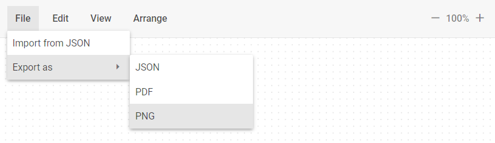
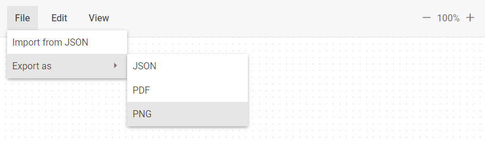
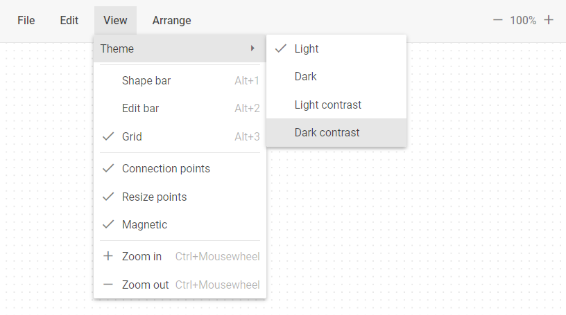
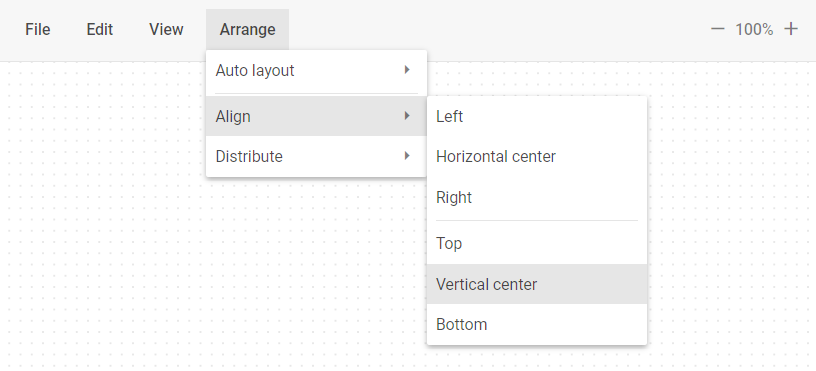
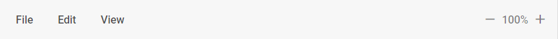

# items

### Description

@short: Optional. An array with controls arranged on Toolbar of Diagram Editor

### Usage

~~~js
items?: (obj | string)[];
~~~

### Configuring Items as Strings

The `items` property allows you to specify [**Service elements**](#service-elements) as an array of strings:

~~~js
items: [ "file", "edit", "view", "arrange", "spacer", "scale" ]
~~~

The full list of service element you can see [here](#service-elements).

### Configuring Items as Objects

The `items` property allows you to specify [**Service elements**](#service-elements) as an array of objects:

~~~js
items: [ 
    {
        id?: string,
        type: string,
        value?: string,
        hotkey?: string,
        icon?: string,
        checkIcon?: (editor: obj) => string,
        handler?: (editor: obj, event: Event) => void,
        css?: string | string[],
        hidden?: boolean,
        disabled?: boolean
    }, {...} 
]
~~~
#### Parameters

For each service element you can specify an object with the following parameters:

- `id` - (optional) - the ID of a service element. By default, the ID of a service element includes **$** and the **type** of the service element: **$file**
- `type` - (required) - the type of a service element. The full list of service element types you can see [here](#service-elements)
- `value` - (optional) - the labe of a service element
- `hotkey` - (optional) - the hotkey combination label of a service element
- `icon` - (optional) - the icon of a service element
- `checkIcon` - (optional) - the handler that allows you to define the icon class. It takes the Diagram Editor object as an argument and returns the icon css class
- `handler` - (optional) - the handler that runs when the ***click*** or ***inputChange*** events occurs. It takes the Diagram Editor object and a [native event](https://developer.mozilla.org/en-US/docs/Web/API/Event) as arguments
- `css` - (optional) - applies a custom css class to a service element
- `hidden` - (optional) - hides a service element
- `disabled` - (optional) - disables a sevice element

### Service elements

Toolbar items are represented by **service elements**. You can use and configure the following service elements:

- `file` - opens a drop-down menu with a group of service elements for importing and exporting files:
    - `importJson` - opens a dialog box to import a file in the JSON format
    - `export` - opens a drop-down submenu with a group of service elements for exporting a file in the following formats:
        - `exportJson` - exports a file in the JSON format
        - `exportPdf` - exports a file in the PDF format
        - `exportPng` - exports a file in the PNG format

In the **default** mode the `edit` collection of items looks in the following way:

In the **org/mindmap** modes the `edit` collection of items looks in the following way:

- `edit` - opens a drop-down menu with a group of service elements for managing and editing shapes, lines, groups, and swimlines
    - `undo` - takes a step back in the history of changes
    - `redo` - takes a step forward in the history of changes
    - `duplicate` - duplicates selected elements
    - `copy` - copies selected files to the `model` object
    - `paste` - pastes copied files from the `model` object
    - `copyStyle` - copies the selected element styles to the `model` object
    - `pasteStyle` - applies styles stored in the `model` object to the selected elements
    - `selectAll` - selects all the elements available for selection
    - `selectNone` - deselects all the available items

In the **default** mode the `edit` collection of items has the following default structure:

~~~jsx
- edit
    - undo
    - redo
    - separator
    - duplicate
    - copy
    - paste
    - separator
    - copyStyle
    - pasteStyle
    - separator
    - selectAll
    - selectNone
~~~

In the **org/mindmap** modes the `edit` collection of items has the following default structure:

~~~jsx
- edit
    - undo
    - redo
    - separator
    - copyStyle
    - pasteStyle
    - separator
    - selectAll
    - selectNone
~~~

- `view` - opens a drop-down menu with a group of service elements for managing view of Diagram Editor elements:
    - `theme` - opens a drop-down submenu with a group of service elements for applying the following themes:
        - `themeLight` - applies the **Light** theme
        - `themeDark` - applies the **Dark** theme
        - `themeLightContrast` - applies the **LightContrast** theme
        - `themeDarkContrast` - applies the **DarkContrast** theme
    - `shapebar` - shows/hides the **Shapebar** panel
    - `editbar` - shows/hides the **Editbar** panel
    - `grid` - shows/hides the **grid** on the Grid area
    - `connectionPoints` - shows/hides the **connection points**
    - `resizePoints` - shows/hides the **resize points**
    - `magnetic` - turns on/of the **magnetic** functionality
    - `zoomIn` - decreases the scale value by 0.05 (5%)
    - `zoomOut` - increases the scale value by 0.05 (5%)

In the **default** mode the `view` collection of items has the following default structure:

~~~jsx
- view
    - theme
        - themeLight
        - themeDark
        - themeLightContrast
        - themeDarkContrast
    - separator
    - shapebar
    - editbar
    - grid
    - separator
    - connectionPoints
    - resizePoints
    - magnetic
    - separator
    - zoomIn
    - zoomOut
~~~

In the **org/mindmap** modes the `view` collection of items has the following default structure:

~~~jsx
- view
    - theme
        - themeLight
        - themeDark
        - themeLightContrast
        - themeDarkContrast
    - separator
    - editbar
    - separator
    - grid
    - separator
    - resizePoints
    - itemsDraggable
    - separator
    - zoomIn
    - zoomOut
~~~

- `arrange` - opens a drop-down menu with a group of service elements for arranging Diagram Editor elements:
    - `layout` - opens a drop-down submenu with a group of service elements to autoplace Diagram Editor elements:
        - `layoutMode` - opens a drop-down submenu with a group of service elements for managing the autoplacement mode:
            - `layoutModeDirect` - applies the **direct** mode of the element commectors
            - `layoutModeEdges` - applies the **edges** mode of the element commectors
        - `layoutOrthogonal` - applies the `orthogonal` mode of the element arrangement
        - `layoutRadial` - applies the `radial` mode of the element arrangement
    - `align` - opens a drop-down submenu with a group of service elements for managing alignment of the Diagram Editor elements:
        - `alignHorizontalLeft` - aligns elements horizontally on the left
        - `alignHorizontalCenter` - aligns elements horizontally in the center
        - `alignHorizontalRight` - aligns elements horizontally on the right
        - `alignVerticalTop` - aligns elements vertically at the top
        - `alignVerticalCenter` - aligns elements vertically in the center
        - `alignVerticalBottom` - aligns elements vertically at the bottom
    - `distribute` - opens a drop-down submenu with a group of service elements for distributing of the Diagram Editor elements
        - `distributeVertical` - distributes elements vertically
        - `distributeHorizontal` - distributes elements horizontally

In the **default** mode the `arrange` collection of items has the following default structure:

~~~jsx
- arrange
    - layout
        - layoutMode
            - layoutModeDirect
            - layoutModeEdges
        - separator
        - layoutOrthogonal
        - layoutRadial
    - align
        - alignHorizontalLeft
        - alignHorizontalCenter
        - alignHorizontalRight
        - separator
        - alignVerticalTop
        - alignVerticalCenter
        - alignVerticalBottom
    - distribute
        - distributeVertical
        - distributeHorizontal
~~~

- `scale` - the control that allows user to increase or decrease the scale value by 0.05 (5%)

In the **default** mode the `scale` item looks in the following way:

In the **org/mindmap** modes the `scale` item looks in the following way:

### Base elements

Besides default [**Service elements**](#service-elements), you can also specify the following **Base elements**:

- [Button](https://docs.dhtmlx.com/suite/toolbar/button/)
- [Custom HTML](https://docs.dhtmlx.com/suite/toolbar/customhtmlbutton/)
- [Datepicker](https://docs.dhtmlx.com/suite/toolbar/datepicker/)
- [ImageButton]( https://docs.dhtmlx.com/suite/toolbar/image_button/)
- [Input](https://docs.dhtmlx.com/suite/toolbar/input/)
- [MenuItem](https://docs.dhtmlx.com/suite/toolbar/menuitem/)
- [NavItem](https://docs.dhtmlx.com/suite/toolbar/navitem/)
- [SelectButton](https://docs.dhtmlx.com/suite/toolbar/selectbutton/)
- [Separator](https://docs.dhtmlx.com/suite/toolbar/separator/)
- [Spacer](https://docs.dhtmlx.com/suite/toolbar/spacer/)
- [Title](https://docs.dhtmlx.com/suite/toolbar/title/)

### Default config

~~~jsx
// Default config for Toolbar in the "default" mode
const defaultConfig = [ "file", "edit", "view", "arrange", "spacer", "scale" ];

// Default config for Toolbar in the "org" and "mindmap" modes
const defaultConfig = [
    "file",
    {
        type: "edit",
        items: [
            "undo",
            "redo",
            "separator",
            "copyStyle",
            "pasteStyle",
            "separator",
            "selectAll",
            "selectNone"
        ]
    },
    {
        type: "view",
        items: [
            "theme",
            "separator",
            "editbar",
            "separator",
            "grid",
            "separator",
            "resizePoints",
            "itemsDraggable",
            "separator",
            "zoomIn",
            "zoomOut"
        ]
    },
    "spacer",
    "scale"
]
~~~

### Example

~~~js {7-11}
const editor = new dhx.DiagramEditor("editor", {
    type: "default",
    view: {
        toolbar: {
            css: "custom_css",
            navigationType: "pointer"
            items: [
                "file", 
                "spacer", 
                "scale"
            ]
        }
    }
});
~~~

**Change log**: Added in v6.0
