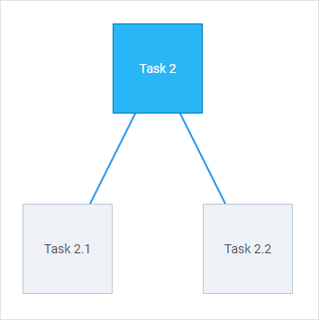
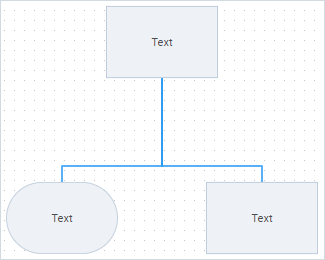

# autoplacement

:::info
The **autoplacement** property works only in the default mode of the editor (*type:"default"*) and only for shapes
:::

### Description

@short: Optional. An object with configuration settings for auto-placement of shapes

### Usage

~~~js
autoplacement?: {
	mode?: "direct" | "edges",
	graphPadding?: number
};
~~~

### Parameters

The **autoplacement** object has the following parameters:

- `mode` - (optional) the mode of connecting shapes, "direct" (by default) or "edges"
- `graphPadding` - (optional) sets the distance between unconnected diagrams, *"200"* by default

### Default config

~~~js
autoplacement: {
	mode: "direct",
	graphPadding: 200
}
~~~

### Example

~~~js
const editor = new dhx.DiagramEditor("editor_container", {
    autoplacement: {
        graphPadding: 100,
        mode: "edges"
    }
});
~~~

### Modes of connecting shapes

| mode: "direct"                                                                  | mode: "edges"                                                                       |
| :------------------------------------------------------------------------------ | :---------------------------------------------------------------------------------- |
| Connectors are aligned "from center to center"; they are straight and diagonal. | Connectors are aligned "from side to side"; they are straight and 90-degree curved. |
|                                                |                                                     |

**Change log**:  added in v3.0

**Related samples**:
- [Diagram editor. Default mode. Autoplacement direct mode](https://snippet.dhtmlx.com/p1ybrkz2)
- [Diagram editor. Default mode. Autoplacement edges mode](https://snippet.dhtmlx.com/1i65txcw)