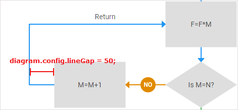

# lineGap

:::info
The property is available only in the default mode of the editor (*type:"default"*). The property does not work if you use groups or swimlanes.
:::

### Description

@short: optional, adds an offset for two connected shapes, and fills the gap with an additional line

### Usage

~~~js
lineGap?: number;
~~~

### Default config

~~~js
lineGap: 10
~~~

### Example

~~~js
const editor = new dhx.DiagramEditor("editor_container", {
    lineGap: 50
});
~~~

The result of applying the **lineGap** property is shown in the image below:

