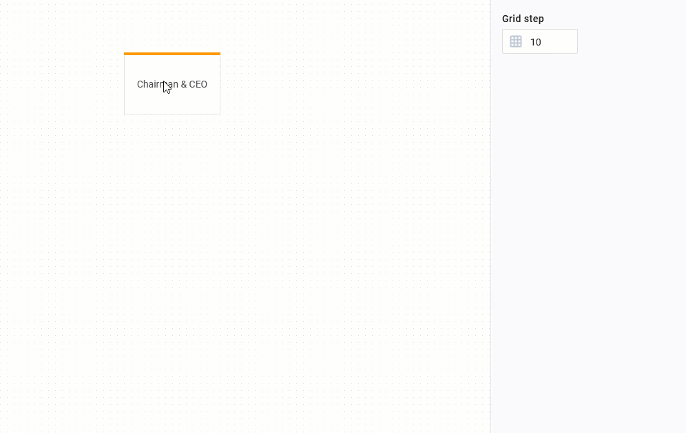
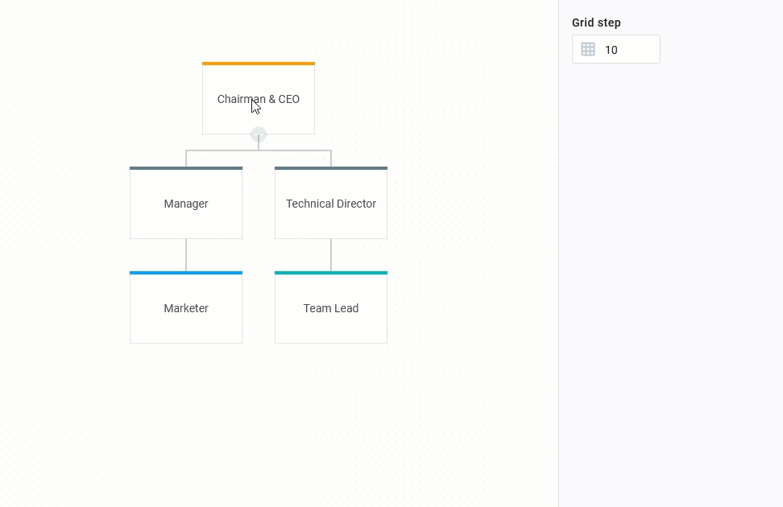

# DHTMLX Diagram Editor overview

The DHTMLX Diagram component provides you with Editor that allows you to try and apply your designer skills in building neat and nice-looking diagrams.

### Editor in the default mode

The interface of the editor initialized in the default mode consists of four functional parts: 

- [toolbar](../guides/diagram_editor/toolbar/)
- [shapebar](../guides/diagram_editor/shapebar/) 
- [grid area](../guides/diagram_editor/grid_area/)
- [editbar](../guides/diagram_editor/editbar/)

To build a diagram, you need either to drag the necessary items from the shapebar or create a copy of the items via the shape toolbar.

You can adjust the attributes of the items via [sidebar options of the editbar](../guides/diagram_editor/editbar/). To accelerate the styling process, use `Alt (Option) + Ctrl (Cmd) + С` combination to copy styles of an item and `Alt (Option) + Ctrl (Cmd) + V` to apply these styles to the chosen items.

| [Diagram Editor. Default mode. Wide flowchart](https://snippet.dhtmlx.com/4d4k3o8p) |
| ----------------------------------------------------------------------------------- |
|                                                		  |                                          		  

You may customize the [shapebar](../guides/diagram_editor/shapebar/) and, if you have added a custom shape, [configure the editbar](/api/diagram_editor/editbar/config/properties_property/) according to the attributes of your shape.

### Editor in the org chart mode

The interface of the editor initialized in the org chart mode consists of three functional parts: 

- [toolbar](../guides/diagram_editor/toolbar/)
- [grid area](../guides/diagram_editor/grid_area/)
- [editbar](../guides/diagram_editor/editbar/)

:::note
Note, the editor in this mode does not have the shapebar
:::

To build a diagram in the org chart mode of the editor, you need to select a shape and add a new child for it. You can drag the shapes from one parent item to another. The moved item is being dragged with all its child items.

You can adjust the attributes of the shapes via the available [sidebar options of the editbar](../guides/diagram_editor/editbar/). To accelerate the styling process, use `Alt (Option) + Ctrl (Cmd) + С` combination to copy styles of an item and `Alt (Option) + Ctrl (Cmd) + V` to apply these styles to the chosen items.

| [Diagram editor. Org chart mode. Basic initialization](https://snippet.dhtmlx.com/og4qm3ja) |
| ------------------------------------------------------------------------------------------- |
|                                                    |

If you've added a custom shape to the editor in the org chart mode, you can [configure the editbar](/api/diagram_editor/editbar/config/properties_property/) to be able to edit custom properties of the shape.

You can add the **assistant** or **partner** items for a parent shape of any level. The assistant or partner items can't be the parent items.

| [Diagram editor. Org chart mode. Basic initialization](https://snippet.dhtmlx.com/og4qm3ja) |
| ------------------------------------------------------------------------------------------- |
|                                          |

The connection between the parent shape and its partner is always horizontal. Also, the connections between the parent shape and all its children become horizontal after adding a partner item for the parent, even if the connections have been vertical before.

| [Diagram editor. Org chart mode. Basic initialization](https://snippet.dhtmlx.com/og4qm3ja) |
| ------------------------------------------------------------------------------------------- |
|                                            |

### Editor in the mindmap mode

The interface of the editor initialized in the mindmap mode consists of three parts:

- [toolbar](../guides/diagram_editor/toolbar/)
- [grid area](../guides/diagram_editor/grid_area/)
- [editbar](../guides/diagram_editor/editbar/)

:::note
Note, the editor in this mode does not have the shapebar
:::

To build a diagram in the mindmap mode of the editor, you need to select a shape and add a new child for it. You can drag the shapes from one parent item to another. The moved item is being dragged with all its child items.

You can adjust the attributes of the shapes via the available [sidebar options of the editbar](../guides/diagram_editor/editbar/). To accelerate the styling process, use `Alt (Option) + Ctrl (Cmd) + С` combination to copy styles of an item and `Alt (Option) + Ctrl (Cmd) + V` to apply these styles to the chosen items.

| [Diagram editor. Mindmap mode. Emotions mind map](https://snippet.dhtmlx.com/lo1vm0e8) |
| -------------------------------------------------------------------------------------- |
|                                                |

If you've added a custom shape to the editor in the mindmap mode, you can [configure the editbar](/api/diagram_editor/editbar/config/properties_property/) to be able to edit custom properties of the shape.

## What's next

That's all. Now you can start working with diagrams or keep exploring the inner world of JavaScript Diagram and Diagram Editor in the [guides](../guides/overview/).
