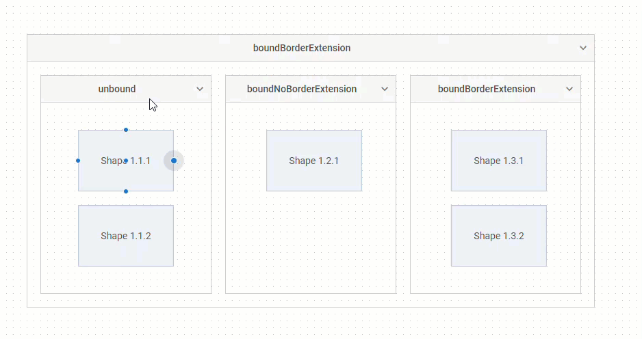

# Groups

## Group overview

A group is a separate kind of the Diagram items. You can draw simple or more complicated schemes by grouping shapes or other groups in different ways. It is possible to create as one-level groups as nested groups, to configure their appearance and behavior.

:::note
Groups are available only in the default mode of Diagram/Diagram Editor (type: "default").
:::

<iframe src="https://snippet.dhtmlx.com/0hf8ahrb?mode=result" frameborder="0" class="snippet_iframe" width="100%" height="650"></iframe>

## Creating groups

To create a group, specify *"$group"* as a value of the **type** attribute inside the group object while preparing a related JSON structure to load into the diagram:

~~~jsx
const data = [
    {
        type: "$group",
        id: 1,
        width: 400,
        height: 200,
        x: 0,
        y: 0,
        header: {
            text: "User Access"
        },
        groupChildren: ["1.1", "1.2"]
    },
    {
        type: "it",
        id: "1.1",
        x: 50,
        y: 75,
        text: "Remote Desktop"
    },
    {
        type: "it",
        id: "1.2",
        x: 200,
        y: 75,
        text: "Login Server"
    },
];

// initializing a diagram
const diagram = new dhx.Diagram("diagram_container");
diagram.data.parse(data);
~~~

### Properties

See [the full list of configuration properties of a `group` object](/groups/configuration_properties/) which allow you to configure the positioning and appearance of the group.

## Grouping shapes in the PERT mode

To group the `task` and `milestone` types of shapes in the PERT mode of the Diagram, use the `project` object in the data set of a diagram. The `"project"` object serves as a container for tasks and milestones, working as a group. It allows creating PERT charts with various nesting levels and provides visual grouping.

~~~jsx
const data = [
    { 
        "id": "4.2", 
        "text": "QA Testing", 
        "type": "project", 
        "parent": "4", 
        "start_date": new Date(2026, 1, 18), 
        "duration": 3, 
        "progress": 0, 
        "open": true 
    },
    { 
        "id": "4.2.1", 
        "text": "Functional Testing", 
        "type": "task", 
        "parent": "4.2", 
        "start_date": new Date(2026, 1, 18), 
        "duration": 2 
    },
    { 
        "id": "4.2.2", 
        "text": "Usability Testing", 
        "type": "task", 
        "parent": "4.2", 
        "start_date": new Date(2026, 1, 20), 
        "duration": 1
    }
];
~~~

### Properties

See [the full list of configuration properties of a `project` object](/groups/configuration_properties/#properties-specific-for-project-shapes) which allow you to configure the positioning and appearance of tasks and milestones in the project.

## Configuring the group header

The header of the group is disabled by default. To create a group with the header, you should specify the **header** property in the configuration object of the group.

~~~jsx
const data = [
    {
        type: "$group", 
        id: 1, 
        width: 400,
        height: 200,
        x: 0,
        y: 0,
        header: {}
    }
];
~~~

The property contains a lot of attributes which allow you to easily adjust the configuration of the group header.
For example, you can define the height of the header and its position, specify the text for your header and adjust its settings.

<iframe src="https://snippet.dhtmlx.com/6hunrja8?mode=js" frameborder="0" class="snippet_iframe" width="100%" height="470"></iframe>

Check [the full list of API properties of the group object](/groups/configuration_properties/).

### A header icon

To be able to collapse/expand a group, you need to enable the **closable** attribute of the [header](/groups/configuration_properties/) property. As a result, an icon, which allows a user to expand/collapse a group, will be added to the header.

~~~jsx
const data = [
    {
        type: "$group", 
        id: 1, 
        width: 400,
        height: 200,
        x: 0,
        y: 0,
        header: {
            text: "Top and collapsed header with tеxt alignment",
            closable: true
        }
    }
];
~~~

You can change the color of the icon via the **iconColor** attribute of the [group object](/groups/configuration_properties/).

## Configuring the behavior of group items

By default, you can drag any child item of the group out of the group and drag it into another group.
To change the behavior of the group items you need to use the **groupBehavior** and **padding** attributes of the **exitArea** property of the [group object](/groups/configuration_properties/).

:::note
The **exitArea** property defines the behavior of the first-level children of the configurable group only.
:::

<iframe src="https://snippet.dhtmlx.com/4gxy38ek?mode=js" frameborder="0" class="snippet_iframe" width="100%" height="550"></iframe>

The *"unbound"* and *"boundBorderExtension"* values of the **groupBehavior** attribute allows you to define whether the child items can be moved out of the group, and to make the group borders expand when a user is trying to drag an item outside. If needed you can also disable the ability to drag items outside the group via the *"boundNoBorderExtension"* value.

If *groupBehavior: "boundNoBorderExtension" | "boundBorderExtension"* is set, you can specify the padding between the group and the edge of the item when moving the item inside the group. For this purpose, use the **padding** attribute:

~~~jsx
const data = [
    {
        type: "$group",
        id: 1,
        width: 830,
        height: 400,
        x: 0,
        y: 0,
        exitArea: {
            groupBehavior: "boundBorderExtension",
            padding: 10
        },
        //fixed: true,
        groupChildren: ["1.1", "1.2", "1.3"]
    },
    // ...
];
~~~
