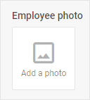

# Avatar

@short: The basic control for uploading of images.

## Usage

~~~jsx
{
    type: "avatar",
    key?: string, // "img" by default
    wrap?: boolean, // false by default
    target?: string,

    hidden?: boolean, // false by default
    disabled?: boolean, // false by default
    readOnly?: boolean, // false by default

    removeIcon?: boolean, // true by default 
    circle?: boolean, // false by default
    icon?: string,
    placeholder?: string,
    preview?: string,
    alt?: string,
    size?: "small" | "medium" | "large" | number, // "medium" by default

    css?: string,
    width?: string | number | "content", // "content" by default
    height?: string | number | "content", // "content" by default
    padding?: string | number,

    // for `wrap:true` check the label properties for the Fieldset
    label?: string,
    labelWidth?: string | number,
    labelPosition?: "left" | "top", // "top" by default

    accept?: string, // "image/*" by default
    fieldName?: string, // "file" by default
    autosend?: boolean, // false by default
    params?: { [key: string]: any },
    headerParams?: { [key: string]: any },
    updateFromResponse?: boolean,  // true by default

    // service properties and methods 
    $on?: { [eventName: string]: function },
    $handler?: function,
    $setValue?: function,
    $layout?: function
~~~

## Description

### Basic properties

- `type` - (required) the type of a control. Set it to *"avatar"*
- `key` - (optional) the name of the specified/modified property in the object of a Diagram item. *"img"* by default
- `wrap` - (optional) allows displaying the external wrapping. *false* by default
- `target` - (optional) sets an URL to the server-side script that will process file upload, the property is required when an image is sent to the server via the control
:::note
While loading an image and sending it to the server via the `target` property, note that the [*value* object](https://docs.dhtmlx.com/suite/form/api/avatar/api_avatar_properties/#description) will be sent to the server. The file itself will be recorded in the dataset in the *base64* format. You can redefine this logic using the [service methods](#service-properties-and-methods). 
:::
- `hidden` - (optional) defines whether a control is hidden. *false* by default
- `disabled` - (optional) defines whether a control is enabled (*false*) or disabled (*true*). *false* by default
- `readOnly` - (optional) sets the readonly mode for the control. *false* by default
- `removeIcon` - (optional) enables the possibility to clear the control by means of the UI. *true* by default
- `circle` - (optional) sets the mode of displaying the control with rounded corners. *false* by default
- `icon` - (optional) allows setting the CSS class of an icon when there is no image uploaded, doesn't work together with the `preview` property
- `placeholder` - (optional) allows setting a text to be visible when there is no image uploaded, doesn't work together with the `preview` property
- `preview` - (optional) specifies the absolute path to the preview image. The preview image is visible, when an image is not uploaded
- `alt` - (optional) sets the attribute of the &lt;img&gt; tag - an alternative text when there is no image uploaded
- `size` - (optional) allows setting one of the three basic control's sizes: *"small" | "medium" | "large"* , or applying a custom size in px. *"medium"* by default
- `css` - (optional) adds style classes to a control
- `width` - (optional) the width of a control. *"content"* by default
- `height` - (optional) the height of a control. *"content"* by default
- `padding` - (optional) sets padding between a cell and a border of the Avatar control
- `label` - (optional) specifies a label for the control
- `labelWidth` - (optional) sets the label width of the control
- `labelPosition` - (optional) defines the position of a label: *"left" | "top"*. *"top"* by default
- `accept` - (optional) allows specifying the type/extension of the selected file. *"image/*"* by default. [Check details](https://developer.mozilla.org/en-US/docs/Web/HTML/Attributes/accept#unique_file_type_specifiers)
- `fieldName` - (optional) sets the file field name in the form data sent to the server. *"file"* by default
- `autosend` - (optional) enables/disables automatic sending of an added file. *false* by default
- `params` - (optional) adds extra parameters for sending an XMLHttpRequest
- `headerParams` - (optional) provides additional parameters for Request Headers
- `updateFromResponse` - (optional) updates file attributes with the data from the server response. *true* by default

### Service properties and methods

:::warning
Note that it's highly not recommended to redefine the service properties and methods for the default types of controls, since it may cause breaks in their functionality. 
:::

- `$on` - (optional) - allows setting an event listener. The object has the following properties:
    - `eventName`  - a callback function which is called with the following parameters:
        - `object` - an object with the following properties:
            - `control` - the [Avatar](https://docs.dhtmlx.com/suite/form/avatar/) Form control
            - `editor` - the object of the Diagram Editor
            - `id` - the id of a Diagram item 
        - `arguments` - (optional) - the [original event arguments](https://docs.dhtmlx.com/suite/category/form-avatar-events/)
- `$handler` - (optional) - a callback function that allows handling actions on firing the `change` event of the [Avatar](https://docs.dhtmlx.com/suite/form/avatar/) Form control and the `change` event of DataCollection. Called with the following parameter:
    - `object` - an object with the following properties:
        - `id` - the id of a Diagram item 
        - `key` - the name of the specified/modified property in the object of a Diagram item 
        - `editor` - the object of the Diagram Editor
        - `control` - the object of the [Avatar](https://docs.dhtmlx.com/suite/form/avatar/) Form control the component is built on
        - `value` - the new value of the [Avatar](https://docs.dhtmlx.com/suite/form/avatar/) Form control
- `$setValue` - (optional) - a callback function that allows setting the value of the [Avatar](https://docs.dhtmlx.com/suite/form/avatar/) Form control on initialization of a control and on changing the value in DataCollection. Called with the following parameter:
    - `object` - an object with the following properties:
        - `editor` - the object of the Diagram Editor
        - `control` - the object of the [Avatar](https://docs.dhtmlx.com/suite/form/avatar/) Form control the component is built on
        - `value` - the value of a Diagram item 
- `$layout` - (optional) - a callback function that allows setting the structure of a control. Returns the configuration of the [Avatar](https://docs.dhtmlx.com/suite/form/avatar/) Form control. Called with the following parameter:
    - `object` - the configuration of the control without service properties

## Example

~~~jsx {7-19}
const editor = new dhx.DiagramEditor("editor_container", {
    type: "default",
    view: {
        editbar: {
            properties: {
                "img-card": [
                    {
                        type: "avatar",
                        accept: "image/*",
                        fieldName: "file",
                        target: "https://docs.dhtmlx.com/suite/backend/upload",
                        params: {
                            "firstCustomParam": "customValue",
                        },
                        headerParams: {
                            "firstCustomParam": "customValue",
                        },
                        autosend: true,
                    },
                ]
            }
        }
    }
});
~~~