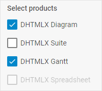

# CheckboxGroup

@short: A control intended for creating groups of checkboxes.

## Usage

~~~js
{
    type: "checkboxGroup",
    options: {
        rows?: object[],
        cols?: object[],
        css?: string,
        height?: string | number | "content", // "content" by default
        width?: string | number | "content", // "content" by default
        padding?: string | number,
    },
    key?: string | string[],
    wrap?: boolean, // false by default
    
    css?: string,
    disabled?: boolean, // false by default
    hidden?: boolean, // false by default
    height?: string | number | "content", // "content" by default
    width?: string | number | "content", // "content" by default
    padding?: string | number,
    
    // for `wrap:true` check the label properties for the Fieldset
    label?: string,
    labelWidth?: string | number,
    labelPosition?: "left" | "top", // "top" by default

    // service properties and methods 
    $on?: { [eventName: string]: function },
    $handler?: function,
    $setValue?: function,
    $layout?: function
}
~~~

Checkbox configuration object inside a CheckboxGroup:

~~~js
{
    id: string,
    text: string,
    value?: string,

    css?: string,
    disabled?: boolean, // false by default
    hidden?: boolean, // false by default
    height?: string | number | "content", // "content" by default
    width?: string | number | "content", // "content" by default
    padding?: string | number
}
~~~

The objects with the `checkbox` configuration inside the control can be used both with the *boolean* value and the *string* one, if the `value` property is specified. [Check the example below](#example) to get the idea.

## Description

### CheckboxGroup properties

#### Basic properties

- `type` - (required) the type of a control, set it to *"checkboxGroup"*
- `key` - (optional) the name of the specified/modified property or the path to it in the object of a Diagram item 
- `wrap` - (optional) allows displaying the external wrapping, *false* by default
- `options` - (required) an object with options of a CheckboxGroup. The object can contain the following attributes:
    - `rows` - (optional) arranges [checkboxes](#checkbox-properties) inside the CheckboxGroup control vertically
    - `cols` - (optional) arranges [checkboxes](#checkbox-properties) inside the CheckboxGroup control horizontally
    - `css` - (optional) adds style classes to a CheckboxGroup
    - `height` - (optional) the height of a CheckboxGroup
    - `padding` - (optional) sets padding between a cell and a border of a CheckboxGroup
    - `width` - (optional) the width of a CheckboxGroup
- `css` - (optional) adds style classes to a control
- `disabled` - (optional) defines whether a control is enabled (*false*) or disabled (*true*)
- `hidden` - (boolean) defines whether a CheckboxGroup is hidden, *false* by default
- `height` - (optional) the height of a control, *"content"* by default
- `width` - (optional) the width of a control, *"content"* by default
- `padding` - (optional) sets padding between a cell and a border of a CheckboxGroup control
- `label` - (optional) specifies a label for the control
- `labelWidth` - (optional) sets the label width of the control
- `labelPosition` - (optional) defines the position of a label: *"left" | "top"*, *"top"* by default

#### Service properties and methods

:::warning
Note that it's highly not recommended to redefine the service properties and methods for the default types of controls, since it may cause breaks in their functionality. If you need to modify the default controls, you should [create a new control type via the `controls` property](/api/diagram_editor/editbar/config/controls_property/). 
:::

- `$on` - (optional) - allows setting an event listener. The object has the following properties:
    - `eventName`  - a callback function which is called with the following parameters:
        - `object` - an object with the following properties:
            - `control` - the [CheckboxGroup](https://docs.dhtmlx.com/suite/form/checkboxgroup/) Form control
            - `editor` - the object of the Diagram Editor
            - `id` - the id of a Diagram item 
        - `arguments` - (optional) - the [original event arguments](https://docs.dhtmlx.com/suite/category/form-checkboxgroup-events/)
- `$handler` - (optional) - a callback function that allows handling actions on firing the `change` event of the [CheckboxGroup](https://docs.dhtmlx.com/suite/form/checkboxgroup/) Form control and the `change` event of DataCollection. Called with the following parameter:
    - `object` - an object with the following properties:
        - `id` - the id of a Diagram item 
        - `key` - the name of the specified/modified property or the path to it in the object of a Diagram item 
        - `editor` - the object of the Diagram Editor
        - `control` - the object of the [CheckboxGroup](https://docs.dhtmlx.com/suite/form/checkboxgroup/) Form control the component is built on
        - `value` - the new value of the [CheckboxGroup](https://docs.dhtmlx.com/suite/form/checkboxgroup/) Form control
- `$setValue` - (optional) - a callback function that allows setting the value of the [CheckboxGroup](https://docs.dhtmlx.com/suite/form/checkboxgroup/) Form control on initialization of a control and on changing the value in DataCollection. Called with the following parameter:
    - `object` - an object with the following properties:
        - `editor` - the object of the Diagram Editor
        - `control` - the object of the [CheckboxGroup](https://docs.dhtmlx.com/suite/form/checkboxgroup/) Form control the component is built on
        - `value` - the value of a Diagram item 
- `$layout` - (optional) - a callback function that allows setting the structure of a control. Returns the configuration of the [CheckboxGroup](https://docs.dhtmlx.com/suite/form/checkboxgroup/) Form control. Called with the following parameter:
    - `object` - the configuration of a control without service properties

### Checkbox properties 

- `id` - (optional) the id of a control, auto-generated if not set
- `text` - (optional) the text label of a checkbox
- `value` - (optional) the value of a checkbox
- `css` - (optional) adds style classes to a control
- `disabled` - (optional) defines whether a control is enabled (*false*) or disabled (*true*), *false* by default
- `hidden` - (optional) defines whether a checkbox is hidden, *false* by default
- `height` - (optional) the height of a control, *"content"* by default
- `width` - (optional) the width of a control, *"content"* by default
- `padding` - (optional) sets padding between a cell and a border of a Checkbox control

## Example

~~~js {7-19}
const editor = new dhx.DiagramEditor("editor_container", {
    type: "default",
    view: {
        editbar: {
            properties: {
                $shape: [
                    {
                        type: "checkboxGroup",
                        label: "Select products",
                        key: "products",
                        options: {
                            rows: [
                                { id: "diagram", text: "DHTMLX Diagram", value: "diagram" },
                                { id: "suite", text: "DHTMLX Suite", value: "suite" },
                                { id: "gantt", text: "DHTMLX Gantt" },
                                { id: "spreadsheet", text: "DHTMLX Spreadsheet", disabled: true },
                            ],
                        }
                    },
                ],
            }
        }
    }
});
editor.parse([
    { 
        "type": "rectangle", 
        "products": { 
            "diagram": "diagram", 
            "suite": "", 
            "gantt": true, 
            "spreadsheet": false 
        } 
    }
]);
~~~