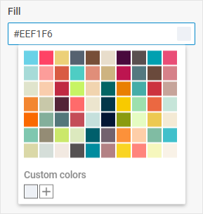

# Colorpicker

@short: An input with a color picker attached to it for selecting a color.

## Usage

~~~js
{
    type: "colorpicker",
    key?: string | string[],
    wrap?: boolean, // false by default
    
    css?: string,
    disabled?: boolean, // false by default
    hidden?: boolean, // false by default
    height?: string | number | "content", // "content" by default
    width?: string | number | "content", // "content" by default
    padding?: string | number,
    
    customColors?: string[],
    grayShades?: boolean, // true by default
    icon?: string,
    mode?: "palette" | "picker", // "palette" by default
    palette?: string[][],
    paletteOnly?: boolean, // false by default
    pickerOnly?: boolean, // false by default
    placeholder?: string,

    // for `wrap:true` check the label properties for the Fieldset
    label?: string,
    labelWidth?: string | number,
    labelPosition?: "left" | "top", // "top" by default

    // service properties and methods 
    $on?: { [eventName: string]: function },
    $handler?: function,
    $setValue?: function,
    $layout?: function
}
~~~

## Description

### Basic properties

- `type` - (required) the type of a control, set it to *"colorpicker"*
- `key` - (optional) the name of the specified/modified property or the path to it in the object of a Diagram item 
- `wrap` - (optional) allows displaying the external wrapping, *false* by default
- `css` - (optional) adds style classes to a control
- `disabled` - (optional) defines whether a control is enabled (*false*) or disabled (*true*), *false* by default
- `hidden` - (optional) defines whether a control is hidden, *false* by default
- `height` - (optional) the height of a control, *"content"* by default
- `width` - (optional) the width of a control, *"content"* by default
- `padding` - (optional) sets padding between a cell and a border of a Colorpicker control
- `customColors` - (optional) shows a section with custom colors in the bottom part of the Colorpicker
- `grayShades` - (optional) defines whether the section with gray shades is displayed in the palette, *true* by default
- `icon` - (optional) the CSS class of an icon from the used icon font
- `mode` - (optional) the mode of a control: *"palette"* (default) or *"picker"*
- `palette` - (optional) contains arrays of colors you want to be shown in a colorpicker
- `paletteOnly` - (optional) defines whether Colorpicker is shown only in the palette mode, *false* by default
- `pickerOnly` - (optional) defines whether Colorpicker is shown only in the picker mode, *false* by default
- `placeholder` - (optional) a tip for the input
- `label` - (optional) specifies a label for a control
- `labelPosition` - (optional) defines the position of a label: *"left" | "top"*, *"top"* by default
- `labelWidth` - (optional) sets the width of the label of a control

### Service properties and methods

:::warning
Note that it's highly not recommended to redefine the service properties and methods for the default types of controls, since it may cause breaks in their functionality. If you need to modify the default controls, you should [create a new control type via the `controls` property](/api/diagram_editor/editbar/config/controls_property/). 
:::

- `$on` - (optional) - allows setting an event listener. The object has the following properties:
    - `eventName`  - a callback function which is called with the following parameters:
        - `object` - an object with the following properties:
            - `control` - the [Colorpicker](https://docs.dhtmlx.com/suite/form/colorpicker/) Form control
            - `editor` - the object of the Diagram Editor
            - `id` - the id of a Diagram item
        - `arguments` - (optional) - the [original event arguments](https://docs.dhtmlx.com/suite/category/form-colorpicker-events/)
- `$handler` - (optional) - a callback function that allows handling actions on firing the `change` and `input` events of the [Colorpicker](https://docs.dhtmlx.com/suite/form/colorpicker/) Form control and the `change` event of DataCollection. Called with the following parameter:
    - `object` - an object with the following properties:
        - `id` - the id of a Diagram item 
        - `key` - the name of the specified/modified property or the path to it in the object of a Diagram item 
        - `editor` - the object of the Diagram Editor
        - `control` - the object of the [Colorpicker](https://docs.dhtmlx.com/suite/form/colorpicker/) Form control the component is built on
        - `value` - the new value of the [Colorpicker](https://docs.dhtmlx.com/suite/form/colorpicker/) Form control
- `$setValue` - (optional) - a callback function that allows setting the value of the [Colorpicker](https://docs.dhtmlx.com/suite/form/colorpicker/) Form control on initialization of a control and on changing the value in DataCollection. Called with the following parameter:
    - `object` - an object with the following properties:
        - `editor` - the object of the Diagram Editor
        - `control` - the object of the [Colorpicker](https://docs.dhtmlx.com/suite/form/colorpicker/) Form control the component is built on
        - `value` - the value of a Diagram item 
- `$layout` - (optional) - a callback function that allows setting the structure of a control. Returns the configuration of the [Colorpicker](https://docs.dhtmlx.com/suite/form/colorpicker/) Form control. Called with the following parameter:
    - `object` - the configuration of a control without service properties

## Example

~~~js {7-25}
const editor = new dhx.DiagramEditor("editor_container", {
    type: "default",
    view: {
        editbar: {
            properties: {
                $shape: [
                    {
                        type: "colorpicker",
                        wrap: true,
                        label: "Fill",
                        placeholder: "Select color",
                        grayShades: false,
                        palette: [
                            ["#69d2e7", "#a7dbd8", "#e0e4cc", "#f38630", "#fa6900", "#7fc7af", "#dad8a7"],
                            ["#fe4365", "#fc9d9a", "#f9cdad", "#c8c8a9", "#83af9b", "#948c75", "#d5ded9"],
                            ["#ecd078", "#d95b43", "#c02942", "#542437", "#53777a", "#cbe86b", "#f2e9e1"],
                            ["#556270", "#4ecdc4", "#c7f464", "#ff6b6b", "#c44d58", "#dce9be", "#555152"],
                            ["#774f38", "#e08e79", "#f1d4af", "#ece5ce", "#c5e0dc", "#005f6b", "#008c9e"],
                            ["#e8ddcb", "#cdb380", "#036564", "#033649", "#031634", "#73626e", "#b38184"],
                            ["#490a3d", "#bd1550", "#e97f02", "#f8ca00", "#8a9b0f", "#fc913a", "#f9d423"],
                            ["#594f4f", "#547980", "#45ada8", "#9de0ad", "#e5fcc2", "#fecea8", "#ff847c"],
                            ["#00a0b0", "#6a4a3c", "#cc333f", "#eb6841", "#edc951", "#80bca3", "#f6f7bd"],
                            ["#e94e77", "#d68189", "#c6a49a", "#c6e5d9", "#f4ead5", "#40c0cb", "#f9f2e7"]
                        ],
                    },
                ]
            }
        }
    }
});
~~~