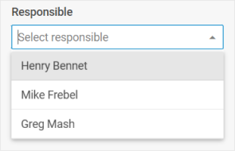

# Combo

@short: An input that represents an advanced select box with a set of options.

## Usage

~~~js
{
    type: "combo",
    options: (object | string)[],
    key?: string,
    wrap?: boolean, // false by default
    
    css?: string,
    disabled?: boolean, // false by default
    hidden?: boolean, // false by default
    height?: string | number | "content", // "content" by default
    width?: string | number | "content", // "content" by default
    padding?: string | number,

    filter?: (item: any, input: string) => boolean,
    itemHeight?: number | string, // 32 by default
    itemsCount?: boolean | ((count: number) => string),
    listHeight?: number | string, // 224 by default
    multiselection?: boolean, // false by default
    placeholder?: string,
    readOnly?: boolean, // false by default
    selectAllButton?: boolean, // false by default
    template?: (item: object) => string,
    virtual?: boolean, // false by default
    
    // for `wrap:true` check the label properties for the Fieldset
    label?: string,
    labelWidth?: string | number,
    labelPosition?: "left" | "top", // "top" by default

    // service properties and methods 
    $on?: { [eventName: string]: ({
            control: object,
            editor: object,
            id?: string | number
        }: any[]) => any
    },
    $handler?: ({
        id?: string | number,
        key: string | string[],
        editor: object,
        control: object,
        value: any
    }) => void,
    $setValue?: ({
        editor: object,
        control: object,
        value: any
    }) => void,
    $layout?: (object: any) => any
}
~~~

Option configuration object inside Combo:

~~~js
{
    id: string | number,
    value: string | number
}
~~~

## Description

### Combo properties

#### Basic properties

- `type` - (required) the type of a control, set it to *"combo"*
- `options` - (required) an array of Combo options, each option can be set as a *string* or as an *object* with a set of `key:value` pairs - [attributes of options and their values](#option-properties) 
- `key` - (optional) the name of the specified/modified property or the path to it in the object of a Diagram item (shape, line, group, swimlane)
- `wrap` - (optional) allows displaying the external wrapping, *false* by default
- `css` - (optional) adds style classes to a control
- `disabled` - (optional) defines whether a control is enabled (*false*) or disabled (*true*), *false* by default
- `hidden` - (optional) defines whether a combo is hidden, *false* by default
- `height` - (optional) the height of a control, *"content"* by default
- `width` - (optional) the width of a control, *"content"* by default
- `padding` - (optional) sets padding between a cell and a border of a Combo control, *"8px"* by default
- `filter` - (optional) sets a custom function for filtering Combo options. [Check the details](https://docs.dhtmlx.com/suite/combobox/customization/#custom-filter-for-options).
- `itemHeight` - (optional) sets the height of a cell in the list of options, *32* by default
- `itemsCount` - (optional) shows the total number of selected options
- `listHeight` - (optional) sets the height of the list of options, *224* by default
- `multiselection` - (optional) enables selection of multiple options in Combo, *false* by default
- `placeholder` - (optional) sets a placeholder in the input of Combo
- `readOnly` - (optional) makes Combo readonly (it is only possible to select options from the list, without entering words in the input), *false* by default
- `selectAllButton` - (optional) defines whether the "Select All" button should be shown, *false* by default
- `template` - (optional) sets a template of displaying options in the popup list
- `virtual` - (optional) enables dynamic loading of data on scrolling the list of options, *false* by default
- `label` - (optional) specifies a label for a control
- `labelPosition` - (optional) defines the position of a label: *"left" | "top"*, *"top"* by default
- `labelWidth` - (optional) sets the width of the label of a control

#### Service properties and methods

:::warning
Note that it's highly not recommended to redefine the service properties and methods for the default types of controls, since it may cause breaks in the code. If you need to modify the default controls, you should [create a new control type]. **TODO - add link**
:::

- `$on` - (optional) - allows setting an event listener. The object has the following properties:
    - `eventName`  - the event listener function which is called with the following parameters:
        - `object` - an object with the following properties:
            - `control` - the form control
            - `editor` - the object of the Diagram Editor
            - `id` - the id of a Diagram item (shape, line, group, swimlane)
        - `arguments` - (optional) - the original event arguments
- `$handler` - (optional) - a function that allows handling actions on firing the `change` and `input` events of a form control and the `change` event of DataCollection. Called with the following parameter:
    - `object` - an object with the following properties:
        - `id` - the id of a Diagram item (shape, line, group, swimlane)
        - `key` - the name of the specified/modified property or the path to it in the object of a Diagram item (shape, line, group, swimlane)
        - `editor` - the object of the Diagram Editor
        - `control` - the object of a Form control the component is built on
        - `value` - the new value of a Form control
- `$setValue` - (optional) - a function that allows setting the value of a Form control on initialization of a control and on changing the value in DataCollection. Called with the following parameter:
    - `object` - an object with the following properties:
        - `editor` - the object of the Diagram Editor
        - `control` - the object of a Form control the component is built on
        - `value` - the value of a Diagram item (shape, line, group, swimlane)
- `$layout` - (optional) - a function that allows setting the structure of a control. Returns the configuration of a Form control. Called with the following parameter:
    - `object` - the configuration of a control without service properties

### Option properties

- `id` - the "id" attribute is returned and goes to form data. This attribute should always be fulfilled to avoid unexpected behavior
- `value` - the "value" attribute is displayed in the input field

## Example

~~~js {7-13}
const editor = new dhx.DiagramEditor("editor_container", {
    type: "org",
    view: {
        editbar: {
            properties: {
                $shape: [
                    {
                        type: "combo",
                        key: "responsible",
                        label: "Responsible",
                        placeholder: "Select responsible",
                        options: ["Henry Bennet", "Mike Frebel", "Greg Mash"]
                    },
                ]
            }
        }
    }
});
editor.parse([
    { "id": "shape_1" },
    { "id": "shape_2", "parent": "shape_1", "responsible": undefined },
    { "id": "shape_3", "parent": "shape_1", "responsible": "Henry Bennet" }
]);
~~~

~~~js {7-14} title="With multiselection enabled"
const editor = new dhx.DiagramEditor("editor_container", {
    type: "org",
    view: {
        editbar: {
            properties: {
                $shape: [
                    {
                        type: "combo",
                        key: "responsible",
                        multiselection: true,
                        label: "Responsible",
                        placeholder: "Select responsible",
                        options: ["Henry Bennet", "Mike Frebel", "Greg Mash"]
                    },
                ]
            }
        }
    }
});
editor.parse([
    { "id": "shape_1" },
    { "id": "shape_2", "parent": "shape_1", "responsible": [] },
    { "id": "shape_3", "parent": "shape_1", "responsible": ["Henry Bennet", "Mike Frebel"] }
]);
~~~

~~~js {7-14} title="Setting options as objects"
const editor = new dhx.DiagramEditor("editor_container", {
    type: "org",
    view: {
        editbar: {
            properties: {
                $shape: [
                    {
                        type: "combo",
                        key: "responsible",
                        multiselection: true,
                        label: "Responsible",
                        placeholder: "Select responsible",
                        options: ["Henry Bennet", "Mike Frebel", { id: 1, value: "Greg Mash" }]
                    },
                ]
            }
        }
    }
});
editor.parse([
    { "id": "shape_1" },
    { "id": "shape_2", "parent": "shape_1", "responsible": [] },
    { "id": "shape_3", "parent": "shape_1", "responsible": ["Mike Frebel", 1] }
]);
~~~