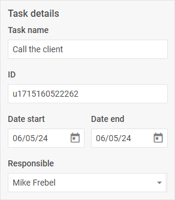

# Fieldset

@short: The basic control for creating complex controls with the help of the [`controls`](/api/diagram_editor/editbar/config/controls_property/) or the [`properties`](/api/diagram_editor/editbar/config/properties_property/) Editbar configuration options.

## Usage

~~~jsx
{
    type: "fieldset",

    compact?: boolean,
    hidden?: boolean, // false by default
    disabled?: boolean, // false by default

    css?: string,
    width?: string | number | "content", // "content" by default
    height?: string | number | "content", // "content" by default
    padding?: string | number,
    align?: "start" | "center" | "end" | "between" | "around" | "evenly", // "start" by default

    label?: string,
    labelAlignment?: "left" | "right" | "center", // "left" by default

    rows?: object[],
    cols?: object[],

    $layout?: function
}
~~~

The `rows` and `cols` properties may include an array of objects of the specified controls or the nested structure given below:

~~~jsx
{
    css?: string,
    width?: string | number | "content", // "content" by default
    height?: string | number | "content", // "content" by default
    padding?: string | number,
    align?: "start" | "center" | "end" | "between" | "around" | "evenly", // "start" by default
    rows?: object[],
    cols?: object[]
}
~~~

## Description

### Basic properties

- `type` - (required) the type of a control. Set it to *"fieldset"*
- `compact` - (optional) specifies the compact mode, removes indents and frame. *false* by default
- `disabled` - (optional) defines whether a control is enabled (*false*) or disabled (*true*). *false* by default
- `hidden` - (optional) defines whether a control is hidden. *false* by default
- `css` - (optional) the name of a CSS class(es) applied to the control group
- `width` - (optional) sets the width of the control group. *"content"* by default
- `height` - (optional) sets the height of the control group. *"content"* by default
- `padding` - (optional) sets the padding for the content inside the control group
- `align` - (optional) sets the alignment of controls inside the control group. *"start"* by default
- `label` - (optional) specifies a label for a control
- `labelAlignment` - (optional) defines the position of the label: *"left"* | *"right"* | *"center"*. *"left"* by default
- `rows` - (optional) arranges controls inside the control group vertically
- `cols` - (optional) arranges controls inside the control group horizontally

#### Service properties and methods

:::warning
Note that it's highly not recommended to redefine the service properties and methods for the default types of controls, since it may cause breaks in their functionality. 
:::

- `$layout` - (optional) - a callback function that allows setting the structure of a control. Returns the configuration of the [Fieldset](https://docs.dhtmlx.com/suite/form/fieldset/) Form control. Called with the following parameter:
    - `object` - the configuration of a control without service properties

## Example

~~~jsx {7-28} title="Creating a fieldset via the properties property"
const editor = new dhx.DiagramEditor("editor_container", {
    type: "org",
    view: {
        editbar: {
            properties: {
                $shape: [
                    {
                        type: "fieldset",
                        label: "Task details",
                        rows: [
                            { type: "input", key: "name", label: "Task name" },
                            { type: "input", key: "id", label: "ID", readOnly: true },
                            {
                                align: "between",
                                cols: [
                                    { type: "datepicker", key: "date_start", label: "Date start", width: "48%" },
                                    { type: "datepicker", key: "date_end", label: "Date end", width: "48%" },
                                ],
                            },
                            {
                                type: "combo",
                                key: "responsible",
                                label: "Responsible",
                                placeholder: "Select responsible",
                                options: ["Henry Bennet", "Mike Frebel", "Greg Mash"]
                            },
                        ],
                    },
                ]
            }
        }
    }
});
~~~

~~~jsx {10-33} title="Creating a complex control via the controls property"
const editor = new dhx.DiagramEditor("editor_container", {
    type: "default",
    view: {
        editbar: {
            properties: {
                $shape: [
                    { type: "details" },
                ],
            },
            controls: {
                details: {
                    type: "fieldset",
                    label: "Task details",
                    rows: [
                        { type: "input", key: "name", label: "Task name" },
                        { type: "input", key: "id", label: "ID", readOnly: true },
                        {
                            align: "between",
                            cols: [
                                { type: "datepicker", key: "date_start", label: "Date start", width: "48%" },
                                { type: "datepicker", key: "date_end", label: "Date end", width: "48%" },
                            ],
                        },
                        {
                            type: "combo",
                            key: "responsible",
                            label: "Responsible",
                            placeholder: "Select responsible",
                            options: ["Henry Bennet", "Mike Frebel", "Greg Mash"]
                        },
                    ],
                },
            }
        }
    }
});
~~~