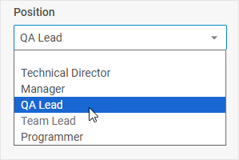

# Select

@short: An advanced select box that provides a set of options to choose from.

## Usage

~~~js
{
    type: "select",
    options: (object | string)[],
    key?: string | string[],
    wrap?: boolean, // false by default

    css?: string,
    disabled?: boolean, // false by default
    hidden?: boolean, // false by default
    height?: string | number | "content", // "content" by default
    width?: string | number | "content", // "content" by default
    padding?: string | number, // "8px" by default
    icon?: string,

    // for `wrap:true` check the label properties for the Fieldset
    label?: string,
    labelWidth?: string | number,
    labelPosition?: "left" | "top", // "top" by default

    // service properties and methods 
    $on?: { [eventName: string]: function },
    $handler?: function,
    $setValue?: function,
    $layout?: function
}
~~~

Option configuration object inside Select:

~~~js
{
    value: string | number,
    content: string,
    disabled?: boolean
}
~~~

## Description

### Select properties

#### Basic properties

- `type` - (required) the type of a control, set it to *"select"*
- `options` - (required) an array of Select options, each option can be set as a *string* or as an *object* with a set of `key:value` pairs - [attributes of options and their values](#option-properties)
- `key` - (optional) the name of the specified/modified property or the path to it in the object of a Diagram item (shape, line, group, swimlane)
- `wrap` - (optional) allows displaying the external wrapping, *false* by default
- `css` - (optional) adds style classes to a control
- `disabled` - (optional) defines whether a control is enabled (*false*) or disabled (*true*)
- `hidden` - (boolean) defines whether a Select is hidden, *false* by default
- `height` - (optional) the height of a control, *"content"* by default
- `width` - (optional) the width of a control, *"content"* by default
- `padding` - (optional) sets padding between a cell and a border of a Select control, *"8px"* by default
- `icon` - (optional) the name of an [icon](https://docs.dhtmlx.com/suite/helpers/icon/) from the used icon font
- `label` - (optional) specifies a label for the control
- `labelWidth` - (optional) sets the label width of the control
- `labelPosition` - (optional) defines the position of a label: *"left" | "top"*, *"top"* by default

#### Service properties and methods

:::warning
Note that it's highly not recommended to redefine the service properties and methods for the default types of controls, since it may cause breaks in their functionality. If you need to modify the default controls, you should [create a new control type via the `controls` property](/api/diagram_editor/editbar/config/controls_property/). 
:::

- `$on` - (optional) - allows setting an event listener. The object has the following properties:
    - `eventName`  - a callback function which is called with the following parameters:
        - `object` - an object with the following properties:
            - `control` - the form control
            - `editor` - the object of the Diagram Editor
            - `id` - the id of a Diagram item (shape, line, group, swimlane)
        - `arguments` - (optional) - the original event arguments
- `$handler` - (optional) - a callback function that allows handling actions on firing the `change` and `input` events of a form control and the `change` event of DataCollection. Called with the following parameter:
    - `object` - an object with the following properties:
        - `id` - the id of a Diagram item (shape, line, group, swimlane)
        - `key` - the name of the specified/modified property or the path to it in the object of a Diagram item (shape, line, group, swimlane)
        - `editor` - the object of the Diagram Editor
        - `control` - the object of a Form control the component is built on
        - `value` - the new value of a Form control
- `$setValue` - (optional) - a callback function that allows setting the value of a Form control on initialization of a control and on changing the value in DataCollection. Called with the following parameter:
    - `object` - an object with the following properties:
        - `editor` - the object of the Diagram Editor
        - `control` - the object of a Form control the component is built on
        - `value` - the value of a Diagram item (shape, line, group, swimlane)
- `$layout` - (optional) - a callback function that allows setting the structure of a control. Returns the configuration of a Form control. Called with the following parameter:
    - `object` - the configuration of a control without service properties

### Option properties

- `value` - (required) sets the value for the select option
- `content` - (required) the content displayed in the select option
- `disabled` - (optional) defines whether the option is enabled (*false*) or disabled (*true*)

## Example

~~~js {7-20}
const editor = new dhx.DiagramEditor("editor_container", {
    type: "default",
     view: {
        editbar: {
            properties: {
                $shape: [
                    {
                        type: "select",
                        label: "Position",
                        key: "position",
                        wrap: true,
                        options: [
                            "",
                            "Technical Director",
                            "Manager",
                            "QA Lead",
                            { value: 4, content: "Team Lead", disabled: true },
                            { value: 5, content: "Programmer" }
                        ],
                    },
                ]
            }
        }
    }
});
~~~