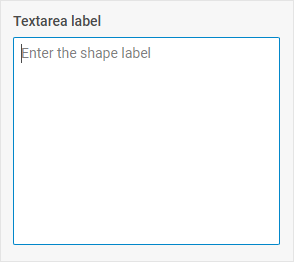

# Textarea

@short: A control that allows a user to enter a simple multi-line text.

## Usage

~~~js
{
    type: "textarea",
    key?: string | string[],
    wrap?: boolean, // false by default
    
    css?: string,
    disabled?: boolean, // false by default
    hidden?: boolean, // false by default
    height?: string | number | "content", // "content" by default
    width?: string | number | "content", // "content" by default
    padding?: string | number,

    maxlength?: number | string,
    minlength?: number | string,
    placeholder?: string, 
    readOnly?: boolean, // false by default

    // for `wrap:true` check the label properties for the Fieldset
    label?: string,
    labelWidth?: string | number,
    labelPosition?: "left" | "top", // "top" by default

    // service properties and methods 
    $on?: { [eventName: string]: function },
    $handler?: function,
    $setValue?: function,
    $layout?: function
}
~~~

## Description

### Basic properties

- `type` - (required) the type of a control, set it to *"textarea"*
:::warning
Note that when creating a new control via the [`controls` property](/api/diagram_editor/editbar/config/controls_property/) it's not allowed to redefine the default types of basic controls. If you need to modify a default control, you should create a new control type.
:::
- `key` - (optional) the name of the specified/modified property or the path to it in the object of a Diagram item 
- `wrap` - (optional) allows displaying the external wrapping, *false* by default
- `css` - (optional) adds style classes to a control
- `hidden` - (optional) defines whether a control is hidden, *false* by default
- `disabled` - (optional) defines whether a control is enabled (*false*) or disabled (*true*), *false* by default
- `width` - (optional) the width of a control, *"content"* by default
- `height` - (optional) the height of a control, *"content"* by default
- `padding` - (optional) sets padding between a cell and a border of the Textarea control
- `maxlength` - (optional) the maximum [number of characters allowed in the textarea](https://docs.dhtmlx.com/suite/form/work_with_form/#number-of-allowed-characters)
- `minlength` - (optional) the minimum [number of characters allowed in the textarea](https://docs.dhtmlx.com/suite/form/work_with_form/#number-of-allowed-characters)
- `placeholder` - (optional) a tip for the textarea
- `readOnly` - (optional) defines whether a textarea is readonly, *false* by default
- `label` - (optional) specifies a label for the control
- `labelWidth` - (optional) sets the label width of the control
- `labelPosition` - (optional) defines the position of a label: *"left" | "top"*, *"top"* by default

### Service properties and methods

:::warning
Note that it's highly not recommended to redefine the service properties and methods for the default types of controls, since it may cause breaks in their functionality. 
:::

- `$on` - (optional) - allows setting an event listener. The object has the following properties:
    - `eventName`  - a callback function which is called with the following parameters:
        - `object` - an object with the following properties:
            - `control` - the [Textarea](https://docs.dhtmlx.com/suite/form/textarea/) Form control
            - `editor` - the object of the Diagram Editor
            - `id` - the id of a Diagram item 
        - `arguments` - (optional) - the [original event arguments](https://docs.dhtmlx.com/suite/category/form-textarea-events/)
- `$handler` - (optional) - a callback function that allows handling actions on firing the `change` and `input` events of the [Textarea](https://docs.dhtmlx.com/suite/form/textarea/) Form control and the `change` event of DataCollection. Called with the following parameter:
    - `object` - an object with the following properties:
        - `id` - the id of a Diagram item 
        - `key` - the name of the specified/modified property or the path to it in the object of a Diagram item 
        - `editor` - the object of the Diagram Editor
        - `control` - the object of the [Textarea](https://docs.dhtmlx.com/suite/form/textarea/) Form control the component is built on
        - `value` - the new value of the [Textarea](https://docs.dhtmlx.com/suite/form/textarea/) Form control
- `$setValue` - (optional) - a callback function that allows setting the value of the [Textarea](https://docs.dhtmlx.com/suite/form/textarea/) Form control on initialization of a control and on changing the value in DataCollection. Called with the following parameter:
    - `object` - an object with the following properties:
        - `editor` - the object of the Diagram Editor
        - `control` - the object of the [Textarea](https://docs.dhtmlx.com/suite/form/textarea/) Form control the component is built on
        - `value` - the value of a Diagram item 
- `$layout` - (optional) - a callback function that allows setting the structure of a control. Returns the configuration of the [Textarea](https://docs.dhtmlx.com/suite/form/textarea/) Form control. Called with the following parameter:
    - `object` - the configuration of a control without service properties

## Example

~~~js {7-13}
const editor = new dhx.DiagramEditor("editor_container", {
    type: "default",
     view: {
        editbar: {
            properties: {
                $shape: [
                    {
                        type: "textarea",
                        key: "text",
                        label: "Textarea label",
                        height: 250,
                        wrap: true
                    },
                ]
            }
        }
    }
});
~~~