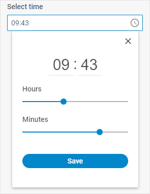

# Timepicker

@short: A control that allows a user to select time value either by moving handles along track bars or by entering hour and minutes values directly into related inputs.

## Usage

~~~js
{
    type: "timepicker",
    key?: string | string[],
    wrap?: boolean, // false by default

    css?: string,
    disabled?: boolean, // false by default
    hidden?: boolean, // false by default
    height?: string | number | "content", // "content" by default
    width?: string | number | "content", // "content" by default
    padding?: string | number,
    
    controls?: boolean, // false by default
    icon?: string,
    placeholder?: string,
    timeFormat?: 12 | 24, // 24 by default
    valueFormat?: "string" | "timeObject", // "string" by default

    // for `wrap:true` check the label properties for the Fieldset
    label?: string,
    labelWidth?: string | number,
    labelPosition?: "left" | "top", // "top" by default

    // service properties and methods 
    $on?: { [eventName: string]: function },
    $handler?: function,
    $setValue?: function,
    $layout?: function
}
~~~

## Description

### Basic properties

- `type` - (required) the type of a control, set it to *"timepicker"*
- `key` - (optional) the name of the specified/modified property or the path to it in the object of a Diagram item (shape, line, group, swimlane)
- `wrap` - (optional) allows displaying the external wrapping, *false* by default
- `css` - (optional) adds style classes to a control
- `hidden` - (optional) defines whether a control is hidden, *false* by default
- `disabled` - (optional) defines whether a control is enabled (*false*) or disabled (*true*), *false* by default
- `width` - (optional) the width of a control, *"content"* by default
- `height` - (optional) the height of a control, *"content"* by default
- `padding` - (optional) sets padding between a cell and a border of the Timepicker control, *"8px"* by default
- `controls` - (optional) defines whether a timepicker is equipped with the Close and Save buttons, *false* by default
- `icon` - (optional) the name of an icon from the used icon font
- `placeholder` - (optional) a tip for the input
- `timeFormat` - (optional) defines what clock format is activated: the 12-hour or 24-hour one. Set the property to *12* or *24* (default) value, correspondingly, *24* by default
- `valueFormat` - (optional) defines the format of the value to be applied when working with the events of the timepicker control: *"string"* (default), *"timeObject"*
- `label` - (optional) specifies a label for the control
- `labelWidth` - (optional) sets the label width of the control
- `labelPosition` - (optional) defines the position of a label: *"left" | "top"*, *"top"* by default

### Service properties and methods

:::warning
Note that it's highly not recommended to redefine the service properties and methods for the default types of controls, since it may cause breaks in their functionality. If you need to modify the default controls, you should [create a new control type via the `controls` property](/api/diagram_editor/editbar/config/controls_property/). 
:::

- `$on` - (optional) - allows setting an event listener. The object has the following properties:
    - `eventName`  - a callback function which is called with the following parameters:
        - `object` - an object with the following properties:
            - `control` - the form control
            - `editor` - the object of the Diagram Editor
            - `id` - the id of a Diagram item (shape, line, group, swimlane)
        - `arguments` - (optional) - the original event arguments
- `$handler` - (optional) - a callback function that allows handling actions on firing the `change` and `input` events of a form control and the `change` event of DataCollection. Called with the following parameter:
    - `object` - an object with the following properties:
        - `id` - the id of a Diagram item (shape, line, group, swimlane)
        - `key` - the name of the specified/modified property or the path to it in the object of a Diagram item (shape, line, group, swimlane)
        - `editor` - the object of the Diagram Editor
        - `control` - the object of a Form control the component is built on
        - `value` - the new value of a Form control
- `$setValue` - (optional) - a callback function that allows setting the value of a Form control on initialization of a control and on changing the value in DataCollection. Called with the following parameter:
    - `object` - an object with the following properties:
        - `editor` - the object of the Diagram Editor
        - `control` - the object of a Form control the component is built on
        - `value` - the value of a Diagram item (shape, line, group, swimlane)
- `$layout` - (optional) - a callback function that allows setting the structure of a control. Returns the configuration of a Form control. Called with the following parameter:
    - `object` - the configuration of a control without service properties

## Example

~~~js {8-13}
const editor = new dhx.DiagramEditor("editor_container", {
    type: "org",
    view: {
        editbar: {
            show: true,
            properties: {
                $shape: [
                    {
                        type: "timepicker",
                        key: "time",
                        label: "Select time",
                        controls: true,
                    },
                ],
            },
        }
    }
});
editor.parse([
    { "id": "shape_1" },
    { "id": "shape_2", "parent": "shape_1", "time": "14:00" },
    { "id": "shape_3", "parent": "shape_1", "time": "18:30" }
]);
~~~