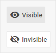

# Toggle

@short: A special button control that changes its state from the pressed to the unpressed one when clicked.

## Usage

~~~js
{
    type: "toggle",
    key?: string | string[],

    hidden?: boolean, // false by default
    disabled?: boolean, // false by default
    full?: boolean, // false by default

    text?: string,
    icon?: string,
    offText?: string,
    offIcon?: string,
    value?: string | number,

    css?: string,
    width?: string | number | "content", // "content" by default
    height?: string | number | "content", // "content" by default
    padding?: string | number,

    // service properties and methods 
    $on?: { [eventName: string]: function },
    $handler?: function,
    $setValue?: function,
    $layout?: function
}
~~~

The control can be used both with the *boolean* value and the *string* one, if the `value` property is specified. The `value` property is needed for assigning the set value as a value of the applied property. [Check the example below](#example) to get the idea.

## Description

### Basic properties

- `type` - (required) the type of a control, set it to *"toggle"*
:::warning
Note that when creating a new control via the [`controls` property](/api/diagram_editor/editbar/config/controls_property/) it's not allowed to redefine the default types of basic controls. If you need to modify a default control, you should create a new control type.
:::
- `key` - (optional) the name of the specified/modified property or the path to it in the object of a Diagram item  
- `hidden` - (optional) defines whether a control is hidden, *false* by default
- `disabled` - (optional) defines whether a control is enabled (*false*) or disabled (*true*), *false* by default
- `full` - (optional) defines whether the toggle will be extended to the width specified by the `width` property, *false* by default
- `text` - (optional) sets a text inside the toggle. When initialized together with the `offText` property, the specified text will be rendered in the selected (pressed) state
- `offText` - (optional) sets the text that will be rendered in the unselected (unpressed) state of the toggle
- `icon` - (optional) sets the CSS class of an icon displayed inside the toggle. When initialized together with the `offIcon` property, the specified CSS classes of icons will be rendered in the selected (pressed) state of the toggle
- `offIcon` - (optional) sets the CSS class of an icon that will be rendered in the unselected (unpressed) state of the toggle
- `value` - (optional) specifies the value in the selected (pressed) state. If not defined, the control is used with the *boolean* value 
- `css` - (optional) adds style classes to a control
- `width` - (optional) the width of a control, *"content"* by default
- `height` - (optional) the height of a control, *"content"* by default
- `padding` - (optional) sets padding between a cell and a border of the Toggle control

### Service properties and methods

:::warning
Note that it's highly not recommended to redefine the service properties and methods for the default types of controls, since it may cause breaks in their functionality. 
:::

- `$on` - (optional) - allows setting an event listener. The object has the following properties:
    - `eventName`  - a callback function which is called with the following parameters:
        - `object` - an object with the following properties:
            - `control` - the [Toggle](https://docs.dhtmlx.com/suite/form/toggle/) Form control
            - `editor` - the object of the Diagram Editor
            - `id` - the id of a Diagram item 
        - `arguments` - (optional) - the [original event arguments](https://docs.dhtmlx.com/suite/category/form-toggle-events/)
- `$handler` - (optional) - a callback function that allows handling actions on firing the `change` event of the [Toggle](https://docs.dhtmlx.com/suite/form/toggle/) Form control and the `change` event of DataCollection. Called with the following parameter:
    - `object` - an object with the following properties:
        - `id` - the id of a Diagram item 
        - `key` - the name of the specified/modified property or the path to it in the object of a Diagram item 
        - `editor` - the object of the Diagram Editor
        - `control` - the object of the [Toggle](https://docs.dhtmlx.com/suite/form/toggle/) Form control the component is built on
        - `value` - the new value of the [Toggle](https://docs.dhtmlx.com/suite/form/toggle/) Form control
- `$setValue` - (optional) - a callback function that allows setting the value of the [Toggle](https://docs.dhtmlx.com/suite/form/toggle/) Form control on initialization of a control and on changing the value in DataCollection. Called with the following parameter:
    - `object` - an object with the following properties:
        - `editor` - the object of the Diagram Editor
        - `control` - the object of the [Toggle](https://docs.dhtmlx.com/suite/form/toggle/) Form control the component is built on
        - `value` - the value of a Diagram item 
- `$layout` - (optional) - a callback function that allows setting the structure of a control. Returns the configuration of the [Toggle](https://docs.dhtmlx.com/suite/form/toggle/) Form control. Called with the following parameter:
    - `object` - the configuration of a control without service properties

## Example

~~~js {7-14} title="Applying the boolean value for a toggle"
const editor = new dhx.DiagramEditor("editor_container", {
    type: "default",
     view: {
        editbar: {
            properties: {
                $group: [
                    {
                        type: "toggle",
                        key: ["header", "enable"],
                        icon: "dxi dxi-eye",
                        offIcon: "dxi dxi-eye-off",
                        text: "Visible",
                        offText: "Invisible",
                    },
                ]
            }
        }
    }
});
~~~

~~~js {7-12} title="Assigning the set value as a value of the applied property"
const editor= new dhx.DiagramEditor("editor", {
    type: "default",
     view: {
        editbar: {
            properties: {
                $shape: [
                    {
                        type: "toggle",
                        key: "fontStyle",
                        value: "italic",
                        icon: "dxi dxi-format-italic"        
                    },
                ]
            }
        }
    }
});
~~~
