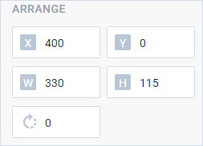

# Arrange

@short: The complex control for editing width, height, rotation angle, x and y properties of a Diagram element

:::info
The **Arrange** control is available only in the *default* mode of the Diagram editor. The control is not available for **line** and **lineTitle** elements.
:::

## Usage

~~~jsx
{
    type: "arrange",

    hidden?: boolean, // false by default
    disabled?: boolean, // false by default

    css?: string,
    width?: string | number | "content", // "content" by default
    height?: string | number | "content", // "content" by default
    padding?: string | number, // "0 16px" by default

    label?: string,
    labelAlignment?: "left" | "right" | "center", // "left" by default
    align?: "start" | "center" | "end" | "between" | "around" | "evenly", // "start" by default
   
    // Service properties
    compact?: boolean, // ??? by default
    $properties?: object
}
~~~

## Description

### Basic properties

- `type` - (required) the type of a control. Set it to *"arrange"*
- `hidden` - (optional) defines whether the control is hidden. *false* by default
- `disabled` - (optional) defines whether the control is enabled (*false*) or disabled (*true*). *false* by default
- `css` - (optional) adds style classes to the control
- `width` - (optional) the width of the control. *"content"* by default
- `height` - (optional) the height of the control. *"content"* by default
- `padding` - (optional) sets the padding for the content inside the control group. *"8px"* by default
- `label` - (optional) specifies a label for the control
- `labelAlignment` - (optional) defines the position of the control label. *"left"* by default
- `align` - (optional) sets the alignment of controls inside the control group. *"start"* by default

### Service properties

:::warning
Note that it's highly not recommended to redefine the service properties for the default types of controls, since it may cause breaks in their functionality. If you need to modify the default controls, you should create a new control type via the [`controls`](/api/diagram_editor/editbar/config/controls_property/) property.
:::

- `compact` - (optional) specifies the compact mode, removes indents and frame
- `$properties` - (optional) allows you to override values of [basic controls](TODO) within a complex control. You can configure the following elements of the **Arrange** control based on the basic controls:
    - `x` - ([input](TODO)) sets the Diagram element position on the x-axis
    - `y` - ([input](TODO)) sets the Diagram element position on the y-axis
    - `width` - ([input](TODO)) sets the Diagram element width (px)
    - `height` - ([input](TODO)) sets the Diagram element height (px)
    - `angle` - ([input](TODO)) sets the Diagram element rotation angle

## Example

~~~jsx {7-13}
const editor= new dhx.DiagramEditor("editor", {
    type: "default",
    view: {
        editbar: {
            properties: {
                rectangle: [
                    {
                        type: "arrange",
                        disabled: true,
                        $properties: {
                            angle: { hidden: true } // configuration of the "input" basic control
                        }
                    }
                ]
            }
        }
    }
});
~~~

**Change log**: The control was added in v6.0
