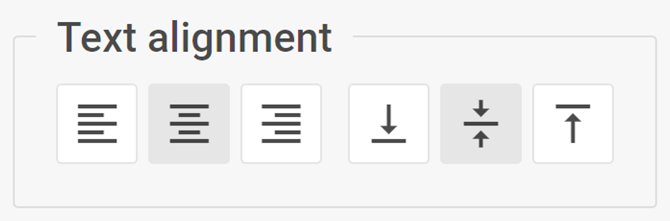

# Text align

@short: The complex control for managing the text alignment within the Diagram elements

## Usage

~~~jsx
{
    type: "textAlign",

    hidden?: boolean, // false by default
    disabled?: boolean, // false by default

    css?: string,
    width?: string | number | "content", // "content" by default
    height?: string | number | "content", // "content" by default
    padding?: string | number, // "0 16px" by default

    label?: string,
    labelAlignment?: "left" | "right" | "center", // "left" by default
    align?: "start" | "center" | "end" | "between" | "around" | "evenly", // "between" by default
    compact?: boolean, // false by default

    // Service properties
    $properties?: object
}
~~~

## Description

### Basic properties

- `type` - (required) the type of a control. Set it to *"textAlign"*
- `hidden` - (optional) defines whether the control is hidden. *false* by default
- `disabled` - (optional) defines whether the control is enabled (*false*) or disabled (*true*). *false* by default
- `css` - (optional) adds style classes to the control
- `width` - (optional) the width of the control. *"content"* by default
- `height` - (optional) the height of the control. *"content"* by default
- `padding` - (optional) sets the padding for the content inside the control group. *"0 16px"* by default
- `label` - (optional) specifies a label for the control
- `labelAlignment` - (optional) defines the position of the label. *"left"* by default
- `align` - (optional) sets the alignment of controls inside the control group. *"between"* by default
- `compact` - (optional) specifies the compact mode, removes indents and frame. *false* by default

### Service properties

- `$properties` - (optional) allows you to override values of [basic controls](/guides/diagram_editor/editbar/basic_controls) within a complex control. You can configure the following elements of the **Text align** control based on the basic controls:
    - `textAlign` - ([toggleGroup](/guides/diagram_editor/editbar/basic_controls/togglegroup)) sets the horizontal alignment of text
    - `textVerticalAlign` - ([toggleGroup](/guides/diagram_editor/editbar/basic_controls/togglegroup)) sets the vertical alignment of text

## Example

~~~jsx {6-11}
const editor= new dhx.DiagramEditor("editor_container", {
    type: "mindmap",
    view: {
        editbar: {
            properties: {
                $shape: [
                    {
                        type: "textAlign",
                        label: "Text align"
                    }
                ]
            }
        }
    }
});
~~~
