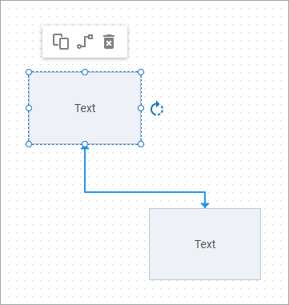
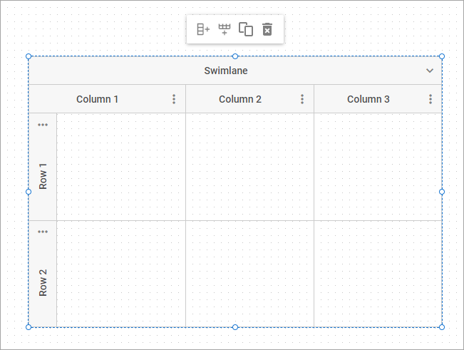
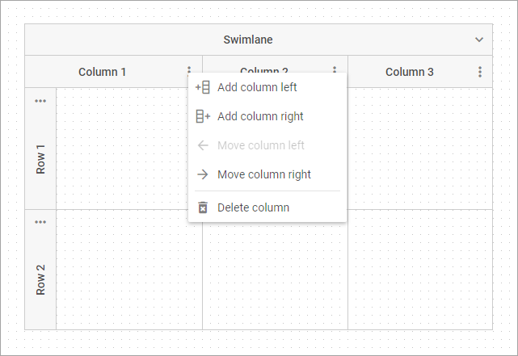

# Grid Area

Grid area is an area intended for editing a diagram. You can easily add new items, change their appearance and positioning, or remove them.

In this section you will find what interface elements you have available for each diagram item depending on the mode the editor is initialized in. The section also explains how to facilitate ease of designing a diagram via using keyboard shortcuts or operating several selected items at once.

## Managing shapes

### Interface elements in the default mode

You can drag shapes from the left panel into the grid area to place them on the desired positions and connect them.

When you click on any shape, it becomes editable and gets personal interface elements:

- a toolbar with controls:
    - *"copy"* - to create a copy of the shape (except for the shape placed inside a group or a swimlane);
    - *"connect"* - to activate the mode for setting connections to a different shape;
    - *"remove"* - to delete the selected shape;
- resizing handles (pull the handles of the editable shape to change its sizes);
- a rotate icon (press the icon to rotate the shape).

When the connection mode is enabled for a shape, you can set links to other shapes, adjust their position and form, as well as delete unnecessary links via the "remove" toolbar control.

Double-click the text of a shape to edit it.

### Interface elements in the org chart mode

You can drag shapes to place them on the desired positions relative to the root shape, or drag the root shape to move the whole diagram. To add a new shape, select a shape and add a new child for it. You can also add assistant or partner items. The connection between parent shape and its partner is always horizontal.

The shapes are draggable from one parent item to another. The moved item is dragged with all its children.

When you click on any shape, it becomes editable and gets personal interface elements:

- a toolbar with controls:
    - *"add"* - to add a new child for the selected shape;
    - *"assistant"* - to add assistant for the selected shape;
    - *"partner"*  - to add partner for the selected shape;
    - *"horizontal"* - to arrange children of the shape horizontally;
    - *"vertical"* - to arrange children of the shape vertically;
    - *"remove"* - to delete the selected shape (except for the root one);
- resizing handles (pull the handles of the editable shape to change its sizes);
- an icon to collapse/expand child shapes.

When you click on assistant or partner shape, it becomes editable and gets personal interface elements:

- *"remove"* - to delete the selected shape

Double-click the text of a shape to edit it.

### Interface elements in the mindmap mode

You can drag shapes to place them on the desired positions relative to the root shape, or drag the root shape to move the whole diagram. If you drag the parent shape, the shape will be moved with all its child shapes. To add a new shape, select a shape and add a new child for it. The shapes are draggable from one parent item to another. The moved item is dragged with all its children.

When you click on any shape, it becomes editable and gets personal interface elements:

- a toolbar with controls:
    - *"add"* - to add a new child for the selected shape (except for the root one);
    - *"addLeft"* - to add a new child to the left of the root shape;
    - *"addRight"* - to add a new child to the right of the root shape;
    - *"remove"* - to delete the selected shape (except for the root one);
- resizing handles (pull the handles of the editable shape to change its sizes);
- an icon to collapse/expand child shapes.

Double-click the text of a shape to edit it.

## Managing lines

In the default mode, you can set links to other shapes, adjust their position and form, as well as add text to the line and delete unnecessary links.

In the default mode, you can also add text to the line by double-clicking on it. Click the text to define its direction or delete it. Double-click the text to edit it.

## Managing groups

You can drag groups from the left panel into the grid area to place them on the desired positions. You can put several shapes or other groups into a group and move them as a unit, copy, or delete.

When you click on any group, it becomes editable and gets personal interface elements:

- a toolbar with controls:
    - *"copy"* - to create a copy of the group (except for the group placed inside another group or a swimlane);
    - *"remove"* - to delete the selected group;
- resizing handles (pull the handles of the editable group to change its sizes).

Double-click the text in the header of the group to edit it.

## Managing swimlanes

You can drag a swimlane from the left panel into the grid area to place it on the desired position.

When you click on any swimlane, it becomes editable and gets personal interface elements:

- a toolbar with controls:
    - *"addRowLast"* - to add a new row at the end of the swimlane;
    - *"addColumnLast"* - to add a new column at the end of the swimlane;
    - *"copy"* - to create a copy of the swimlane;
    - *"remove"* - to delete the selected swimlane;
- resizing handles (pull the handles of the editable swimlane to change its sizes).

Besides, there are the abilities to add, move, or remove columns or rows of the swimlane via the options of the context menu. The context menu will appear after the user clicks on the icon of a swimlane subheader.

Note, that some options of moving the first/last columns and rows are deactivated by internal settings of a swimlane.

## Editing attributes of an item

After selecting an item in the grid area, you can update its attributes [via the sidebar options in the right panel of the editor](../../../guides/diagram_editor/right_panel/).

## Configuring toolbar per-item

You can customize the personal toolbar of shapes, groups, swimlanes according to your needs via the [shapeToolbar](../../../api/editor/shapetoolbar_property/) property of the editor.

## Using hotkeys

There is a set of hotkeys you can use while creating a diagram in the editor:

- **Ctrl+C** - to copy an item(s) (*in the default mode only*);
- **Ctrl+V** - to paste an item(s) (*in the default mode only*);
- **Shift+Left Click** - to select several items;
- **Ctrl+A** or **Cmd+A** (for MAC) - to select all items;
- **Ctrl+Z** - to revert the latest action;
- **Del** - to delete an item(s);
- **Arrows** - to move an item(s) left/right/up/down.

## Manipulating multiple items

It is possible to select several diagram items via hovering them over with the left mouse button pressed. You can also select necessary items using keyboard shortcuts - Shift+Left Click.

You can operate all the selected items at once, namely:

- to create a copy of the items (*in the default mode only*);
- to paste the items (*in the default mode only*);
- to drag the items;
- to delete the items.

You can select and delete lines when the editor is initialized in the default mode only.
