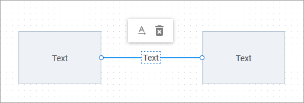

# Grid area

Grid area is an area intended for editing a diagram. You can easily add new items, change their appearance and positioning, or remove them.

In this section you will find what interface elements are available for each diagram item depending on the mode the editor is initialized in. The section also explains how to facilitate ease of designing a diagram by using keyboard shortcuts or operating several selected items at once.

:::note
Distance between points in the Grid area depends on the value of the [grid step](/api/diagram_editor/editor/config/gridstep_property/)
:::

## Managing shapes

### Interface elements in the default mode

You can drag shapes from the shapebar into the grid area to place them at the desired positions and connect them.

When you click on any shape, it becomes editable and gets personal interface elements:

- a toolbar with controls:
    - *"copy"* - to create a copy of the shape (except for the shape placed inside a group or a swimlane)
    - *"connect"* - to activate the mode for setting connections to a different shape
    - *"remove"* - to delete the selected shape
- resizing handles (pull the handles of the editable shape to change its sizes)
- a rotate icon (press the icon to rotate the shape)

When the connection mode is enabled for a shape, you can set links to other shapes, adjust their position and form, as well as delete unnecessary links via the "remove" toolbar control.

Double-click the text of a shape to edit it.

### Interface elements in the org chart mode

You can drag shapes to place them at the desired positions relative to the root shape, or drag the root shape to move the whole diagram. To add a new shape, select a shape and add a new child for it. You can also add *assistant* or *partner* items. The connection between a parent shape and its partner is always horizontal.

You can drag shapes from one parent item to another. The moved item is dragged with all its children.

When you click on any shape, it becomes editable and gets personal interface elements:

- a toolbar that may include the following controls:
    - *"add"* - to add a new child for the selected shape
    - *"add assistant"* - to add an assistant for the selected shape
    - *"add partner"*  - to add a partner for the selected shape
    - *"align vertically"* - to arrange children of the shape vertically
    - *"align horizontally"* - to arrange children of the shape horizontally
    - *"remove"* - to delete the selected shape (except for the root one) with its children
- resizing handles (pull the handles of the editable shape to change its sizes)
- an icon to collapse/expand child shapes (if there are any)

When you click on an assistant or partner shape, it becomes editable and gets personal interface elements:

- *"remove"* - to delete the selected shape

Double-click the text of a shape to edit it.

### Interface elements in the mindmap mode

You can drag shapes to place them at the desired positions relative to the root shape, or drag the root shape to move the whole diagram. If you drag the parent shape, the shape will be moved with all its child shapes. To add a new shape, select a shape and add a new child for it. The shapes can be dragged from one parent item to another. The moved item is dragged with all its children.

When you click on any shape, it becomes editable and gets personal interface elements:

- a toolbar with controls:
    - *"add"* - to add a new child for the selected shape (except for the root one)
    - *"addLeft"* - to add a new child to the left of the root shape
    - *"addRight"* - to add a new child to the right of the root shape
    - *"remove"* - to delete the selected shape (except for the root one) with its children
- resizing handles (pull the handles of the editable shape to change its sizes)
- an icon to collapse/expand child shapes

Double-click the text of a shape to edit it.

## Managing lines

In the default mode, you can set links to other shapes, adjust their position and form, as well as add text to the line and delete unnecessary links.

In the default mode, you can also add a text to the line by double-clicking on it. Click the text to define its direction or delete it. Double-click the text to edit it.

## Managing groups

You can drag groups from the shapebar into the grid area to place them at the desired positions. You can put several shapes or other groups into a group and move them as a unit, copy, or delete.

When you click on any group, it becomes editable and gets personal interface elements:

- a toolbar with controls:
    - *"copy"* - to create a copy of the group (except for the group placed inside another group or a swimlane);
    - *"remove"* - to delete the selected group;
- resizing handles (pull the handles of the editable group to change its sizes).

Double-click the text in the header of the group to edit it.

## Managing swimlanes

You can drag a swimlane from the shapebar into the grid area to place it at the desired position.

When you click on any swimlane, it becomes editable and gets personal interface elements:

- a toolbar with controls:
    - *"addRowLast"* - to add a new row at the end of the swimlane
    - *"addColumnLast"* - to add a new column at the end of the swimlane
    - *"copy"* - to create a copy of the swimlane
    - *"remove"* - to delete the selected swimlane
- resizing handles (pull the handles of the editable swimlane to change its sizes)

Besides, there are the abilities to add, move, or remove columns or rows of the swimlane via the options of the context menu. The context menu will appear after the user clicks on the icon of a swimlane subheader.

Note, that some options of moving the first/last columns and rows are deactivated by internal settings of a swimlane.

## Editing attributes of an item

After selecting an item in the grid area, you can update its attributes [via the sidebar options in the editbar of the editor](../../../guides/diagram_editor/editbar/overview/).

## Configuring the toolbar of an item

You can customize the personal toolbar of shapes, groups, swimlanes according to your needs via the [shapeToolbar](../../../api/diagram_editor/editor/config/shapetoolbar_property/) property of the editor.

## Enabling/disabling snap lines

:::note
The feature is available only in the default mode of Editor
:::

From v5.0, the Grid area is equipped with snap lines which will simplify the process of placing shapes symmetrically to each other. 

If you need to change the width and color of the lines, or to hide them at all, use the [magnetic](../../../api/diagram_editor/editor/config/magnetic_property/) property of Editor.

## Manipulating multiple items

It is possible to select several diagram items via hovering them over with the left mouse button pressed. You can also select necessary items using keyboard shortcuts - Shift+Left Click.

You can operate all the selected items at once, namely:

- to copy and paste items (*in the default mode only*)
- to drag the items
- to delete the items
- to paste the copied item's styles
- [to align a group of items](#aligning-multiple-items) (*in the default mode only*)

You can select and delete lines when the editor is initialized in the default mode only.

### Aligning multiple items

:::note
The feature is available only in the default mode of Editor.
::: 

From v5.0, you can align or distribute a group of items by selecting them and clicking the necessary control in the toolbar. The available controls are:

| Control                           | Description                                |
| --------------------------------- | -------------------------------------------|
| **Align left**                    | Align items to the left along the x-axis   |
| **Align horizontal centers**      | Align items to the center along the x-axis |
| **Align right**                   | Align items to the right along the x-axis  |
| **Distribute horizontal spacing** | Distribute items evenly along the x-axis   |
| **Distribute vertical spacing**   | Distribute items evenly along the y-axis   |
| **Align top**                     | Align items to the top along the y-axis    |
| **Align vertical centers**        | Align items to the center along the y-axis |
| **Align bottom**                  | Align items to the bottom along the y-axis | 

