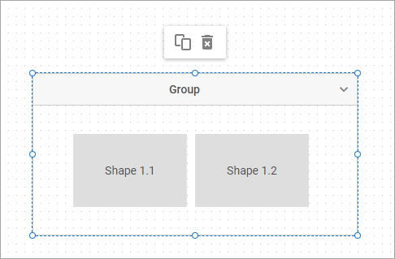

# Grid Area

Grid area is an area intended for editing diagram.

## Managing items in the default mode

### Editing shapes

#### Default mode of Diagram

When you click on any shape, it becomes editable and gets a personal toolbar with editing options.

"copy"
"connect"
"remove"

The toolbar allows:

- creating a copy of the shape;
- activating the mode for setting connections to a different shape;
- deleting the selected shape.

There is also the ability to configure the toolbar according to your needs. Read the details [below](#configuringtoolbarforshapes).

### Editing lines

When the connection mode is enabled for a shape, you can set links to other shapes, adjust their position and form, as well as delete unnecessary links.

### Editing groups

You can drag groups from the left panel into the grid area to place them on the desired positions.
In the editing mode each selected group gets resizing handles. You can pull the handles of an editable group to change its sizes. 

When you click any group, it becomes editable and gets a personal toolbar with editing options.

The default toolbar controls are: "copy", "remove".

To configure the toolbar, use the **shapeToolbar** configuration property of the Diagram editor in the similar way as it's shown [here](diagram_guides/editor_mode.md#configuringtoolbarforshapes).

### Editing swimlanes

In the editing mode each selected swimlane gets resizing handles. You can pull the handles of an editable swimlane to change its sizes. 

When you click any swimlane, it becomes editable and gets a personal toolbar with editing options.

The default toolbar controls are: "addRowLast", "addColumnLast", "copy", "remove".
To configure the toolbar, use the **shapeToolbar** configuration property of the Diagram editor in the similar way as it's shown [here](diagram_guides/editor_mode.md#configuringtoolbarforshapes). 

Besides, there is the ability to add, move, or remove columns or rows of the swimlane via the options of the context menu. 

The context menu will appear after the user clicks on the icon of a subheader.

## Managing shapes in the org mode

### Editing shapes

You can drag shapes to place them on the desired positions relative to the root shape, or drag the root shape to move the whole diagram.
In the editing mode each selected shape gets resizing handles. You can pull the handles of an editable shape to change its sizes.

When you click any shape, it becomes editable and gets a personal toolbar with editing options.

The toolbar allows:

- adding a new child for the selected shape
- deleting the selected shape (except for the root one)
- choosing the mode of arranging children of the selected shape (vertical or horizontal)

## Editing via interface elements. Mindmap mode

### Editing shapes

You can drag shapes to place them on the desired positions relative to the root shape, or drag the root shape to move the whole diagram. If you drag the parent shape, the shape will be moved with all its child shapes.

When you click any shape, it becomes editable and gets a personal toolbar with editing options.

The toolbar allows:

- adding a new child for the selected shape
- deleting the selected shape (except for the root one)
- choosing the side of adding children relative to the root shape (left or right)

## Resizing items

Each selected item excluding lines gets resizing handles. You can pull the handles of an editable item to change its sizes. 

## Rotating shapes

In the default mode of Editor, it is possible to rotate a shape by clicking a special icon next to it.
## Configuring toolbar per-item

Editing groups
-----------------
You can put several shapes or other groups into a group and move them as a unit, copy, or delete.

 

###Editing groups via sidebar options

You can select the necessary group and update its attributes via the sidebar options in the right panel of the editor.

###Editing swimlanes  via sidebar options

You can select any swimlane and update its attributes via the sidebar options in the right panel of the editor.

Modes of Editing (Org chart mode)
-------------

###Editing via the interface elements

There is also the ability to configure the toolbar according to your needs. Read the details [below](#configuringtoolbarforshapes).

###Editing via the sidebar options

The sidebar of the editor allows adjusting the attributes of the shape:

<table>
<tr><td></td>
<td><ul>
	<li>modify the step of moving a shape;</li> 
	<li>modify the color of a shape header via the related colorpicker;</li> 
    <li>set the left and top offsets to define the position of a shape;</li> 
    <li>set the width and height of a shape;</li> 
	<li>edit the title (for the "img-card" type);</li> 
	<li>edit the text of a shape;</li>  
    <li>load an image for the card and update it (for the "img-card" type). An image is loaded from the computer and saved in the base64 format right into the data.
   </li> 	
</ul></td></tr>
</table>

The image above presents a sidebar for editing org-chart shapes. The sidebar for editing flow-chart shapes looks [a little different](diagram_guides/editor_mode.md#editingshapes).

You can also create a sidebar with the necessary set of options for editing a custom shape; see details [here](orgchart_guides/editor_mode.md#rightpanelcustomization).

Modes of Editing (mindmap mode)
-------------

###Editing via the interface elements

There is also the ability to configure the toolbar according to your needs. Read the details [below](#configuringtoolbarforshapes).

###Editing via the sidebar options

The sidebar of the editor allows adjusting the attributes of the shape:

<table>
<tr><td></td>
<td><ul>
	<li>modify the step of moving a shape;</li> 
    <li>set the left and top offsets to define the position  of a shape;</li> 
    <li>set the width and height of a shape;</li> 
	<li>modify the color of a shape via the related colorpicker;</li> 
	<li>change the outline of a shape: set its color, type and width;</li> 
	<li>edit the text of a shape;</li>  
    <li>adjust the text settings:<ul> 
    	<li>font size, weight, style and color;</li> 
        <li>line spacing;</li>
        <li>horizontal and vertical text alignment.</li></ul>
    </li>	
</ul></td></tr>
</table>

The image above presents a sidebar for editing mindmap shapes. The sidebars for editing [flow-chart shapes](diagram_guides/editor_mode.md#editingshapes) and [org-chart](orgchart_guides/editor_mode.md#modesofediting) ones look a little different.

You can also create a sidebar with the necessary set of options for editing a custom shape; see details [here](mindmap_guides/editor_mode.md#rightpanelcustomization).

 

Using hotkeys
---------------

There is a set of hotkeys you can use while creating a diagram in the editor:

- **Ctrl+C** - to copy an item(s) (*in the default mode only*);
- **Ctrl+V** - to paste an item(s) (*in the default mode only*);
- **Shift+Left Click** - to select several items;
- **Ctrl+A** or **Cmd+A** (for MAC) - to select all items;
- **Ctrl+Z** - to revert the latest action;
- **Del** - to delete an item(s);
- **Arrows** - to move an item(s) left/right/up/down.

Manipulating multiple items
--------------------------------

It is possible to select several diagram items via hovering them over with the left mouse button pressed. You can also select necessary items using keyboard shortcuts - Shift+Left Click.

You can operate all the selected items at once, namely:

- to create a copy of the items (*in the default mode only*);
- to paste the items (*in the default mode only*);
- to drag the items;
- to delete the items.