# Right panel

Right panel is a part of the editor with a *property sheet* that provides options for modifying values of the attributes of the diagram items.

You can select a necessary item and edit its attributes via the related sidebar options.

## Sidebar options for editing shapes

Right panel can contain different sidebar options for editing various attributes of a shape. The presence or absence of the options in the right panel completely depends on the type and configuration of the shape, and the mode of Diagram initialization.

### Grid step

Use to modify the step of moving a shape. The option can be hidden via the **gridStep** attribute of the [controls](../../../api/editor/controls_property/) property of the editor.

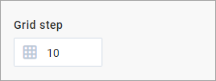

### Arrange

Use to set the position of a shape via x and y coordinates; to define the width and height of a shape and set the angle of rotation.

*The option is available for flow chart shapes in the default mode of the editor only.*

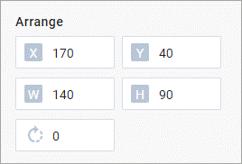

### Position

Use to set the left and top offsets to define the position of a shape.

*The option is available for "card", "img-card", and "topic" shapes.*

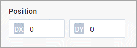

### Size

Use to set the width and height of a shape.

*The option is available for "card", "img-card", and "topic" shapes.*

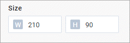

### Fill

Use to modify the color of a shape via the related colorpicker.

*The option is available for "topic" and flow chart shapes.*

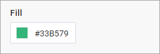

### Color

Use to modify the color of a shape header via the related colorpicker.

*The option is available for "img-card" shapes.*

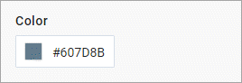

### Text

Use to edit the text of a shape.

### Stroke

Use to change the outline of a shape: set its color, type and width.

*The option is available for "topic" and flow chart shapes.*

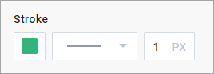

### Text settings

Use to adjust the text settings:

- font size, weight, style and color;
- line spacing;
- horizontal and vertical text alignment.

*The option is available for "topic" and flow chart shapes.*

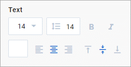

### Title

Use to edit the title.

*The option is available for "img-card" shapes.*

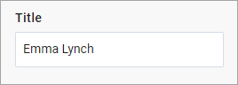

### Image

Use to load an image for the card and update it. An image is loaded from the computer and saved in the base64 format right into the data.

*The option is available for "img-card" shapes.*

## Configuring options for editing custom shapes

When you create a custom shape with a standard configuration (i.e. without adding custom properties), the options of the right panel will be rendered automatically depending on the data set of the shape.

In case you create more complex shape, you can change the structure of the right panel and specify additional options for editing custom properties of the shape. To do this, you need to make use of the **properties** attribute of the  method.

<iframe src="https://snippet.dhtmlx.com/8fubjmlz?mode=js" frameborder="0" class="snippet_iframe" width="100%" height="600"></iframe>

The **properties** attribute contains a set of objects that defines which sidebar options will be rendered in the right panel of the editor for the shape. [Check the full list of available types of the options you can apply while configuring the right panel](../../../api/diagram/addshape_method/#types-of-sidebar-options).

The order of the objects in the array defines the order the sidebar options will be displayed in the right panel.

## Sidebar options for editing lines

### Grid step

Use to modify the step of moving a line. The option can be hidden via the **gridStep** attribute of the [controls](../../../api/editor/controls_property/) property of the editor.

### Stroke

Use to change the settings of a line:

- to modify the color of a connector line;
- to define the width and type of a connector line;
- to choose the type of the line's start and end points;
- to select the type of a connector line;
- to set the radius for rounded corners of a line.

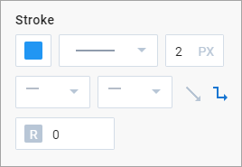

## Sidebar options for editing titles of lines

Lines with title are available in the default mode only.

### Fill

Use to modify the background color of the text item of a line via the related colorpicker.

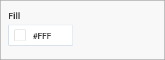

### Text

Use to edit the text of the text item of a line.

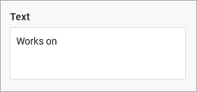

### Text style

Use to adjust the text settings:

- font size, line spacing, weight, style
- color, horizontal text alignment.

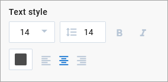

## Sidebar options for editing groups, swimlanes

### Grid step

Use to modify the step of moving an item. The option can be hidden via the **gridStep** attribute of the [controls](../../../api/editor/controls_property/) property of the editor.

### Arrange

Use to set the position of an item via x and y coordinates; to define the width and height of a group/swimlane.

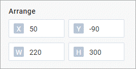

### Fill

Use to modify the color of an item via the related colorpicker.

### Stroke

Use to change the outline of an item: set its color and width.

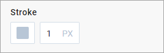

### Header text

Use to edit the text of the header of an item.

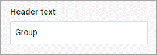

### Header style

Use to adjust the text settings of the header of an item:

- font size, weight, style and color;
- line spacing;
- horizontal and vertical text alignment.

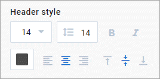

### Header fill

Use to modify the color of the header of an item via the related colorpicker.

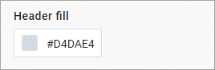

### Header position

Use to define the position of the header of an item.

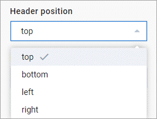

### Header

Use to show/hide the header of an item. If you hide the header, such options as *Header text*, *Header style*, *Header fill*, *Header position* will become hidden.

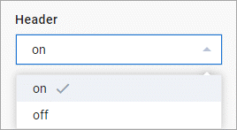

### Subheader rows

Use to show/hide the left/right subheadings of a swimlane.

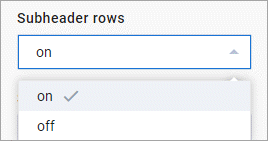

### Subheader cols

Use to show/hide the top/bottom subheadings of a swimlane.

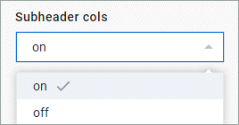
