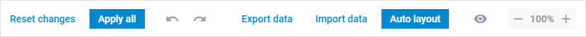

# Toolbar

Toolbar is a top part of Editor that helps to control the editing process and can look like:

## Default toolbar

By default, the toolbar contains the following controls:

- **reset** - to reset all the applied changes to the previous state. The control works in tandem with the  event;
- **apply** - to apply changes made in the editor to the diagram. The control works in tandem with the  event; 
- **historyManager** - to undo and redo changes;
- **export** - to export the data of the diagram to the JSON format. The control works in tandem with the  event;
- **import** - to import the data from a JSON file to the diagram. The control works in tandem with the  event;
- **autoLayout** - to arrange diagram shapes and connectors either in the **orthogonal** or **radial** hierarchy automatically. The control works in tandem with the  event; *It works only in the default mode of Diagram and does not work if you use groups or swimlanes;*
- **editManager** - to hide and show the panels of the editor. The control works in tandem with the  event;
- **scale** - to zoom a diagram in the editor in and out. The control works in tandem with the [zoomIn](../../../api/editor/zoomin_event/) and [zoomOut](../../../api/editor/zoomout_event/) events.

## Custom toolbar

You can change the structure of the toolbar via the [controls](api/editor/controls_property.md) configuration property of the editor. 
Using the property you can define which controls to show/hide in the Editor.

<iframe src="https://snippet.dhtmlx.com/w0ktaab3?mode=js" frameborder="0" class="snippet_iframe" width="100%" height="600"></iframe>
