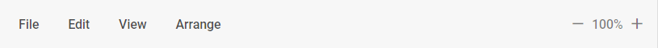
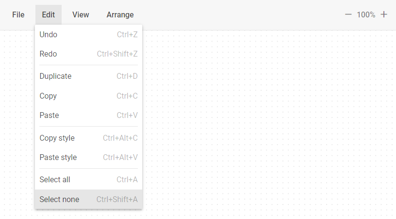
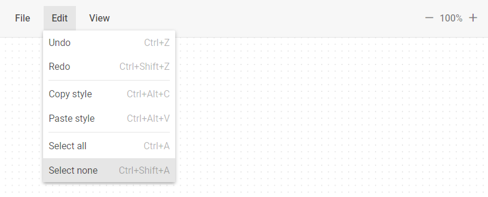
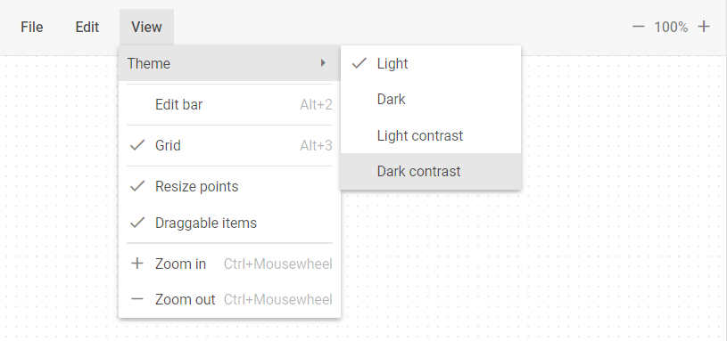

# Toolbar

Toolbar is a top part of Diagram Editor that helps users to control the editing process.

To configure the Toolbar you can use the following properties:

- [`css`](api/diagram_editor/toolbar/config/css_property.md) - applies the custom CSS class

- [`navigationType`](api/diagram_editor/toolbar/config/navigationtype_property.md) - defines the action that activates a Toolbar item. You can specify one of the following actions:
    - `"click"` - activates a Toolbar item when a user clicks on it
    - `"pointer"` - activates a Toolbar item when a user hovers the mouse pointer over it

- [`items`](api/diagram_editor/toolbar/config/items_property.md) - the array of [**items**](#service-elements) (controls) arranged on Toolbar. There are 2 ways how to configure Toolbar items:
    - [**Configuring Items via Strings**](api/diagram_editor/toolbar/config/items_property.md/#configuring-items-via-strings)
    - [**Configuring Items via Objects**](api/diagram_editor/toolbar/config/items_property.md/#configuring-items-via-objects)

~~~jsx {7-38}
const editor = new dhx.DiagramEditor("editor_container", {
    type: "default",
    view: {
        toolbar: {
            css: "custom_css",
            navigationType: "pointer",
            items: [
                {
                    type: "file",
                    items: [
                        "importJson",
                        {
                            type: "exportJson",
                            value: "Export to JSON"
                        },
                        {
                            id: "custom_id_1",
                            type: "menuItem",
                            value: "Server export",
                            icon: "dxi dxi-vault",
                            items: [
                                "exportPdf",
                                {
                                    id: "custom_id_2",
                                    type: "menuItem",
                                    value: "PNG",
                                    handler: editor => {
                                        editor.diagram.export.png();
                                        // custom logic here
                                    }
                                }
                            ]
                        }
                    ]
                },
                "spacer",
                "scale"
            ]
        }
    }
});
~~~

## Service elements

Toolbar items are represented by **service elements**. You can use and configure the following service elements:

- **file** - forms a group of service elements for importing and exporting files

    

    The **file** item has the following structure:

    ~~~jsx
    - file
        - importJson
        - export
            - exportJson
            - exportPdf
            - exportPng
    ~~~

    The **file** collection of items looks in the following way:

    
    

- **importJson** - opens a dialog box to import a file in the JSON format

- **export** - forms a group of service elements for exporting a file in the selected format

    

    The **export** item has the following structure:

    ~~~jsx
    - export
        - exportJson
        - exportPdf
        - exportPng
    ~~~
    

- **exportJson** - exports a file in the JSON format

- **exportPdf** - exports a file in the PDF format

- **exportPng** - exports a file in the PNG format

- **edit** - forms a group of service elements for managing and editing shapes, lines, groups, and swimlanes

    

    In the ***default*** mode the **edit** collection of items has the following default structure:

    ~~~jsx
    - edit
        - undo
        - redo
        - separator
        - duplicate
        - copy
        - paste
        - separator
        - copyStyle
        - pasteStyle
        - separator
        - selectAll
        - selectNone
    ~~~

    

    In the ***org/mindmap*** modes the **edit** collection of items has the following default structure:

    ~~~jsx
    - edit
        - undo
        - redo
        - separator
        - copyStyle
        - pasteStyle
        - separator
        - selectAll
        - selectNone
    ~~~

    
    

- **undo** - takes a step back in the history of changes

- **redo** - takes a step forward in the history of changes

- **duplicate** - duplicates selected elements

- **copy** - copies selected files to the `model` object

- **paste** - pastes copied files from the `model` object

- **copyStyle** - copies the selected element styles to the `model` object

- **pasteStyle** - applies styles stored in the `model` object to the selected elements

- **selectAll** - selects all the elements available for selection

- **selectNone** - deselects all the available items

- **view** - forms a group of service elements for managing view of Diagram Editor elements

    

    In the ***default*** mode the **view** collection of items has the following default structure:

    ~~~jsx
    - view
        - theme
            - themeLight
            - themeDark
            - themeLightContrast
            - themeDarkContrast
        - separator
        - shapebar
        - editbar
        - grid
        - separator
        - connectionPoints
        - resizePoints
        - magnetic
        - separator
        - zoomIn
        - zoomOut
    ~~~

    

    In the ***org/mindmap*** modes the **view** collection of items has the following default structure:

    ~~~jsx
    - view
        - theme
            - themeLight
            - themeDark
            - themeLightContrast
            - themeDarkContrast
        - separator
        - editbar
        - separator
        - grid
        - separator
        - resizePoints
        - itemsDraggable
        - separator
        - zoomIn
        - zoomOut
    ~~~

    
    

- **theme** - forms a group of service elements for applying themes

    

    The **theme** item has the following structure:

    ~~~jsx
    - theme
        - themeLight
        - themeDark
        - themeLightContrast
        - themeDarkContrast
    ~~~
    

- **themeLight** - applies the **Light** theme

- **themeDark** - applies the **Dark** theme

- **themeLightContrast** - applies the **LightContrast** theme

- **themeDarkContrast** - applies the **DarkContrast** theme

- **shapebar** - shows/hides the **Shapebar** panel

- **editbar** - shows/hides the **Editbar** panel

- **grid** - shows/hides the **grid** on the Grid area

- **connectionPoints** - shows/hides the **connection points**

- **resizePoints** - shows/hides the **resize points**

- **magnetic** - turns on/of the **magnetic** functionality

- **zoomIn** - decreases the scale value by 0.05 (5%)

- **zoomOut** - increases the scale value by 0.05 (5%)

- **arrange** - forms a group of service elements for arranging Diagram Editor elements

    

    In the ***default*** mode the **arrange** collection of items has the following default structure:

    ~~~jsx
    - arrange
        - layout
            - layoutMode
                - layoutModeDirect
                - layoutModeEdges
            - separator
            - layoutOrthogonal
            - layoutRadial
        - align
            - alignHorizontalLeft
            - alignHorizontalCenter
            - alignHorizontalRight
            - separator
            - alignVerticalTop
            - alignVerticalCenter
            - alignVerticalBottom
        - distribute
            - distributeVertical
            - distributeHorizontal
    ~~~

    
    

- **layout** - forms a group of service elements to autoplace Diagram Editor elements

    

    The **layout** item has the following structure:

    ~~~jsx
    - layout
        - layoutMode
            - layoutModeDirect
            - layoutModeEdges
        - separator
        - layoutOrthogonal
        - layoutRadial
    ~~~
    

- **layoutMode** - forms a group of service elements for managing the autoplacement mode

    

    The **layoutMode** item has the following structure:

    ~~~jsx
    - layoutMode
        - layoutModeDirect
        - layoutModeEdges
    ~~~
    

- **layoutModeDirect** - applies the `direct` mode of the element connectors

- **layoutModeEdges** - applies the `edges` mode of the element connectors

- **layoutOrthogonal** - applies the `orthogonal` mode of the element arrangement

- **layoutRadial** - applies the `radial` mode of the element arrangement

- **align** - forms a group of service elements for managing alignment of the Diagram Editor elements

    

    The **align** item has the following structure:

    ~~~jsx
    - align
        - alignHorizontalLeft
        - alignHorizontalCenter
        - alignHorizontalRight
        - separator
        - alignVerticalTop
        - alignVerticalCenter
        - alignVerticalBottom
    ~~~
    

- **alignHorizontalLeft** - aligns elements horizontally on the left

- **alignHorizontalCenter** - aligns elements horizontally in the center

- **alignHorizontalRight** - aligns elements horizontally on the right

- **alignVerticalTop** - aligns elements vertically at the top

- **alignVerticalCenter** - aligns elements vertically in the center

- **alignVerticalBottom** - aligns elements vertically at the bottom

- **distribute** - forms a group of service elements for distributing of the Diagram Editor elements

    

    The **distribute** item has the following structure:
    ~~~jsx
    - distribute
        - distributeVertical
        - distributeHorizontal
    ~~~
    

- **distributeVertical** - distributes elements vertically

- **distributeHorizontal** - distributes elements horizontally

- **scale** - the control that allows users to increase or decrease the scale value by 0.05 (5%)

    

    The **scale** item looks in the following way:

    
    

- [**separator**](https://docs.dhtmlx.com/suite/toolbar/api/api_separator_properties/) - a horizontal (between menu options) or vertical (between toolbar controls) line separating items/groups of items from each other.

- [**spacer**](https://docs.dhtmlx.com/suite/toolbar/api/api_spacer_properties/) - a space on the toolbar used for aligning controls

## Base elements

Besides [**Service elements**](#service-elements), you can also specify and configure the following **Base elements** using the [object](api/diagram_editor/toolbar/config/items_property.md/#configuring-items-via-objects) approach:

- [Button](https://docs.dhtmlx.com/suite/toolbar/button/)
- [Custom HTML](https://docs.dhtmlx.com/suite/toolbar/customhtmlbutton/)
- [Datepicker](https://docs.dhtmlx.com/suite/toolbar/datepicker/)
- [ImageButton]( https://docs.dhtmlx.com/suite/toolbar/image_button/)
- [Input](https://docs.dhtmlx.com/suite/toolbar/input/)
- [MenuItem](https://docs.dhtmlx.com/suite/toolbar/menuitem/)
- [NavItem](https://docs.dhtmlx.com/suite/toolbar/navitem/)
- [SelectButton](https://docs.dhtmlx.com/suite/toolbar/selectbutton/)
- [Separator](https://docs.dhtmlx.com/suite/toolbar/separator/)
- [Spacer](https://docs.dhtmlx.com/suite/toolbar/spacer/)
- [Title](https://docs.dhtmlx.com/suite/toolbar/title/)

The example below shows how to add the [Button](https://docs.dhtmlx.com/suite/toolbar/button/) control to the Toolbar:

~~~jsx {6-9}
const editor = new dhx.DiagramEditor("editor_container", {
    type: "org", // "default" | "org" | "mindmap"
    view: {
        toolbar: {
            items: [
                {
                    type: "button", 
                    value: "Best button"
                }
            ]
        }
    }
});
~~~

In addition to the inner properties of **base elements** (excluding [Separator](https://docs.dhtmlx.com/suite/toolbar/separator/), [Spacer](https://docs.dhtmlx.com/suite/toolbar/spacer/) and [Title](https://docs.dhtmlx.com/suite/toolbar/title/)) you can also use the following properties:

- `checkIcon` - (optional) - the handler that returns the icon css class. It is called with the following argument:
    - `editor` - the Diagram Editor object

~~~jsx
checkIcon?: (editor: IDiagramEditor) => string; // Use only for base elements that contain icon
~~~

- `handler` - (optional) - the handler that runs when the ***click*** or ***inputChange*** event occurs. It is called with the following arguments:
    - `editor` - the Diagram Editor object
    - `event` - a [native event](https://developer.mozilla.org/en-US/docs/Web/API/Event)

~~~jsx
handler?: (editor: object, event: Event) => void;
~~~
