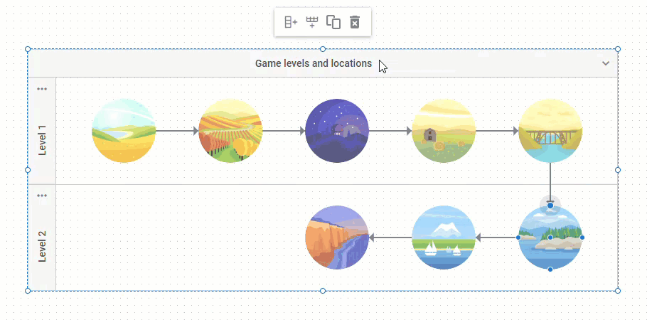

# Inline editing

Inline editing lets you edit the text content of a diagram item by double-clicking on it. You can edit the items both in the diagram and in the editor.

Inline editing for Lines is enabled only in the default mode of Diagram.

:::note 
Inline editing does not work for custom shapes.
:::

The functionality is enabled by default. To disable inline editing, you should use the `editable` property of the element, which you want to make uneditable, and set its value to *false*.

You can find examples of disabling inline editing for diagram items below:

#### Line titles

~~~jsx title="Disabling the ability to edit the text content of a line" {18}
const data = [
    // configuring shapes
    { "id": "shape_1", "type": "start", "x": 0, "text": "Start" },
    { "id": "shape_2", "type": "process", "x": 400, "text": "Step 1" },
    // configuring a line
    {
        "id": "line_1",
        "type": "line",
        "from": "shape_1",
        "to": "shape_2"
    },
    // configuring a line title
    {   
        "id": "title_1", 
        "type": "lineTitle",
        "parent": "line_1", 
        "text": "Some text",
        "editable": false // disables inline editing of the text item of a line
    }
];
~~~

#### Shapes

~~~jsx title="Disabling the ability to edit the text content of a shape"
const data = [
    { "id": 1, "x": 280, "y": 0, "text": "Start", "type": "start", "editable": false}
];
~~~

#### Groups

~~~jsx title="Disabling the ability to edit the text content of the header of a group"
const data = [    
    {
        "type": "$group",
        "id": 1,
        "width": 400,
        "height": 200,
        "x": 0,
        "y": 0,
        "header": {
            "text": "Group 1",
            "editable": false
        }
    }
];
~~~

#### Swimlanes

~~~jsx title="Configuring the ability to edit the text content of the header and subheaders of a swimlane"
const data = [
    {
        "id": "main",
        "type": "$swimlane",
        "height": 730,
        "width": 1195,
        "header": {
            "closable": true,
            "text": "Waterfall diagram template",
            // disables inline editing for the header 
            "editable": false
        },
        "layout": [
            [1, 2, 3]
        ],
        "subHeaderCols": {
            "headers": [
                { "text": "September", "fill": "rgba(243, 92, 79, 0.4)" },
                // enables inline editing for the subheader
                { "text": "October", "fill": "rgba(155, 96, 248, 0.4)", "editable": true },
                { "text": "November", "fill": "rgba(255, 174, 18, 0.4)" }
            ],
            // disables inline editing for all subheaders
            "editable": false
        }
    },
];
~~~

## API events

The library includes a set of helpful [API events](../../api/inline_editor/) which you can use to control the behavior of the editor on its opening/closing, as well as to control the process of editing the text of the items.
