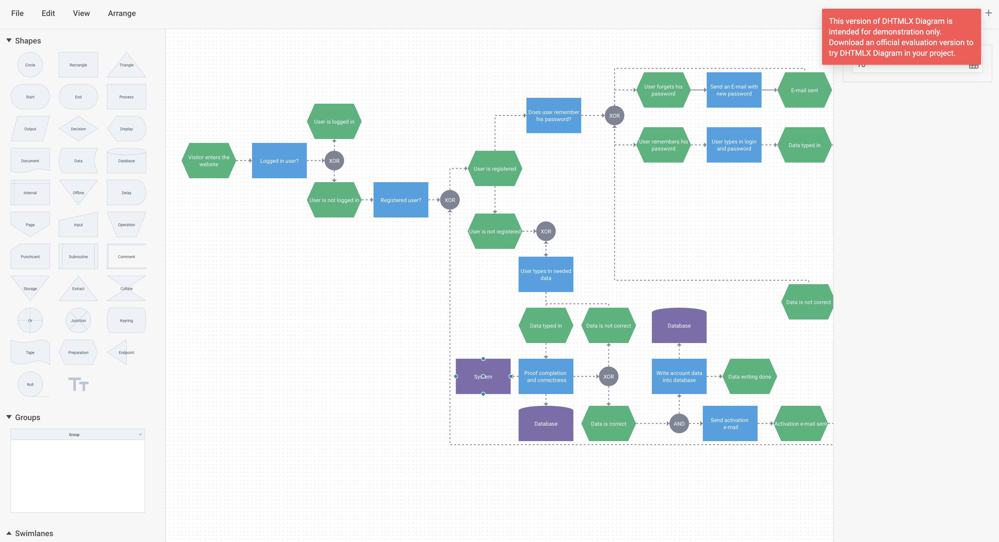

# Integration with Angular

:::tip
You should be familiar with the basic concepts and patterns of **Angular** to use this documentation. To refresh your knowledge, please refer to the [**Angular documentation**](https://angular.io/docs).
:::

DHTMLX Diagram is compatible with **Angular**. We have prepared code examples on how to use DHTMLX Diagram with **Angular**. For more information, refer to the corresponding [**Example on GitHub**](https://github.com/DHTMLX/angular-diagram-demo).

## Creating a project

:::info
Before you start to create a new project, install [**Angular CLI**](https://angular.io/cli) and [**Node.js**](https://nodejs.org/en/).
:::

Create a new **my-angular-diagram-app** project using Angular CLI. Run the following command for this purpose:

~~~json
ng new my-angular-diagram-app
~~~

:::note
If you want to follow this guide, disable Server-Side Rendering (SSR) and Static Site Generation (SSG/Prerendering) when creating new Angular app!
:::

The command above installs all the necessary tools, so you don't need to run any additional commands.

### Installation of dependencies

After that, go to the app directory:

~~~json
cd my-angular-diagram-app
~~~

Install dependencies and start the dev server. For this, use the [**yarn**](https://yarnpkg.com/) package manager:

~~~json
yarn
yarn start
~~~

The app should run on a localhost (for instance `http://localhost:3000`).

## Creating Diagram

Now you should get the DHTMLX Diagram source code. First of all, stop the app and proceed with installing the Diagram package.

### Step 1. Package installation

Download the [**trial Diagram package**](/guides/diagram_editor/initialization/#installing-diagram-editor-via-npm-and-yarn) and follow steps mentioned in the README file. Note that trial Diagram is available 30 days only.
  
### Step 2. Component creation

Now you need to create an Angular component, to add Diagram Editor into the application. Create  the **diagram-editor** folder in the **src/app/** directory, add a new file into it and name it **diagram-editor.component.ts**. Then complete the steps described below.

#### Import source files

Open the file and import Diagram source files. Note that:

- if you use PRO version and install the Diagram package from a local folder, the imported path looks like this:

~~~jsx
import { DiagramEditor } from 'dhx-diagram-package';
~~~

- if you use the trial version of Diagram, specify the following path:

~~~jsx
import { DiagramEditor } from '@dhx/trial-diagram';
~~~

In this tutorial you can see how to configure the **trial** version of Diagram.

#### Set the container and initialize Diagram Editor

To display Diagram Editor on the page, you need to set the container to render the component inside and initialize Diagram Editor using the corresponding constructor:

~~~jsx {1,9,13-14,19-20} title="diagram-editor.component.ts"
import { DiagramEditor } from "@dhx/trial-diagram";
import { IDefaultEditorConfig } from "@dhx/trial-diagram/codebase/types/ts-diagram-editor";
import { Component, ElementRef, OnInit, ViewChild, OnDestroy, ViewEncapsulation } from '@angular/core';

@Component({
    encapsulation: ViewEncapsulation.None,
    selector: 'diagram-editor', // a template name used in the "app.component.ts" file as <diagram-editor/>
    styleUrls: ['./diagram-editor.component.css'], // include a css file
    template: `

`
})

export class DiagramEditorComponent implements OnInit, OnDestroy {
    // initialize container for Diagram Editor
    @ViewChild('container', { static: true }) editor_container!: ElementRef;

    private _diagram_editor!: DiagramEditor;

    ngOnInit() {
        // initialize the Diagram Editor component
        this._diagram_editor = new DiagramEditor( this.editor_container.nativeElement, { type: "default" } as IDefaultEditorConfig);
    }

    ngOnDestroy() {
        this._diagram_editor.destructor(); // destruct Diagram Editor
    }
}
~~~

#### Adding styles

To display Diagram Editor correctly, you need to provide the corresponding styles. For this purpose, you can create the **diagram-editor.component.css** file in the **src/app/diagram-editor/** directory and specify important styles for Diagram Editor and its container:

~~~css title="diagram-editor.component.css"
/* import Diagram styles */
@import "@dhx/trial-diagram/codebase/diagram.min.css";

/* specify styles for initial page */
html,
body {
    height: 100%;
    padding: 0;
    margin: 0;
}

/* specify styles for the Diagram Editor container */
.widget {
    height: 100%;
    width: 100%;
}
~~~

#### Loading data

To add data into Diagram Editor, you need to provide a data set. You can create the **data.ts** file in the **src/app/diagram-editor/** directory and add some data into it:

~~~jsx title="data.ts"
export function getData() {
    return [
        { id: 1, x: 880, y: 105, text: "Does user remember his password?", type: "process", lineHeight: 18, fontColor: "#fff", fill: "#3DA0E3", stroke: "#3DA0E3" },
        { id: 2, x: 1080, y: 125, width: 50, "height": 50, text: "XOR", type: "circle", lineHeight: 18, fontColor: "#fff", fill: "#7D8495", stroke: "#7D8495" },
        { id: 3, x: 1160, y: 40, text: "User forgets his password", type: "preparation", lineHeight: 18, fontColor: "#fff", fill: "#33B579", stroke: "#33B579" },
        { id: 3.1, x: 1340, y: 40, text: "Send an E-mail with new password", type: "process", lineHeight: 18, fontColor: "#fff", fill: "#3DA0E3", stroke: "#3DA0E3" },
        { id: 3.2, x: 1520, y: 40, text: "E-mail sent", type: "preparation", fontColor: "#fff", lineHeight: 18, fill: "#33B579", stroke: "#33B579" },
        { id: 4, x: 1160, y: 180, text: "User remembers his password", type: "preparation", lineHeight: 18, fontColor: "#fff", fill: "#33B579", stroke: "#33B579" },
        { id: 5, x: 1340, y: 180, text: "User types in login and password", type: "process", lineHeight: 18, fontColor: "#fff", fill: "#3DA0E3", stroke: "#3DA0E3" },
        // other data

        { from: 1, to: 2, type: "dash", forwardArrow: "filled", stroke: "#7D8495" },
        { from: 2, to: 3, type: "dash", toSide: "bottom", forwardArrow: "filled", stroke: "#7D8495" },
        { from: 2, to: 7.5, type: "dash", fromSide: "bottom", toSide: "top", backArrow: "filled", stroke: "#7D8495" },
        { from: 2, to: 3.2, type: "dash", fromSide: "top", toSide: "top", stroke: "#7D8495" },
        { from: 3, to: 3.1, type: "line", forwardArrow: "filled", stroke: "#7D8495" },
        { from: 3.1, to: 3.2, type: "line", forwardArrow: "filled", stroke: "#7D8495" },
        { from: 2, to: 4, type: "dash", toSide: "top", forwardArrow: "filled", stroke: "#7D8495" },
        { from: 4, to: 5, type: "dash", forwardArrow: "filled", stroke: "#7D8495" },
        { from: 5, to: 6, type: "dash", forwardArrow: "filled", stroke: "#7D8495" },
        // other data
    ]
}
~~~

Then open the ***diagram-editor.component.ts*** file. Import the file with data and apply it using the [`parse()`](api/diagram_editor/editor/methods/parse_method.md) method within the `ngOnInit()` method, as shown below.

~~~jsx {3,19,22} title="diagram-editor.component.ts"
import { DiagramEditor } from "@dhx/trial-diagram";
import { IDefaultEditorConfig } from "@dhx/trial-diagram/codebase/types/ts-diagram-editor";
import { getData } from "./data"; // import data
import { Component, ElementRef, OnInit, ViewChild, OnDestroy, ViewEncapsulation } from '@angular/core';

@Component({
    encapsulation: ViewEncapsulation.None,
    selector: 'diagram-editor', 
    styleUrls: ['./diagram-editor.component.css'],
    template: `

`
})

export class DiagramEditorComponent implements OnInit, OnDestroy {
    @ViewChild('container', { static: true }) editor_container!: ElementRef;

    private _diagram_editor!: DiagramEditor;

    ngOnInit() {
        const data = getData(); // initialize data property
        this._diagram_editor = new DiagramEditor( this.editor_container.nativeElement, { type: "default" } as IDefaultEditorConfig);
        
        this._diagram_editor.parse(data);
    }

    ngOnDestroy() {
        this._diagram_editor.destructor();
    }
}
~~~

Now the Diagram Editor component is ready to use. When the element will be added to the page, it will initialize the Diagram Editor with data. You can provide necessary configuration settings as well. Visit our [Diagram Editor API docs](/category/diagram-editor-api/) to check the full list of available properties.

#### Handling events

When a user makes some action in the Diagram Editor, it invokes an event. You can use these events to detect the action and run the desired code for it. See the [full list of events](api/diagram_editor/editor/events/overview.md).

Open the **diagram-editor.component.ts** file and complete the `ngOnInit()` method as in:

~~~jsx {5-7} title="diagram-editor.component.ts"
// ...
ngOnInit() {
    this._diagram_editor = new DiagramEditor(this.editor_container.nativeElement, { type: "default" } as IDefaultEditorConfig);

    this._diagram_editor.events.on("zoomIn", (step) => {
        console.log("The diagram in the editor is zoomed in. The step is" + step);
    });
}

ngOnDestroy() {
    this._diagram_editor.destructor();
}
~~~

### Step 3. Adding Diagram Editor into the app

To add the ***DiagramEditorComponent*** into the app, open the ***src/app/app.component.ts*** file and replace the default code with the following one:

~~~jsx {5} title="app.component.ts"
import { Component } from "@angular/core";

@Component({
    selector: "app-root",
    template: `<diagram-editor/>` // a template created in the "diagram-editor.component.ts" file 
})
export class AppComponent {
    name = "";
}
~~~

Then create the ***app.module.ts*** file in the ***src/app/*** directory and specify the *DiagramEditorComponent* as shown below:

~~~jsx {4-5,8} title="app.module.ts"
import { NgModule } from "@angular/core";
import { BrowserModule } from "@angular/platform-browser";

import { AppComponent } from "./app.component";
import { DiagramEditorComponent } from "./diagram-editor/diagram-editor.component";

@NgModule({
    declarations: [AppComponent, DiagramEditorComponent],
    imports: [BrowserModule],
    bootstrap: [AppComponent]
})
export class AppModule {}
~~~

The last step is to open the ***src/main.ts*** file and replace the existing code with the following one:

~~~jsx title="main.ts"
import { platformBrowserDynamic } from "@angular/platform-browser-dynamic";
import { AppModule } from "./app/app.module";
platformBrowserDynamic()
    .bootstrapModule(AppModule)
    .catch((err) => console.error(err));
~~~

After that, you can start the app to see Diagram Editor loaded with data on a page.

Now you know how to integrate DHTMLX Diagram Editor with Angular. You can customize the code according to your specific requirements. The final example you can find on [**GitHub**](https://github.com/DHTMLX/angular-diagram-demo).
