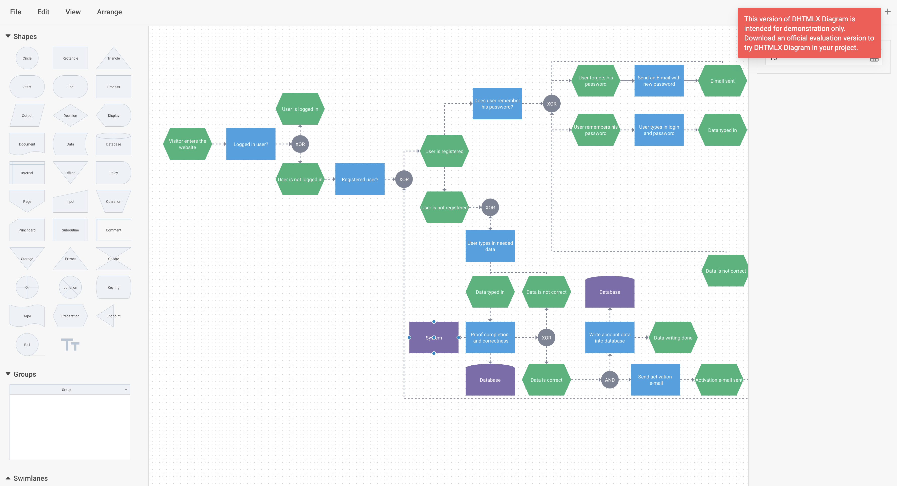

# Integration with React

:::tip
You should be familiar with the basic concepts and patterns of [**React**](https://react.dev) to use this documentation. To refresh your knowledge, please refer to the [**React documentation**](https://reactjs.org/docs/getting-started.html).
:::

DHTMLX Diagram Editor is compatible with **React**. We have prepared code examples of how to use DHTMLX Diagram Editor with **React**. For more information, refer to the corresponding [**Example on GitHub**](https://github.com/DHTMLX/react-diagram-demo).

## Creating a project

:::info
Before you start to create a new project, install [**Vite**](https://vitejs.dev/) (optional) and [**Node.js**](https://nodejs.org/en/).
:::

You can create a basic **React** project (this project) or use **React with Vite**. Let's name the project as **my-react-diagram-app**:

~~~json
npx create-react-app my-react-diagram-app
~~~

### Installation of dependencies

Go to the new created app directory:

~~~json
cd my-react-diagram-app
~~~

Install dependencies and start the dev server. For this, use a package manager:

- if you use [**yarn**](https://yarnpkg.com/), run the following commands:

~~~json
yarn
yarn start
~~~

- if you use [**npm**](https://www.npmjs.com/), run the following commands:

~~~json
npm install
npm run dev
~~~

The app should run on a localhost (for instance `http://localhost:3000`).

## Creating Diagram Editor

Now you should get the DHTMLX Diagram Editor source code. First of all, stop the app and proceed with installing the Diagram Editor package.

### Step 1. Package installation

Download the [**trial Diagram Editor package**](/guides/diagram_editor/initialization/#installing-diagram-editor-via-npm-and-yarn) and follow steps mentioned in the README file. Note that trial Diagram Editor is available 30 days only.

### Step 2. Component creation

Now you need to create a React component, to add Diagram Editor into the application. Create a new file in the ***src/*** directory and name it ***DiagramEditor.jsx***.

#### Import source files

Open the ***DiagramEditor.jsx*** file and import Diagram Editor source files. Note that:

- if you use PRO version and install the Diagram Editor package from a local folder, the import paths look like this:

~~~jsx title="DiagramEditor.jsx"
import { DiagramEditor } from 'dhx-diagram-package';
import 'dhx-diagram-package/codebase/diagram.css';
~~~

Note that depending on the used package, the source files can be minified. In this case make sure that you are importing the CSS file as **diagram.min.css**.

- if you use the trial version of Diagram, specify the following paths:

~~~jsx title="DiagramEditor.jsx"
import { DiagramEditor } from '@dhx/trial-diagram';
import '@dhx/trial-diagram/codebase/diagram.min.css';
~~~

In this tutorial you can see how to configure the **trial** version of Diagram.

#### Set the container and initialize Diagram Editor

To display Diagram Editor on the page, you need to create the container for Diagram Editor, and initialize this component using the corresponding constructor:

~~~jsx {2,6,9-10} title="DiagramEditor.jsx"
import { useEffect, useRef } from "react";
import { DiagramEditor } from "@dhx/trial-diagram";
import "@dhx/trial-diagram/codebase/diagram.min.css"; // include Diagram Editor styles

export default function DiagramEditorComponent(props) {
    let container = useRef(); // initialize container for Diagram Editor

    useEffect(() => {
        // initialize the Diagram Editor component
        const diagram_editor = new DiagramEditor(container.current, {});

        return () => {
            diagram_editor.destructor(); // destruct Diagram Editor 
        }
    });

    return 

;
}
~~~

#### Adding styles

To display Diagram Editor correctly, you need to specify important styles for Diagram Editor and its container in the main css file of the project:

~~~css title="index.css"
/* specify styles for initial page */
html,
body,
#root {
    height: 100%;
    padding: 0;
    margin: 0;
}

/* specify styles for the Diagram Editor container */
.widget {
    height: 100%;
    width: 100%;
}
~~~

#### Loading data

To add data into the Diagram Editor, you need to provide a data set. Let's create the ***data.js*** file in the ***src/*** directory and add some data into it:

~~~jsx title="data.js"
export function getData() {
    return [
        { id: 1, x: 880, y: 105, text: "Does user remember his password?", type: "process", lineHeight: 18, fontColor: "#fff", fill: "#3DA0E3", stroke: "#3DA0E3" },
        { id: 2, x: 1080, y: 125, width: 50, "height": 50, text: "XOR", type: "circle", lineHeight: 18, fontColor: "#fff", fill: "#7D8495", stroke: "#7D8495" },
        { id: 3, x: 1160, y: 40, text: "User forgets his password", type: "preparation", lineHeight: 18, fontColor: "#fff", fill: "#33B579", stroke: "#33B579" },
        { id: 3.1, x: 1340, y: 40, text: "Send an E-mail with new password", type: "process", lineHeight: 18, fontColor: "#fff", fill: "#3DA0E3", stroke: "#3DA0E3" },
        { id: 3.2, x: 1520, y: 40, text: "E-mail sent", type: "preparation", fontColor: "#fff", lineHeight: 18, fill: "#33B579", stroke: "#33B579" },
        { id: 4, x: 1160, y: 180, text: "User remembers his password", type: "preparation", lineHeight: 18, fontColor: "#fff", fill: "#33B579", stroke: "#33B579" },
        { id: 5, x: 1340, y: 180, text: "User types in login and password", type: "process", lineHeight: 18, fontColor: "#fff", fill: "#3DA0E3", stroke: "#3DA0E3" },
        // other data

        { from: 1, to: 2, type: "dash", forwardArrow: "filled", stroke: "#7D8495" },
        { from: 2, to: 3, type: "dash", toSide: "bottom", forwardArrow: "filled", stroke: "#7D8495" },
        { from: 2, to: 7.5, type: "dash", fromSide: "bottom", toSide: "top", backArrow: "filled", stroke: "#7D8495" },
        { from: 2, to: 3.2, type: "dash", fromSide: "top", toSide: "top", stroke: "#7D8495" },
        { from: 3, to: 3.1, type: "line", forwardArrow: "filled", stroke: "#7D8495" },
        { from: 3.1, to: 3.2, type: "line", forwardArrow: "filled", stroke: "#7D8495" },
        { from: 2, to: 4, type: "dash", toSide: "top", forwardArrow: "filled", stroke: "#7D8495" },
        { from: 4, to: 5, type: "dash", forwardArrow: "filled", stroke: "#7D8495" },
        { from: 5, to: 6, type: "dash", forwardArrow: "filled", stroke: "#7D8495" },
        // other data
    ]
}
~~~

Then open the ***App.js*** file and import data. After this you can pass data into the new created `<DiagramEditor/>` components as **props**:

~~~jsx {2,5-6} title="App.js"
import DiagramEditor from "./DiagramEditor";
import { getData } from "./data";

function App() {
    let data = getData();
    return <DiagramEditor data={data} />;
}

export default App;
~~~

Go to the ***DiagramEditor.jsx*** file and apply the passed **props** to the Diagram Editor via the [`parse()`](api/diagram_editor/editor/methods/parse_method.md) method:

~~~jsx {5,11} title="DiagramEditor.jsx"
import { useEffect, useRef } from "react";
import { DiagramEditor } from "@dhx/trial-diagram";
import "@dhx/trial-diagram/codebase/diagram.min.css";

export default function DiagramEditorComponent(props) {
    let container = useRef();

    useEffect(() => {
        const diagram_editor = new DiagramEditor(container.current, {});
        
        diagram_editor.parse(props.data);

        return () => {
            diagram_editor.destructor();
        }
    });

    return 

;
}
~~~

Now the Diagram Editor component is ready to use. When the element will be added to the page, it will initialize the Diagram Editor with data. You can provide necessary configuration settings as well. Visit our [Diagram Editor API docs](/category/diagram-editor-api/) to check the full list of available properties.

#### Handling events

When a user makes some action in the Diagram Editor, it invokes an event. You can use these events to detect the action and run the desired code for it. See the [full list of events](api/diagram_editor/editor/events/overview.md).

Open ***DiagramEditor.jsx*** and complete the `useEffect()` method in the following way:

~~~jsx {5-7} title="DiagramEditor.jsx"
// ...
useEffect(() => {
    const diagram_editor = new DiagramEditor(container.current, {});

    diagram_editor.events.on("zoomIn", (step) => {
        console.log("The diagram in the editor is zoomed in. The step is" + step);
    });

    return () => {
        diagram_editor.destructor();
    }
}, []);
// ...
~~~

After that, you can start the app to see Diagram Editor loaded with data on a page.

Now you know how to integrate DHTMLX Diagram Editor with React. You can customize the code according to your specific requirements. The final example you can find on [**GitHub**](https://github.com/DHTMLX/react-diagram-demo).
