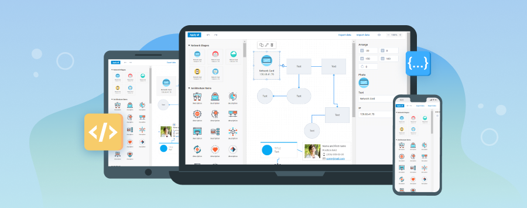

# Touch support

Since version 4.2 and upper, the DHTMLX Diagram library provides the built-in Touch support that should work out of the box.

While interacting with applications by touching the screen, a tap becomes the same thing as a mouse click.
Thus, the click events (fire on clicking, double clicking an item) will continue working on touch-screen devices. But note, that the mouseover events will not trigger.

Touch support enables recognition for the following touch gestures:

- **Double Tap** - to edit the text of a shape/group/swimlane; to create and edit the text of a connector line
- **Press, Hold, and Drag** - to call blockSelection and select several items
- **Drag** - to drag a shape/group/swimlane; to drag a shape/text/group/swimlane from the left panel of the editor
