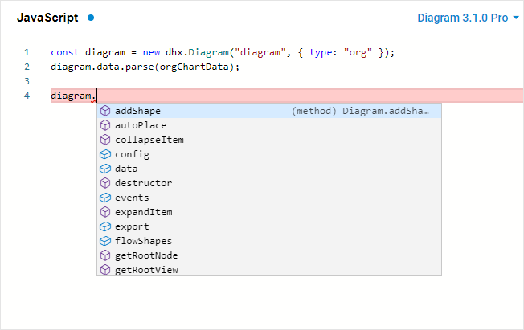

# Using Diagram with TypeScript

Starting from v3.1, the library of DHTMLX Diagram provides the ability to use TypeScript definitions. The built-in support of TypeScript should work out of the box.

{{note You can try out the functionality directly in our <a href="https://snippet.dhtmlx.com/ybpmz0zk"  target="_blank">Snippet Tool</a>.}}

Advantages of using TypeScript
------------------------------

Why we suggest that you use DHTMLX Diagram with TypeScript?

The main benefit of TypeScript is that it lets you know exactly what type of data APIs of the DHTMLX Diagram library expect.

The way of building an application becomes more intelligent as checking the types together with autocompletion allow you to avoid potential mistakes as well as to code without constantly using the documentation.