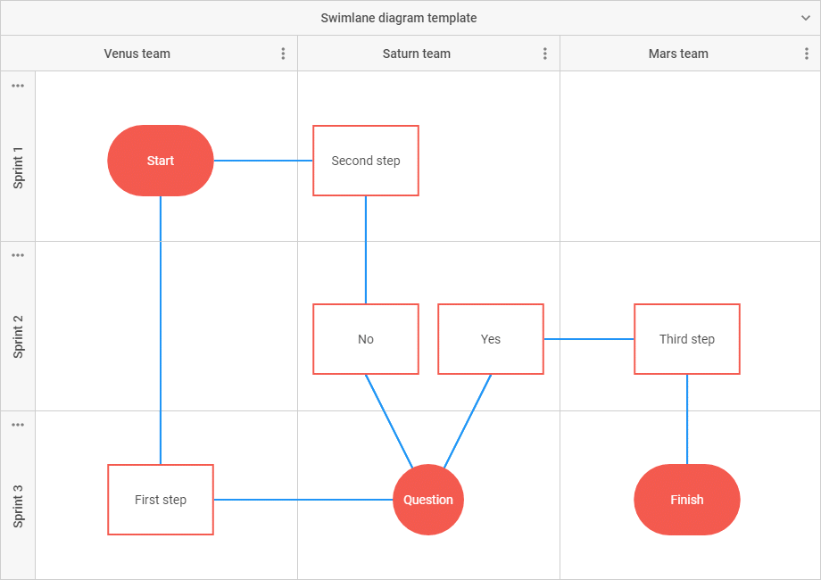

# Diagram Overview

DHTMLX Diagram is a client-side chart component that allows you to display relations between some objects, concepts or living beings in a visual form:
as a scheme, chart, organizational chart, mind map, etc. The diagram makes it easier to present tangled and bulky information in a simple and accessible way.

Diagram in the default mode
------------------------

DHTMLX Diagram provides the possibility to make various diagrams using a predefined set of shapes and connectors, and experiment with their look and feel.

You can choose shapes of desired types, link them by suitable connectors and build any type of a diagram that will show the sequence of some operations making up a particular process, like this:

|[Data Planning Model](https://snippet.dhtmlx.com/e6zm6wh1)|[Vertical Decision Tree](https://snippet.dhtmlx.com/t6t8ay80)|[Wide Flowchart](https://snippet.dhtmlx.com/4d4k3o8p)|
|---|---|---|
||||

|[Decision Tree](https://snippet.dhtmlx.com/7bn52dl1)|[Activity Diagram](https://snippet.dhtmlx.com/a9t2z2dt)|
|-----|-----|
||| 

### Custom shapes

You can easily create your own templates of shapes and use them to design any diagram you need. For example, it is possible to create such famous types of custom diagrams as:

|[Life Cycle Diagram](https://snippet.dhtmlx.com/y4k51owl)|[Venn Diagram](https://snippet.dhtmlx.com/2tzyfois)|[UML Class Diagram](https://snippet.dhtmlx.com/madymxt5)|
|-----|-----|---|
|||   |

|[Network Diagram](https://snippet.dhtmlx.com/u1xqyo9w)|[Game levels and locations](https://snippet.dhtmlx.com/1h4j9gb3)|
|---|---|
|||

### Groups

You can draw simple or more complicated schemes by grouping shapes in different ways with the help of such an element of Diagram as a group. It is possible to create as one-level groups as nested groups, to configure their appearance and behavior. Check the details in the [Groups configuration](diagram_guides/shapes_arrows_list.md#groupsconfiguration) article.

|[Diagram. Default mode. Virtual private cloud architecture](https://snippet.dhtmlx.com/0hf8ahrb)|
|---|
||

### Swimlanes

Usage of swimlanes of the DHTMLX Diagram library lets you represent any process (be it a business process, manufacturing or service one, and any other processes) or its separate parts from start to finish.

|[Diagram. Default mode. Swimlane template](https://snippet.dhtmlx.com/z6x5m3gb)|
|---|
||

Diagram in the org chart mode
-----------------------

There is also an org chart mode of diagram that presents a set of shapes connected by lines in a hierarchical order. 

<iframe src="https://snippet.dhtmlx.com/qnx3ekin?mode=result" frameborder="0" class="snippet_iframe" width="100%" height="500"></iframe>

### Custom shapes

An example of adding custom shapes for creating a diagram to present the hierarchical organizational structure of a medical institution:

|[Diagram. Org chart mode. Medical hierarchy diagram template](https://snippet.dhtmlx.com/8fubjmlz)|
|---|
||

Diagram in the mindmap mode
--------------

The mindmap mode is used to represent a core topic or idea surrounded by the branches of the subtopics.

|[Diagram. Mindmap mode. Emotions mind map](https://snippet.dhtmlx.com/twd25ww1)|
|---|
||

The shapes are connected by curved lines and arranged around a central shape of the diagram.

### Custom shapes

An example of adding a custom template into the mindmap mode of the diagram to create a site map:

<iframe src="https://snippet.dhtmlx.com/do1jwmw1?mode=result" frameborder="0" class="snippet_iframe" width="100%" height="600"></iframe>

## Diagram Editor

The DHTMLX Diagram component provides you with Editor that allows you to try and apply your designer skills in building neat and nice-looking diagrams.

### Editor in the default mode

The interface of the editor initialized in the default mode consists of four functional parts: toolbar, left panel, grid area, and right panel.

To build a diagram, you need either to drag the necessary items from the left panel or create a copy of the items via the per-item toolbar. You can adjust the attributes of the items via sidebar options of the right panel.

|[Diagram. Default mode. Wide flowchart](https://snippet.dhtmlx.com/4d4k3o8p)|
|--|
||

If you need to edit a custom shape you may customize the left panel and configure the right panel according to the attributes of your shape.

<iframe src="https://snippet.dhtmlx.com/2z0a18oz?mode=result" frameborder="0" class="snippet_iframe" width="100%" height="600"></iframe>

### Editor in the org chart mode

The interface of the editor initialized in the org chart mode consists of three parts: toolbar, grid area, and right panel. Note, that the editor does not have the left panel. 

To build a diagram in the org chart mode of the editor, you need to select a shape and add a new child for it.
You can adjust the attributes of the shapes via the available sidebar options of the right panel.

|[Diagram editor. Org chart mode. Basic initialization](https://snippet.dhtmlx.com/og4qm3ja)|
|--|
||

In the example below, you can notice that a set of sidebar options for editing the attributes of the shape with an image differs from the sidebar options for editing a simple card.

<iframe src="https://snippet.dhtmlx.com/vghuunmd?mode=result" frameborder="0" class="snippet_iframe" width="100%" height="600"></iframe>

If you've added a custom shape to the editor in the org chart mode, you can configure the right panel to be able to edit custom properties of the shape.

### Editor in the mindmap mode

The interface of the editor initialized in the mindmap mode consists of three parts: toolbar, grid area, and right panel. Note, that the editor does not have the left panel. 

To build a diagram in the mindmap mode of the editor, you need to select a shape and add a new child for it. You can adjust the attributes of the shapes via the available sidebar options of the right panel.

|[Diagram editor. Mindmap mode. Emotions mind map](https://snippet.dhtmlx.com/lo1vm0e8)|
|--|
||

If you've added a custom shape to the editor in the org chart mode, you can configure the right panel to be able to edit custom properties of the shape.

Shape Search
---------------

DHTMLX Diagram provides you with a set of API that you can apply in order to make working with a Diagram more convenient.
For example, you can implement a feature of searching a shape on request that helps you to simplify work with large diagrams. 

<iframe src="https://snippet.dhtmlx.com/d7kvzq4r?mode=result" frameborder="0" class="snippet_iframe" width="100%" height="500"></iframe>

Diagram Scale
----------------

You can apply the zoom template to your diagram to be able to change its appearance via zooming the diagram in or out. Besides, you can make it possible to user to get the detailed information on the selected shape.

<iframe src="https://snippet.dhtmlx.com/09o8t3o2?mode=result" frameborder="0" class="snippet_iframe" width="100%" height="500"></iframe>
