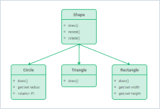

DHTMLX Diagram is a client-side chart component that allows you to display relations between some objects, concepts or living beings in a visual form:
as a scheme, chart, organizational chart, mind map, etc. The diagram makes it easier to present tangled and bulky information in a simple and accessible way.

Diagram in the default mode
------------------------
```
TODO:
- Убрать из описания упоминание custom CSS classes.
- Добавить раздел с описанием возможностей custom shapes
```
DHTMLX Diagram provides the possibility to make various diagrams using a predefined set of shapes and connectors, and experiment with their look and feel via the "native" and custom CSS classes.

You can choose shapes of desired types, link them by suitable connectors and build any type of a diagram that will show the sequence of some operations making up a particular process, like this:
   
|[Data Planning Model](https://snippet.dhtmlx.com/e6zm6wh1)|[Vertical Decision Tree](https://snippet.dhtmlx.com/t6t8ay80)|[Wide Flowchart](https://snippet.dhtmlx.com/4d4k3o8p)|
|---|---|---|
||||

|[Decision Tree](https://snippet.dhtmlx.com/7bn52dl1)|[Activity Diagram](https://snippet.dhtmlx.com/a9t2z2dt)|[Data Planning Model](https://snippet.dhtmlx.com/e6zm6wh1)|
|-----|-----|---|
|||   |

### Groups

You can draw simple or more complicated schemes by grouping shapes in different ways with the help of such an element of Diagram as a group. It is possible to create as one-level groups as nested groups, to configure their appearance and behavior. Check the details in the [Groups configuration](diagram_guides/shapes_arrows_list.md#groupsconfiguration) article.

<iframe src="https://snippet.dhtmlx.com/0hf8ahrb?mode=result" frameborder="0" class="snippet_iframe" width="100%" height="600"></iframe>

### Swimlanes

Usage of swimlanes of the DHTMLX Diagram library lets you represent any process (be it a business process, manufacturing or service one, and any other processes) or its separate parts from start to finish.

<iframe src="https://snippet.dhtmlx.com/z6x5m3gb?mode=result" frameborder="0" class="snippet_iframe" width="100%" height="700"></iframe>

Diagram in the org mode
-----------------------

There is also an org mode of diagram that presents a set of shapes connected by lines in a hierarchical order. 

<iframe src="https://snippet.dhtmlx.com/qnx3ekin?mode=result" frameborder="0" class="snippet_iframe" width="100%" height="500"></iframe>

Diagram in the mindmap mode
--------------

The mindmap mode is used to represent a core topic or idea surrounded by the branches of the subtopics.

<iframe src="https://snippet.dhtmlx.com/twd25ww1?mode=result" frameborder="0" class="snippet_iframe" width="100%" height="600"></iframe>

The shapes are connected by curved lines and arranged around a central shape of the diagram. Each shape has a text and a colored border. The color of the outline depends on the level the shape belongs to. But you can change the look and feel of the shapes depending on your needs.


## Diagram Editor

The DHTMLX Diagram component provides you with Editor that allows you to try and apply your designer skills in building neat and nice-looking diagrams.

### Editor in the default mode

The interface of the editor initialized in the default mode consists of four functional parts: toolbar, left panel, grid area, and right panel.

```
TODO:
- По возможности заменить картинку размер в ширину желательно 940px + на изображении устарел UI
```


To build a diagram, you need either to drag the necessary items from the left panel or create a copy of the items via the per-item toolbar. You can adjust the attributes of the items via sidebar options of the right panel.

<iframe src="https://snippet.dhtmlx.com/4d4k3o8p?mode=result" frameborder="0" class="snippet_iframe" width="100%" height="600"></iframe>

```
TODO:
- Заменен пример ниже
```

If you need to edit a custom diagram, you may configure the toolbar of the editor, customize the left panel, and configure the right panel according to the attributes of your shape.

<iframe src="https://snippet.dhtmlx.com/2z0a18oz?mode=result" frameborder="0" class="snippet_iframe" width="100%" height="600"></iframe>

### Editor in the org mode

The interface of the editor initialized in the org mode consists of three parts: toolbar, grid area, and right panel.

```
TODO:
- По возможности заменить картинку размер в ширину желательно 940px + на изображении устарел UI
```


```
TODO:
Ниже перечислен стандартный набор функций, актуальный для фигуры type: "card".
Что является неполным списком возможностей по отношению к другим типам фигур, в том числе и пользовательским.
Эта информация устарела. Думаю, что нужно либо дополнять, с учетом новых возможностей, либо убрать сославшись на API редактора в режиме "org"
```

To build a diagram in the org mode of the editor, you need to select a shape and add a new child for it. Also you can:

- set precise positioning for shapes;
- define their width and height;
- edit the content of a shape;
- set a suitable color of a shape header.

<iframe src="https://snippet.dhtmlx.com/vghuunmd?mode=result" frameborder="0" class="snippet_iframe" width="100%" height="600"></iframe>

### Editor in the mindmap mode

The interface of the editor initialized in the mindmap mode consists of three parts: toolbar, grid area, and right panel.

```
TODO:
- По возможности заменить картинку размер в ширину желательно 940px + на изображении устарел UI
```


```
TODO:
Возможностей гораздо больше, все зависит от выбранного типа фигуры, актуально и для org mode;
```

The mindmap mode of the editor makes building and editing a mind map quick and easy. To add a new shape, select a shape and add a new child for it. Aside from that, you can:

- set the left-top position of a shape;
- define the size of a shape;
- define the look of a shape: set a suitable shape color, define outline settings, insert a text inside and adjust its look and feel;

<iframe src="https://snippet.dhtmlx.com/lo1vm0e8?mode=result" frameborder="0" class="snippet_iframe" width="100%" height="600"></iframe>


Custom Diagram
--------------

You can build your own diagram by creating custom shapes of the desired appearance and linking them by suitable connectors, as well as create groups and swimlanes of different configurations.

|[Life Cycle Diagram](https://snippet.dhtmlx.com/y4k51owl)|[Venn Diagram](https://snippet.dhtmlx.com/2tzyfois)|[UML Class Diagram](https://snippet.dhtmlx.com/madymxt5)|
|-----|-----|---|
|||   |


|[Medical Hierarchy](https://snippet.dhtmlx.com/8fubjmlz)|[Network Diagram](https://snippet.dhtmlx.com/u1xqyo9w)|
|---|---|
|||


Shape Search
---------------

DHTMLX Diagram provides you with a set of API that you can apply in order to make working with a Diagram more convenient.
For example, you can implement a feature of searching a shape on request that helps you to simplify work with large diagrams. 

<iframe src="https://snippet.dhtmlx.com/d7kvzq4r?mode=result" frameborder="0" class="snippet_iframe" width="100%" height="500"></iframe>

Diagram Scale
----------------

You can apply the zoom template to your diagram to be able to change its appearance via zooming the diagram in or out. Besides, you can make it possible to user to get the detailed information on the selected shape.

<iframe src="https://snippet.dhtmlx.com/09o8t3o2?mode=result" frameborder="0" class="snippet_iframe" width="100%" height="500"></iframe>
