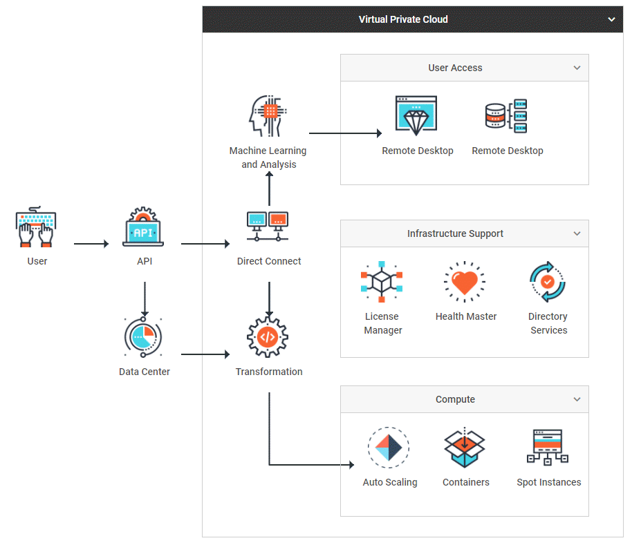
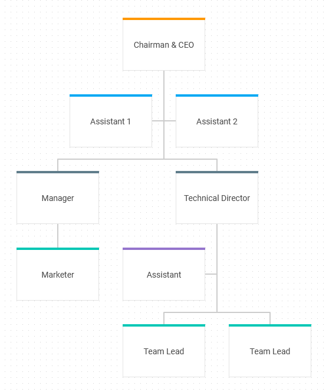
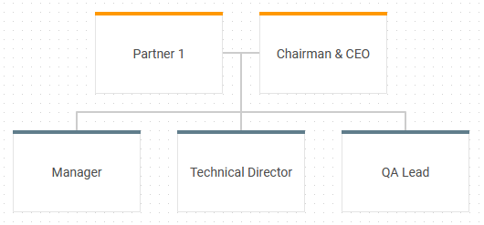
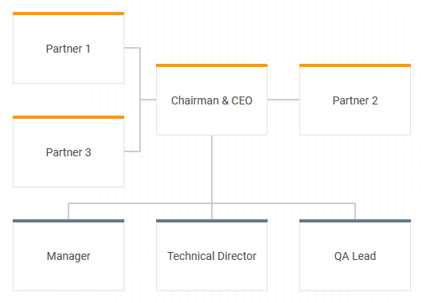

# DHTMLX Diagram overview

## Approach 1

import DiagramPreview from '@site/src/components/DiagramPreview/index';

<DiagramPreview/>

## Approach 2

<iframe src="https://snippet.dhtmlx.com/ilidi344?mode=result" class="snippet_iframe" width="100%" height="600"></iframe>

DHTMLX Diagram is a client-side chart component that allows you to display relations between some objects, concepts or living beings in a visual form:
as a scheme, chart, organizational chart, mind map, etc. The diagram makes it easier to present tangled and bulky information in a simple and accessible way.

## Diagram in the default mode

DHTMLX Diagram provides the possibility to make various diagrams using a [predefined set of shapes](/shapes/default_shapes/) and [connectors](/lines), and experiment with their look and feel.

You can choose shapes of desired types, link them by suitable connectors and build any type of a diagram that will show the sequence of some operations making up a particular process, like this:

| [Data Planning Model](https://snippet.dhtmlx.com/e6zm6wh1) | [Vertical Decision Tree](https://snippet.dhtmlx.com/t6t8ay80) | [Wide Flowchart](https://snippet.dhtmlx.com/4d4k3o8p) |
| ---------------------------------------------------------- | ------------------------------------------------------------- | ----------------------------------------------------- |
|                    |                        |                      |

| [Decision Tree](https://snippet.dhtmlx.com/7bn52dl1) | [Activity Diagram](https://snippet.dhtmlx.com/a9t2z2dt) |
| ---------------------------------------------------- | ------------------------------------------------------- |
|                    |                            |

### Custom shapes

You can easily create [your own templates of shapes](/shapes/custom_shape/) and use them to design any diagram you need. For example, it is possible to create such famous types of custom diagrams as:

| [Life Cycle Diagram](https://snippet.dhtmlx.com/y4k51owl) | [Venn Diagram template](https://snippet.dhtmlx.com/2tzyfois) | [UML Class Diagram template](https://snippet.dhtmlx.com/madymxt5) |
| --------------------------------------------------------- | --------------------------------------------------- | -------------------------------------------------------- |
|                                     |                                 |                                      |

| [Network Diagram template](https://snippet.dhtmlx.com/u1xqyo9w) | [Game levels and locations](https://snippet.dhtmlx.com/1h4j9gb3) |
| ------------------------------------------------------ | ---------------------------------------------------------------- |
|                                 |                                       |

### Groups

You can draw simple or more complicated schemes by grouping shapes in different ways with the help of such an element of Diagram as a group. It is possible to create as one-level groups as nested groups, to configure their appearance and behavior. Check the details in the [Groups](/groups/) article.

| [Diagram Editor. Default mode. Virtual private cloud architecture](https://snippet.dhtmlx.com/0hf8ahrb) |
| ------------------------------------------------------------------------------------------------ |
|                                                                     |

### Swimlanes

Usage of swimlanes of the DHTMLX Diagram library lets you represent any process (be it a business process, manufacturing or service one, and any other processes) or its separate parts from start to finish. Check the details in the [Swimlanes](/swimlanes/) article.

| [Diagram. Default mode. Swimlane template](https://snippet.dhtmlx.com/z6x5m3gb) |
| ------------------------------------------------------------------------------- |
|                                                         |

### Line titles

The titles of Lines are enabled in the default mode of Diagram. You can add the text by double-clicking on a line. Use double-clicking also for editing the text. Check the details in the [LineTitles](/line_titles/) article.

<iframe src="https://snippet.dhtmlx.com/e6zm6wh1?mode=result" frameborder="0" class="snippet_iframe" width="100%" height="600"></iframe>

## Diagram in the org chart mode

There is also an org chart mode of Diagram that presents a set of shapes connected by lines in a hierarchical order.

<iframe src="https://snippet.dhtmlx.com/5ign6fyy?text=diagram&mode=result" frameborder="0" class="snippet_iframe" width="100%" height="600"></iframe>

### Assistant and partner shapes

A parent shape of any level can have assistant or partner items. The assistant and partner shapes can't be parent items. The assistant and partner items can be added in the [editor](./editor_overview/#editor-in-the-org-chart-mode) or by preparing a [data set](guides/loading_data.md/#preparing-data-to-load).

In the hierarchical order, the assistant items are displayed between parent and children shapes.

| [Diagram editor. Org chart mode. Basic initialization](https://snippet.dhtmlx.com/og4qm3ja) |
| ------------------------------------------------------------------------------------------- |
|                                                      |

The connection between parent shape and its partner items is always horizontal. Also, the connections between parent shape and all its children become horizontal when you add the partner item for a parent, even if the connections were vertical before.

The partner shapes are very useful for building a family tree.

**Related sample**: [Diagram editor. Org chart mode. Family tree](https://snippet.dhtmlx.com/5pfybpmz)

Here are examples of how the connections of parent shapes look like with one, two, three, and four partners.

| One partner                               | Two  partners                              |
| ----------------------------------------- | ------------------------------------------ |
|  |  |

| Three partners                               | Four partners                               |
| -------------------------------------------- | ------------------------------------------- |
|  |  |

### Custom shapes

An example of adding custom shapes for creating a diagram to present the hierarchical organizational structure of a medical institution:

| [Diagram Editor. Org chart mode. Medical hierarchy diagram template](https://snippet.dhtmlx.com/8fubjmlz) |
| -------------------------------------------------------------------------------------------------- |
|                                                          |

## Diagram in the mindmap mode

The Mindmap mode is used to represent a core topic or idea surrounded by the branches of the subtopics.

| [Diagram. Mindmap mode. Emotions mind map](https://snippet.dhtmlx.com/twd25ww1) |
| ------------------------------------------------------------------------------- |
|                                                 |

The shapes are connected by curved lines and arranged around a central shape of the diagram.
### Custom shapes

An example of adding a custom template into the mindmap mode of the diagram to create a site map:

<iframe src="https://snippet.dhtmlx.com/do1jwmw1?mode=result" frameborder="0" class="snippet_iframe" width="100%" height="600"></iframe>

## Shape search

DHTMLX Diagram provides you with a set of API that you can apply in order to make working with a Diagram more convenient.
For example, you can implement a feature of searching a shape on request that helps you to simplify work with large diagrams.

<iframe src="https://snippet.dhtmlx.com/d7kvzq4r?mode=result" frameborder="0" class="snippet_iframe" width="100%" height="600"></iframe>

## Diagram scale

You can apply the zoom template to your diagram to be able to change its appearance via zooming the diagram in or out. Besides, you can make it possible to user to get the detailed information on the selected shape.

<iframe src="https://snippet.dhtmlx.com/09o8t3o2?mode=result" frameborder="0" class="snippet_iframe" width="100%" height="600"></iframe>

## What's next

Now you can learn about using DHTMLX Diagram Editor in your application. Read the [Diagram Editor overview](editor_overview.md) to get more about this tool.
