# Default shapes

## Shapes overview

The DHTMLX Diagram library provides you with a set of default types of shapes that you can use to build your diagram. The default shapes include:

- a set of the flow chart shapes

:::note
Use the name of the necessary shape as a value of the `type` attribute inside the shape object, while [preparing a data set for loading into the diagram](/guides/loading_data/#preparing-data-to-load).
:::

| Type of a shape  | Image of a shape                                   | Type of a shape| Image of a shape |
|------------------|----------------------------------------------------|----------------|------------------|
|"circle"          |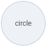        |"comment" |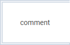|
|"rectangle"       |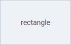  |"storage" |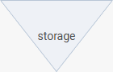|
|"triangle"        |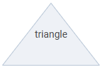    |"extract" |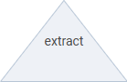|   
|"display"         |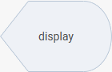      |"decision"|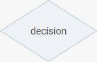|
|"document"        |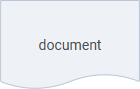    |"collate" |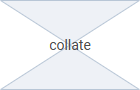| 
|"data"            |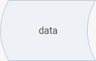            |"or"      |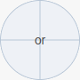|   
|"database"        |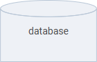    |"junction"|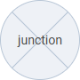|
|"internal"        |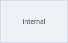    |"roll"    |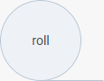|   
|"offline"         |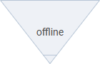      |"keyring" |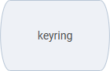| 
|"delay"           |          |"tape"    |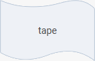|   
|"output"          |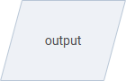        |"start"   |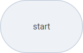|   
|"page"            |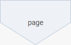            |"end"     |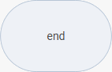|   
|"input"           |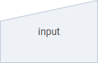          |"process" |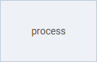| 
|"operation" |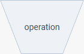|"preparation"|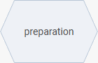|
|"punchcard"       |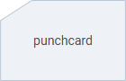  |"endpoint"|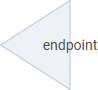|
|"subroutine"      |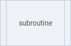|                  |

- the `"card"` type that is the default type of shapes in the **org chart** mode of Diagram. Each shape has a text and a colored header line. Shapes located on the same level have headers of identical color.

<iframe src="https://snippet.dhtmlx.com/5ign6fyy?mode=result" frameborder="0" class="snippet_iframe" width="100%" height="650"></iframe>

- the `"img-card"` type that can be used for adding shapes with images. Don't forget to provide images for cards via the `img` attribute of the shape object.

- the `"topic"` type that is the default type of shapes in the **mindmap** mode of Diagram. Each shape has a text and a colored border. The color of the outline depends on the level the shape belongs to.

<iframe src="https://snippet.dhtmlx.com/3igf1gd5?mode=result" frameborder="0" class="snippet_iframe" width="100%" height="650"></iframe>

:::note
Any of the above shapes can be added into the diagram of any mode ("default", "org", or "mindmap" one).
:::

## Setting the type of a shape

To set the type of a shape, use the [`type`](/shapes/configuration_properties/) property inside the shape object while preparing a related JSON structure to load into the diagram:

~~~jsx
const data = [
    { id: 1, x: 280, y: 0, text: "Start", type: "start" },
    { id: 2, x: 280, y: 120, text: "Read N", type: "output" },
    { id: 3, x: 280, y: 240, text: "M=1\nF=2", type: "process" },
    { id: 4, x: 280, y: 360, text: "F=F*M", type: "process" },
    { id: 5, x: 280, y: 480, text: "Is M=N?", type: "decision" }
];
~~~

:::note
See [the full list of configuration properties of a shape object](/shapes/configuration_properties/). Do not add custom properties while creating data objects for default shapes.
:::

### Setting the default shape type

It is also possible to set the default type for all the shapes via the [`defaultShapeType`](../api/diagram/defaultshapetype_property.md) attribute of the diagram config object:

~~~jsx
const diagram = new dhx.Diagram("diagram_container", {
    type: "default", // or type: "org", or type: "mindmap" 
    defaultShapeType: "rectangle"
});
diagram.data.parse(data);
~~~

This value will be applied, if the configuration object of the shape doesn't contain the `type` property.
