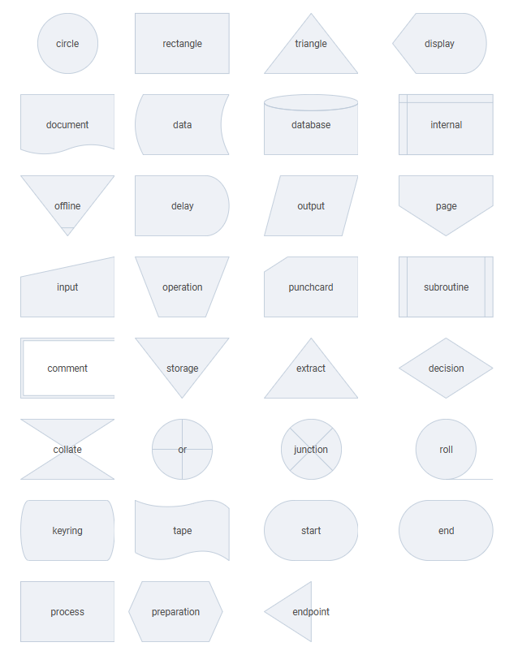
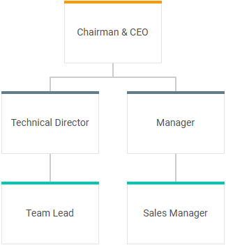
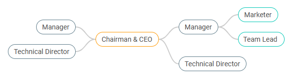

# Basic sets of shapes

The DHTMLX Diagram library provides you with sets of shapes that you can use to build your diagram. Each Diagram mode: [default](#shapes-in-the-default-mode), [org chart](#shapes-in-the-org-chart-mode), [mindmap](#shapes-in-the-mindmap-mode) and [PERT](#shapes-in-the-pert-mode) has a *basic set* of shapes' types. 

:::tip
You can add a shape of any type into a diagram initialized in any mode. Use the name of the necessary shape as a value of the `type` attribute inside the shape object, while [preparing a data set for loading into the diagram](/guides/loading_data/#preparing-data-to-load).
:::

See [the full list of configuration properties of a shape object](/shapes/configuration_properties/). 

## Shapes in the default mode

In the **default** mode of Diagram, the basic set includes **flow chart** shapes. Check the available types of flow chart shapes:

There is also the `"text"` item that presents a simple text that can be used in a diagram as a shape and connected with other shapes. 

**Related sample**: [Diagram Editor. Default mode. Wide flowchart](https://snippet.dhtmlx.com/4d4k3o8p)

:::note
You can group shapes of the Diagram in the default mode. [Check the related guide](/groups/).
:::

### Properties

Check the configuration properties specific for [shapes in the **default** Diagram mode](/diagram/shapes/configuration_properties/#properties-specific-for-the-default-mode) and [**flow shapes** and the `"text"` item](/diagram/shapes/configuration_properties/#properties-specific-for-text-topic-and-flow-chart-shapes).

## Shapes in the org chart mode

In the **org chart** mode of Diagram, the basic set includes two types of shapes: `"card"` and `"img-card"`. 

Each shape with the `"card"` type has a text and a colored header line. Shapes located on the same level have headers of identical color. Examples of "card" shapes are shown in the diagram of the org chart type below:

**Related sample**: [Diagram. Org chart mode. Basic initialization](https://snippet.dhtmlx.com/5ign6fyy?mode=result)

The `"img-card"` type can be used for adding shapes with images. Don't forget to provide images for cards via the `img` attribute of the shape object. The following org chart diagram is built with shapes of the `"img-card"` type:

**Related sample**: [Diagram editor. Org chart mode. Basic initialization](https://snippet.dhtmlx.com/og4qm3ja?mode=result)

### Properties

Check the configuration properties specific for [shapes in the **org chart** Diagram mode](/diagram/shapes/configuration_properties/#properties-specific-for-the-org-chart-mode), [the `"card"` shapes](/diagram/shapes/configuration_properties/#properties-specific-for-card-shapes)
and [the `"img-card"` shapes](/diagram/shapes/configuration_properties/#properties-specific-for-img-card-shapes).

## Shapes in the mindmap mode

In the **mindmap** mode of Diagram, the `"topic"` type of shapes is the basic one. Each shape has a text and a colored border. The color of the outline depends on the level the shape belongs to. Examples of "topic" shapes are given in the following diagram of the mindmap type:

**Related sample**: [Diagram. Mindmap mode. Basic initialization](https://snippet.dhtmlx.com/3igf1gd5)

### Properties

Check the configuration properties specific for [shapes in the **mindmap** Diagram mode](/diagram/shapes/configuration_properties/#properties-specific-for-the-mindmap-mode) and [the `"topic"` shapes](/diagram/shapes/configuration_properties/#properties-specific-for-text-topic-and-flow-chart-shapes).

## Shapes in the PERT mode

The basic types of shapes in the **PERT** mode of Diagram are:
    
- the `"task"` type - a shape that has a header and renders dates and duration:

- the `"milestone"` type - a shape without duration that indicates a key point of the project:

- the `"project"` type - a container used to [group the shapes of the `"task"` and `"milestone"` types](/groups/#grouping-shapes-in-the-pert-mode): 

**Related sample**: [Diagram. PERT chart. Initialization ](https://snippet.dhtmlx.com/4h5fi7xd)

### Properties

Check the configuration properties specific for [the `"task"` shapes](/diagram/shapes/configuration_properties/#properties-specific-for-task-shapes), [the `"milestone"` shapes](/diagram/shapes/configuration_properties/#properties-specific-for-milestone-shapes) and [the `"project"` group](/diagram/groups/configuration_properties/#properties-specific-for-project-object).

## Setting the type of a shape

To set the type of a shape, use the [`type`](/shapes/configuration_properties/) property inside the shape object while preparing a related JSON structure to load into the diagram:

~~~jsx
const data = [
    { "id": 1, "x": 280, "y": 0, "text": "Start", "type": "start" },
    { "id": 2, "x": 280, "y": 120, "text": "Read N", "type": "output" },
    { "id": 3, "x": 280, "y": 240, "text": "M=1\nF=2", "type": "process" },
    { "id": 4, "x": 280, "y": 360, "text": "F=F*M", "type": "process" },
    { "id": 5, "x": 280, "y": 480, "text": "Is M=N?", "type": "decision" }
];
~~~

:::note
See [the full list of configuration properties of a shape object](/shapes/configuration_properties/). Do not add custom properties while creating data objects for shapes from basic sets. To add a custom property, you need to [create a custom shape](/shapes/custom_shape/).
:::

### Setting the default shape type

It is also possible to set the default type for all the shapes via the [`defaultShapeType`](/api/diagram/defaultshapetype_property/) attribute of the diagram config object:

~~~jsx
const diagram = new dhx.Diagram("diagram_container", {
    type: "default", // type: "org" | type: "mindmap" | type: "pert"  
    defaultShapeType: "rectangle"
});
diagram.data.parse(data);
~~~

This value will be applied if the configuration object of a shape doesn't contain the `type` property.

