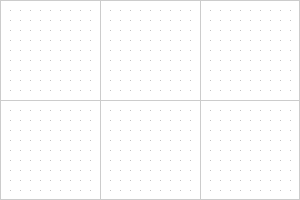
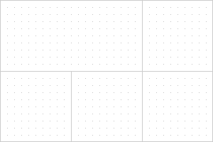
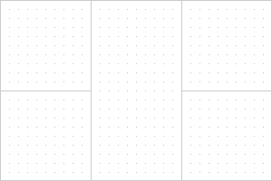

# Configuring Swimlanes

## Swimlane overview

A swimlane represents a rectangular element of Diagram that consists of cells (or lanes) arranged vertically or horizontally. Each cell (*type: "$sgroup"*) can include child items such as shapes, or groups. 

{{note Swimlanes are available only in the default mode of Diagram/Diagram Editor (type: "default").}}

```
TODO:
- Можно добавить больше вставко со снипет тула
```


**Related sample:** [Diagram. Default mode. Swimlane template](https://snippet.dhtmlx.com/z6x5m3gb)

Swimlanes will help you to visualize any process (be it a business process, manufacturing or service one, and any other processes) or its separate parts from start to finish.

## Creating swimlanes

To create a swimlane, you need to specify **type: "$swimlane"**  and define the structure of the swimlane layout inside the swimlane object while preparing a data set to load into the diagram:

~~~js
const data = [
    // configuring a swimlane
    {
	    type: "$swimlane",
	    height: 500,
  	    width: 850,
        // the layout of a swimlane should contain at least one cell
	    layout: [ 
	        [1] // the cell with id:"1" and type:"$sgroup"
	    ],
    }
];

// initializing a diagram
const diagram = new dhx.Diagram("diagram_container");
diagram.data.parse(data);
~~~

The code example above presents the simplest configuration of a swimlane with default settings (i.e. without a header and subheader).

### Swimlane structure

The structure of a swimlane can be rather different. It is defined via the [layout](../configuration_properties/) configuration property of the swimlane object. The property allows you to arrange the cells of a swimlane into rows and columns.

All you need to do is specify an array with a matrix as a value of the property. The matrix can be either an array:  

~~~js
// a swimlane with 3 columns
layout: [
    [1, 2, 3]
],
~~~

or a set of arrays separated by commas:

~~~js
// a swimlane with 2 rows and 3 columns
layout: [
    [1, 2, 3],
    [4, 5, 6] 
],
~~~

where:

- each cell in the layout have a unique number;
- the number of arrays defines the number of rows (if there are several arrays, the number of cells must be equal in all the arrays);
- the number of cells in the array defines the number of columns.

### Properties of a swimlane object

Check [the full list of configuration properties of a swimlane object](../configuration_properties/) to be able to create various swimlanes with different settings depending on your needs.

## Configuring a swimlane cell

When you initialize a swimlane on the page, the id of a swimlane cell is generated automatically as well as its configuration. To change the default configuration of the cell, create an object of the cell which must include the **type: "$sgroup"** and **id** attributes, and specify the necessary configuration settings there:

~~~js
const data = [
    // configuring a swimlane
    {
	    type: "$swimlane",
        id: "main",
	    height: 500,
  	    width: 850,
	    layout: [ 
	        [1, 2, 3]
	    ],
    },
    // configuring a swimlane cell
    {
	    type: "$sgroup",
	    id: 3,
        style: {
            fill: "grey"
        }
    }
];
~~~

### Properties of a cell object

Check [the full list of configuration properties of a swimlane cell](../configuration_properties/#properties-of-a-swimlane-cell).

## Grouping cells

When you specify a unique number for each cell, all the cells will be rendered with the borders:

~~~js
layout: [
    [1, 2, 3],
    [4, 5, 6] 
],
~~~



If needed you can group a range of cells and remove a border(s) between them. To do this, choose any cell from the range and replace unique numbers of the cell(s) from the range with the number of this cell.<br>
Here is an example of grouping first two cells placed in the first row:

~~~js
layout: [
    [1, 1, 3],
    [4, 5, 6] 
],
~~~

The result will look like this:



Here is an example of grouping the cells placed in the second column:

~~~js
layout: [
    [1, 2, 3],
    [4, 2, 6]
],
~~~

The result:



**Related sample:**	[Diagram editor. Default mode. Configuring columns and rows in swimlanes](https://snippet.dhtmlx.com/uzx5ulal)

## Sizes of a swimlane and its cells

The size of the swimlane is defined by the **width** and **height** configuration attributes of the swimlane.

~~~js
const data = [
    // configuring a swimlane
    {
        type: "$swimlane",
        id: "main"
        height: 500,
        width: 850,
        layout: [ 
	          [1, 2, 3]
        ],
    }
];
~~~

### Cell width

The width of a cell depends on the width of the swimlane, the number of columns, and the height of the left/right swimlane header and subheader. For example:

~~~js
const data = [
    {
	    type: "$swimlane",
        id: "main",
	    height: 500,
  	    width: 830,
	    layout: [ 
            // 3 columns
	        [1, 2, 3] 
	    ],
        header: {
            position: "left",
            height: 40
        },
        subHeaderRows: {
            enable: true,
            position: "left",
            height: 40
        },
    }
];
~~~

The width of each cell can be calculated as *(830-40-40)/3 = 250*.

### Cell height

The height of a cell depends on the height of the swimlane, the number of rows, and the height of the top/bottom swimlane header and subheader. For example:

~~~js
const data = [
    {
	    type: "$swimlane",
        id: "main",
	    height: 500,
  	    width: 830,
	    layout: [ 
            // 2 rows
	        [1, 2, 3],
            [4, 5, 6]
	    ],
        header: {
            position: "top",
            height: 40
        },
        subHeaderCols: {
            enable: true,
            position: "top",
            height: 40
        },
    }
];
~~~

The height of each cell can be calculated as *(500-40-40)/2 = 210*.
